# VoltElectronics — complete CI/CD walkthrough

Prepared 7 October 2026 from the `main` repository YAML, Terraform modules, deployment scripts and configuration inspected in Azure Repos, plus service-connection details verified during this session.

This is a description of the implemented pipeline. Reading and preparing this document did not queue a new build or apply Terraform. Repository-derived resource names describe the configuration; they do not prove that every resource currently exists. Live identifiers verified in this session are marked separately. The complete reviewed YAML and supporting source are included at the end so that every command, task input and environment mapping can be examined within this single file.

## Contents

1. [Actual names and identifiers](#1-actual-names-and-identifiers)
2. [Overall architecture](#2-overall-architecture)
3. [Triggers, parameters and execution rules](#3-triggers-parameters-and-execution-rules)
4. [Complete stage dependency graph](#4-complete-stage-dependency-graph)
5. [One-time setup and identity](#5-one-time-setup-and-identity)
6. [Terraform state and infrastructure](#6-terraform-state-and-infrastructure)
7. [Every stage, step by step](#7-every-stage-step-by-step)
8. [Artifact and release provenance](#8-artifact-and-release-provenance)
9. [Application request and data flows](#9-application-request-and-data-flows)
10. [How to run and inspect the pipeline](#10-how-to-run-and-inspect-the-pipeline)
11. [Failure handling, recovery and operational limits](#11-failure-handling-recovery-and-operational-limits)
12. [Source inventory and evidence](#12-source-inventory-and-evidence)
13. [Complete source appendix](#13-complete-source-appendix)
14. [CI/CD theory explained through VoltElectronics](#14-cicd-theory-explained-through-voltelectronics)

Mermaid blocks render as diagrams in a Markdown viewer with Mermaid support. Labels containing `BUILD_ID`, `COMMIT` or `PUBLIC_IP` denote runtime values, not literal Azure resource names.

## 1. Actual names and identifiers

| Item | Actual name / value | Evidence / meaning |
|---|---|---|
| Azure DevOps organization | `edukrondevops` | Existing organization |
| Project and repository | `VoltElectronics` | Reviewed repository |
| Pipeline definition | `13` | Project README |
| Pipeline YAML | `azure-pipelines.yml` | Executable stage definition |
| Run display name | `volt-electronics-$(Date:yyyyMMdd).$(Rev:r)` | Date plus daily revision; different from numeric Build ID |
| Branches | `main`, `feature/*` | YAML CI trigger |
| Agent image | `ubuntu-24.04` | Microsoft-hosted pool configuration |
| Azure account used for setup | `giftzee.online@gmail.com` | Setup script and session |
| Subscription | `Azure subscription 1` | Session verification |
| Subscription ID | `c2383fdd-26a3-44a8-9d61-2c7f2e1e08bf` | Session verification |
| Tenant ID | `66946bae-c7f1-4099-b768-6ec1ac684280` | Session verification |
| Service connection | `volt-electronics-azure-wif` | Recreated and verified this session |
| Current service connection ID | `b840b286-3e83-43e4-8e02-b8e8c0db0545` | Replacement endpoint |
| User-assigned pipeline identity | `volt-electronics-pipeline` | Existing identity |
| Identity client ID | `79aa2f8b-3943-4bb3-95de-53af7b258947` | Session verification; not an object/principal ID |
| Federated credential | `volt-devops` | Recreated trust |
| State resource group | `volt-electronics-tfstate-rg` | Bootstrap/backend configuration |
| Active application state account | `voltstateusc2383fdd` | East US backend configured by project |
| Earlier/bootstrap account | `voltstatec2383fdd` | Central India account retained for recovery |
| State container | `tfstate` | Backend configuration |
| Application state blob key | `volt-electronics/app.tfstate` | Active application backend key |
| Application resource group | `volt-electronics-rg` | Terraform with `appName=volt-electronics` |
| Application VM | `volt-electronics-app` | Compute module name |
| Application public IP resource | `volt-electronics-app-ip` | Static Standard public IP |
| Application NIC / data disk | `volt-electronics-app-nic` / `volt-electronics-app-data` | Terraform names |
| Private SonarQube VM | `volt-electronics-sonar` | Enabled by default |
| SonarQube NIC / data disk | `volt-electronics-sonar-nic` / `volt-electronics-sonar-data` | Terraform names |
| VM administrator | `voltadmin` | SSH public-key authentication |
| Application container | `volt-app` | Deployment script |
| Application image tag | `volt:BUILD_ID` | Numeric `Build.BuildId` |
| SonarQube project | key `volt-electronics`, name `VOLT Electronics` | Sonar properties |
| Release storage account | `volt` + 10-character random suffix | Terraform-generated; literal live name was not verified |
| Release container | `releases` | Private Blob container |
| Per-build release prefix | `builds/BUILD_ID` | Pipeline Azure upload path |
| Data mount | `/mnt/volt-data` | Managed disk LUN 0 |

Project: [VoltElectronics](https://dev.azure.com/edukrondevops/VoltElectronics). Pipeline: [definition 13](https://dev.azure.com/edukrondevops/VoltElectronics/_build?definitionId=13). Source: [Azure Repos main](https://dev.azure.com/edukrondevops/VoltElectronics/_git/VoltElectronics?path=/azure-pipelines.yml&version=GBmain).

The live public IP, generated release account, NIC private IPs, current build ID and full commit are deliberately not replaced by guessed values. Read them from the particular run's `deployment-outputs/outputs.json` and run summary. The screenshot supplied earlier showed run ID `79`, display name `volt-electronics-20261005.24`, commit prefix `ec8432b8` and 95.34% coverage; that is historical evidence for that run, not the result of a new run or a guaranteed current deployment.

## 2. Overall architecture

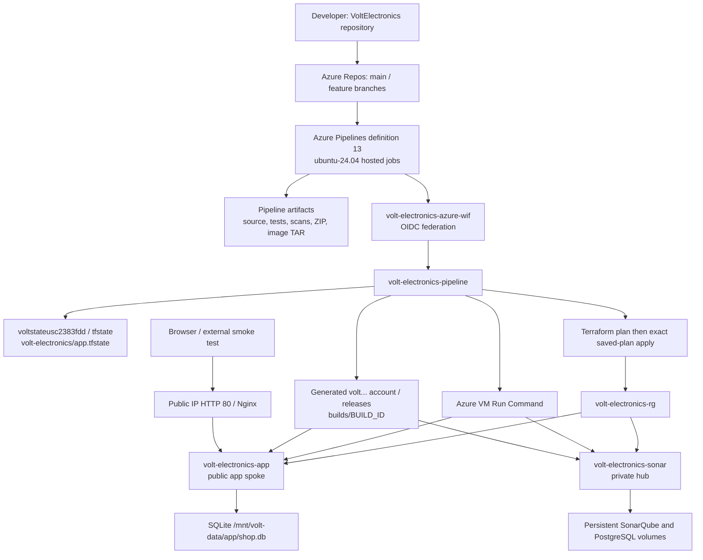

The release uses a Docker TAR transported through private Blob Storage. There is no Azure Container Registry push in this pipeline. Hosted agents reach Azure management APIs and temporarily permitted Blob endpoints; they do not need a direct connection to the private SonarQube VM. Run Command executes the private analysis on that VM.

## 3. Triggers, parameters and execution rules

| Setting | Value | Consequence |
|---|---|---|
| CI trigger | `main`, `feature/*`, `batch: true` | Matching pushes queue CI; batching coalesces CI changes while a run is active |
| PR validation | Main-branch build policy, according to repository documentation | No YAML `pr:` trigger is defined; current policy settings were not independently re-read |
| `deployAzure` | Boolean, default `false` | Four Azure stages are inserted only when selected true |
| `sonarMode` | `ephemeral` default; `external` alternative | Chooses the first SonarQube server; does not remove the second private hub gate during CD |
| Deployment runtime condition | Success, `refs/heads/main`, reason not `PullRequest` | Infrastructure runs only for an eligible main run |
| Python | `3.12` | Agent interpreter; Docker base is separately specified |
| Terraform | `1.9.8` | Checksum-verified official Linux AMD64 archive |
| Trivy | `0.75.0` | Scanner Docker version |

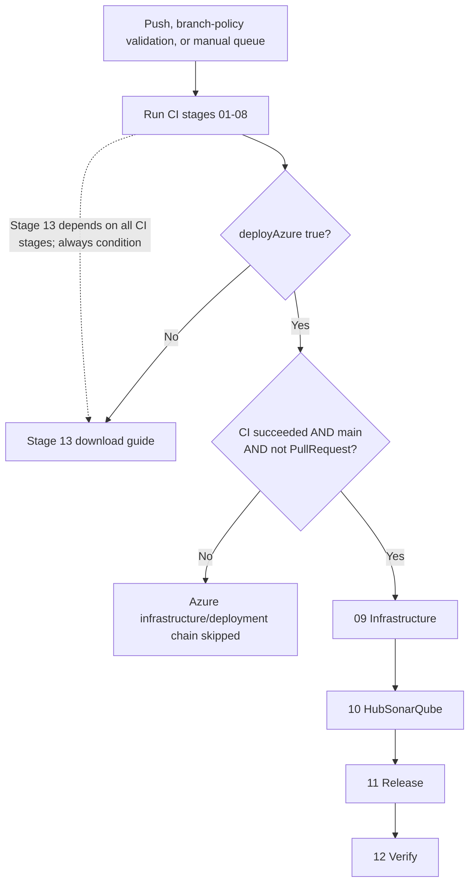

Compile-time inclusion and runtime eligibility are different. With `deployAzure=false`, stages 09–12 are absent from the compiled run. With true on a feature branch or PR, they can be present but the Infrastructure condition fails and downstream CD stages normally skip. Most stage/task conditions use Azure Pipelines' success defaults. Reporting tasks explicitly use `succeededOrFailed()` where shown in the YAML.

Each stage has one job with the same identifier as the stage. Each starts with `python scripts/pipeline_summary.py STAGE`, receiving the selected deployment parameter in `DEPLOY_REQUESTED`. Files are passed between jobs using published/downloaded artifacts; do not rely on one hosted job's local workspace surviving into another.

## 4. Complete stage dependency graph

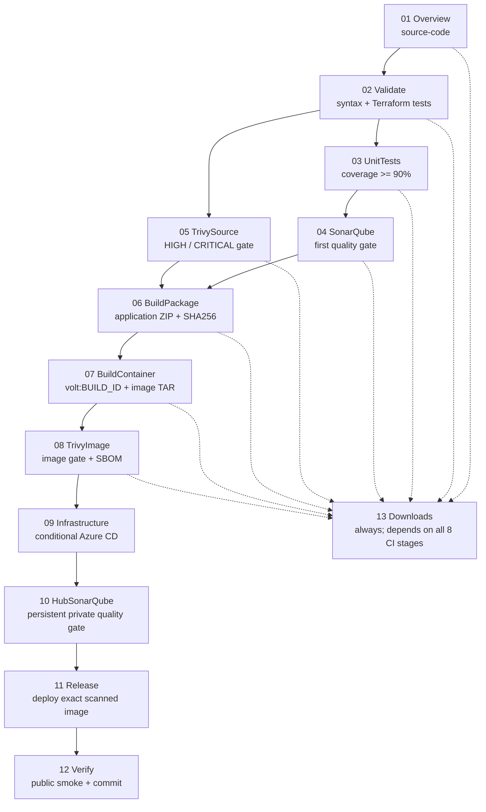

Stage 05 can run alongside the UnitTests → SonarQube branch after Validate. BuildPackage waits for both. Stage 13 does **not** depend on stages 09–12 and can run concurrently with CD. Its display number does not make it the final job to finish. `always()` permits it to run after CI failure, subject to the run/agent still being able to execute; it cannot recover artifacts that were never created.

## 5. One-time setup and identity

### 5.1 Setup sequence

1. Authenticate Azure CLI with the intended account, verify account and subscription, then select subscription `c2383fdd-26a3-44a8-9d61-2c7f2e1e08bf`.
2. Bootstrap protected state storage through `scripts/bootstrap.ps1` and `infra/bootstrap`.
3. Establish the pipeline identity and resource-group permissions. `scripts/create-federation.ps1` describes the reproducible setup; the service connection was subsequently recreated through the UI in this session.
4. Create the AzureRM service connection `volt-electronics-azure-wif` using workload identity federation and the existing managed identity.
5. Add or update `volt-devops` on `volt-electronics-pipeline` using the issuer, subject and audience supplied by the actual service connection. The subject changes when the endpoint is replaced.
6. Create the East US CI backend using `scripts/create-ci-backend.ps1`; migrate application state with Terraform's migration flow and retain the original account.
7. Configure the pipeline variables in the table below, and verify storage data access as well as management permissions.
8. Validate a CI-only run, then queue eligible main with `deployAzure=true` when deployment is intended.

### 5.2 Pipeline variables

| Variable | Required configured value / purpose |
|---|---|
| `azureServiceConnection` | `volt-electronics-azure-wif` |
| `subscriptionId` | `c2383fdd-26a3-44a8-9d61-2c7f2e1e08bf` |
| `appName` | `volt-electronics` |
| `azureLocation` | `eastus` |
| `stateResourceGroup` | `volt-electronics-tfstate-rg` |
| `stateStorageAccount` | `voltstateusc2383fdd` |
| `sshPublicKey` | Actual SSH **public** key; no private key in variables or source archive |
| `sonarHostUrl` | Required only for first-gate external mode; reachable from hosted agent |
| `sonarToken` | Secret variable required only for external mode |

These are the intended settings supported by repository setup and session observations. The entire current pipeline variable UI was not re-read for this document. Unexpanded or incorrect values cause deployment failure rather than automatically discovering the correct resources.

### 5.3 Current federated trust

| Field | Current replacement connection value |
|---|---|
| Federated credential | `volt-devops` |
| Issuer | `https://login.microsoftonline.com/66946bae-c7f1-4099-b768-6ec1ac684280/v2.0` |
| Audience | `api://AzureADTokenExchange` |
| Subject | `/eid1/c/pub/t/rmuUZvHHmUC3aG7BrGhCgA/a/rISbSSETf0KqFyZ8ppdXmA/sc/23609cc8-ca30-4d7d-a018-0a285693d227/b840b286-3e83-43e4-8e02-b8e8c0db0545` |

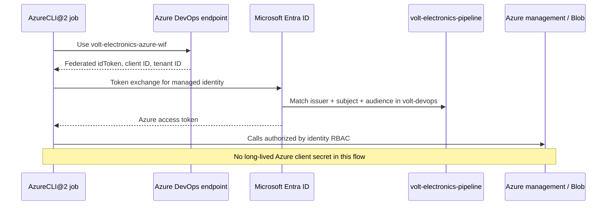

`AzureCLI@2` uses `addSpnToEnvironment: true`. `terraform-auth.sh` requires `servicePrincipalId`, `tenantId`, `idToken` and deployment settings, exports `ARM_CLIENT_ID`, `ARM_TENANT_ID`, `ARM_SUBSCRIPTION_ID`, `ARM_USE_OIDC=true`, `ARM_OIDC_TOKEN` and the corresponding `TF_VAR_*` values. It must be sourced; tokens must not be printed by shell tracing.

### 5.4 Permission boundaries and recreation history

The effective service-connection pipeline permission verified after recreation allows **any pipeline in the current VoltElectronics project**. The setup script and older repository documentation recommend authorizing only definition 13; those recommendations differ from the observed effective UI permission. Endpoint Administrators and Bharath K have administrative access. No service-connection checks were configured at the time observed.

Observed pipeline identity Azure roles: Contributor on `volt-electronics-tfstate-rg` and `volt-electronics-rg`; Storage Blob Data Contributor on the two state accounts and on the application resource group; Storage Blob Data Reader on the application resource group; Role Based Access Control Administrator on the application resource group. Role assignment scope and Blob data-plane authorization are distinct from service-connection pipeline authorization.

Old connection ID `8079fa6c-62eb-4dc5-98b1-2233189a1b77` was replaced by `b840b286-3e83-43e4-8e02-b8e8c0db0545`. Azure DevOps required deleting the old federated credential before connection deletion. The connection and credential were recreated with the existing identity and verified, preserving the effective access. No pipeline execution was performed as part of that recreation. Historical trust values should not be reused.

## 6. Terraform state and infrastructure

### 6.1 Exactly where the state is configured

```text
Subscription: c2383fdd-26a3-44a8-9d61-2c7f2e1e08bf
Resource group: volt-electronics-tfstate-rg
Active application account: voltstateusc2383fdd (East US)
Container: tfstate
Blob key: volt-electronics/app.tfstate
Configured Blob address:
https://voltstateusc2383fdd.blob.core.windows.net/tfstate/volt-electronics/app.tfstate
```

This address is the configured backend path, not a public download link. Blob existence/content was not opened for this document. State can contain sensitive values; it is excluded from pipeline artifacts and source downloads.

`voltstatec2383fdd` in Central India is retained for bootstrap/recovery. Keys also include `volt-electronics/bootstrap.tfstate` and `volt-electronics/ci-backend.tfstate`. The reviewed `create-ci-backend.ps1` explicitly initializes the **ci-backend Terraform root** against the old account's `tfstate/volt-electronics/ci-backend.tfstate`, creates the new East US storage, then migrates the application root to the new account's `volt-electronics/app.tfstate`. Do not assume every state key moved to the new account.

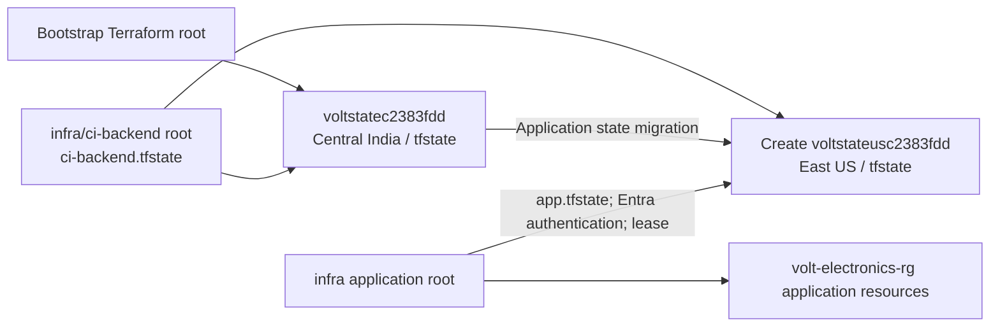

Repository documentation explains the regional move: same-region hosted-agent storage requests were not resolved by public-IP rules in the original region. The pipeline verifies authenticated Blob reachability after temporarily adding the actual job's IPv4; it does not assume that adding a firewall rule alone proves access.

### 6.2 State access lifecycle

```mermaid
sequenceDiagram
  participant Agent as Infrastructure job
  participant ARM as Azure management
  participant Blob as voltstateusc2383fdd / tfstate
  Agent->>ARM: Add current hosted-agent IPv4 network rule
  Agent->>Blob: Poll authenticated container list
  Blob-->>Agent: Data access succeeds
  Agent->>Blob: Terraform init with app.tfstate backend
  Agent->>Blob: Acquire state lease for modifying operation
  Agent->>ARM: Plan resource changes
  Agent->>ARM: Apply deployment.tfplan
  Agent->>Blob: Persist state and release operation lease
  Agent->>ARM: EXIT trap removes temporary IPv4 rule
  Note over Agent,Blob: Cleanup is best effort; abrupt termination can leave a rule
```

`agent-storage-access.sh` discovers IPv4 via `api.ipify.org` unless `VOLT_AGENT_IP` is already set, validates its basic dotted-decimal shape, adds the rule and polls Blob listing up to 24 times at 10-second intervals. Infrastructure/HubSonarQube/Release install exit traps to remove their temporary rules. `lock-timeout=5m` waits for Terraform locking. Blob leasing serializes state-changing operations; it does not lock the entire Sonar/deploy/smoke chain.

### 6.3 Terraform module tree

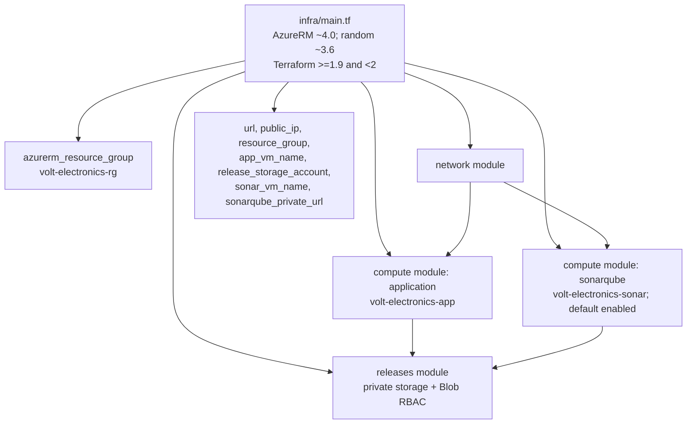

AzureRM uses Azure AD storage authorization and disables automatic resource-provider registrations in the reviewed provider configuration. The location defaults to `eastus`; both VM sizes default to `Standard_D2s_v4`. SSH public key and subscription are required inputs. Optional `trusted_public_ips` defaults to an empty list. Terraform mocked architecture tests validate plans without provisioning Azure.

### 6.4 Exact network layout

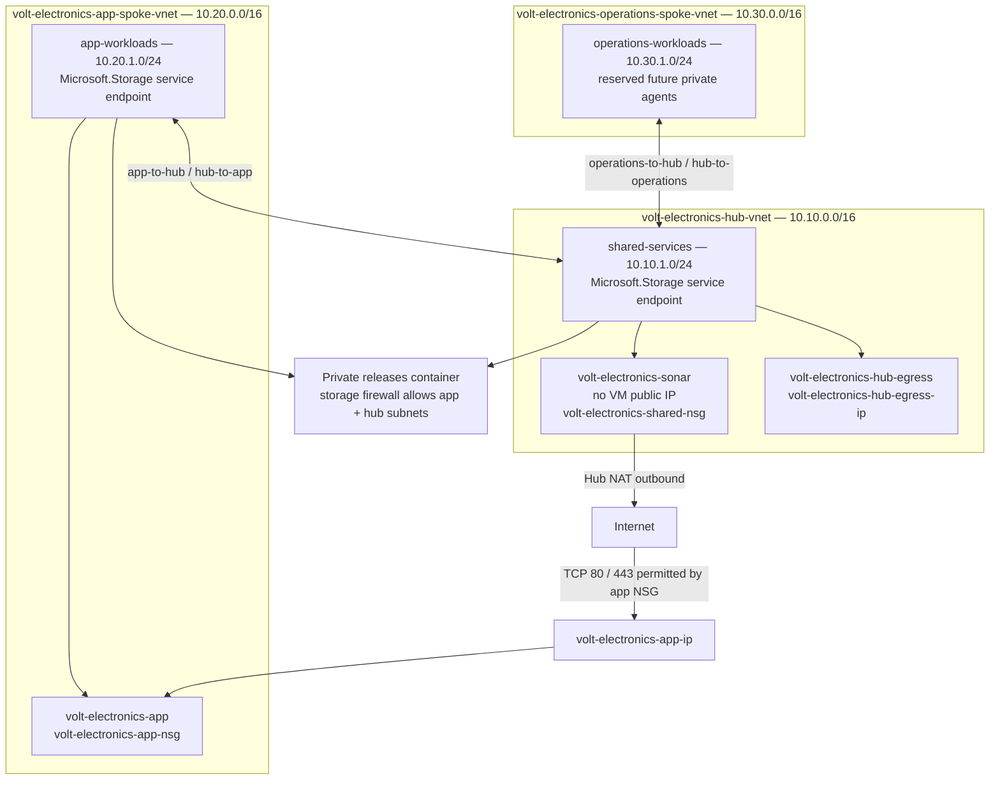

| Network rule / component | Implemented behavior |
|---|---|
| App NSG `PublicWeb` priority 100 | Allows Internet TCP 80 and 443 |
| App NSG `DenyOtherInbound` priority 4000 | Denies other inbound traffic |
| Shared NSG `PrivateSonar` priority 100 | TCP 9000 from 10.10/16, 10.20/16 and 10.30/16 |
| Shared NSG final deny priority 4000 | Denies other inbound traffic |
| Hub ↔ spoke peerings | Four directional peerings; no forwarded traffic or gateway transit |
| Hub NAT | Associated with shared-services subnet; not automatically attached to either spoke |
| Operations spoke | Reserved network; this YAML provisions no private agent there |
| Release account | Public Blob access disabled, shared keys disabled, TLS 1.2 minimum, default-deny network ACL, AzureServices bypass, app/hub subnet allow rules |
| Storage connectivity | Service endpoints plus firewall rules; no private endpoint in reviewed configuration |

The intentional app web NSG exposure has an inline Trivy `AVD-AZU-0047` suppression. This is a specific IaC exception; the document does not claim that every finding is unsuppressed. Port 443 being allowed does not mean HTTPS is configured: the deployment script creates HTTP Nginx on port 80.

### 6.5 Compute and persistence

Both compute modules configure Ubuntu 24.04 LTS from Canonical, SSH-only access, system-assigned identity, host encryption, platform automatic patching, SCSI controller, 32 GiB Premium LRS OS disk and an attached 64 GiB Premium LRS data disk at LUN 0 with caching `None`. Data disks have `prevent_destroy`. Cloud-init is supplied at creation and its subsequent changes are ignored by Terraform lifecycle; editing that template alone is therefore not a reliable update path for existing hosts.

`infra/cloud-init/host.yml` updates packages and installs Docker, Compose v2, Nginx, unzip, Python, curl and jq. It writes `vm.max_map_count=524288` and Docker configuration with data root `/mnt/volt-data/docker`, JSON-file log rotation at 10 MiB with three files. It stops Docker, applies sysctl, installs Azure CLI from Microsoft's installer, enables Docker and disables Nginx until the app deployment configures it. Deployment mounts the data disk before starting containers, so Docker images and named volumes use persistent storage.

`ops/sonarqube-compose.yml` defines `db` using `postgres:17-alpine`, database/user `sonar`, generated database password and volume `sonar_postgres`. Its `pg_isready -U sonar` health check runs every 10 seconds with 10 retries. SonarQube uses `sonarqube:community`, waits for the database service to be healthy, connects to `jdbc:postgresql://db:5432/sonar`, and persists `sonar_data`, `sonar_extensions`, `sonar_logs`. Both services restart unless stopped. Compose defaults its host binding to loopback, but `deploy-sonarqube.sh` creates `SONAR_BIND_IP=0.0.0.0` so private VNet clients can reach port 9000 through the shared NSG; the VM still has no public IP. PostgreSQL has no published host port in this Compose file.

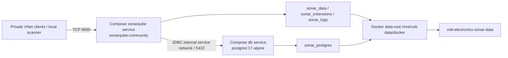

| Host | Persistence / purpose | Storage identity permission |
|---|---|---|
| `volt-electronics-app` | `/mnt/volt-data/app`, release TARs and SQLite backups | Blob Data Reader on release account |
| `volt-electronics-sonar` | `/mnt/volt-data/sonar` and Docker named volumes | Blob Data Contributor on release account |
| Pipeline identity | Infrastructure administration and upload/download | Blob contributor + management roles described above |

## 7. Every stage, step by step

### 01 — Overview: release context and downloadable source

**Stage/job:** `Overview`. **Dependency:** none. **Output:** `source-code`.

1. Print stage purpose and release identity using `pipeline_summary.py`.
2. Select Python 3.12 with `UsePythonVersion@0`.
3. Execute `python scripts/source_bundle.py "$(Build.ArtifactStagingDirectory)/source/volt-electronics-source.zip"`.
4. Print build ID, full source commit and repository URI.
5. Publish staging `source` as artifact `source-code`.

The source bundle exports authored root files and `docs`, `infra`, `pipelines`, `scripts`, `static`, `templates`, `tests`, `ops`, with allowed suffixes. It skips `.terraform`, `__pycache__`, `.git`, downloads and pytest cache; excludes `backend.tf`, `backend.hcl`, names containing `tfstate` and `.tfplan`. It does not archive arbitrary workstation files or runtime SQLite data. This is an allowlist/exclusion implementation, not proof that an accidentally committed secret in an allowed source file is absent; Stage 05 supplies the secret scan. Source is published before security gates, so access to project artifacts remains an important boundary.

### 02 — Validate: application syntax and Terraform

**Stage/job:** `Validate`. **Dependency:** `Overview`.

1. Print stage purpose.
2. Select Python 3.12.
3. Include `pipelines/templates/install-terraform.yml`: download official Terraform 1.9.8 Linux AMD64 ZIP and checksum list, verify the archive using SHA256, unzip, make executable and prepend its directory to agent PATH.
4. Compile Python source: `python -m compileall -q app.py catalog.py scripts tests`.
5. Check JavaScript syntax: `node --check static/app.js`.
6. Run `terraform fmt -check -recursive infra`.
7. Initialize application root with backend disabled, readonly lock file and noninteractive input; run `terraform validate` and `terraform test`.
8. Initialize and validate `infra/bootstrap` with backend disabled and readonly lock file.
9. Initialize and validate `infra/ci-backend` the same way.

A failed syntax, formatting, schema or mocked Terraform test blocks both UnitTests and TrivySource. Backend-disabled validation does not contact the real state backend and does not deploy infrastructure. Readonly dependency locking means provider resolution must match the checked-in lock files.

### 03 — UnitTests: application behavior and coverage

**Stage/job:** `UnitTests`. **Dependency:** `Validate`. **Output:** `unit-test-reports`.

1. Print stage purpose and select Python.
2. Install `requirements-dev.txt`.
3. Create `reports`.
4. Run `pytest tests -v` with JUnit output `reports/tests.xml`, coverage of `app` and `catalog`, XML `reports/coverage.xml`, HTML `reports/coverage-html`, terminal missing-line report and `--cov-fail-under=90`.
5. Publish JUnit using `PublishTestResults@2` with title `VOLT ecommerce behavior`; fail for failed tests or missing results.
6. Publish coverage using `PublishCodeCoverageResults@2`; fail for empty coverage.
7. Publish the entire report directory as `unit-test-reports`.

The report tasks and artifact publish use `succeededOrFailed()` so a failing pytest run can still provide evidence. The repository describes nine tests covering registration/login, CSRF, checkout totals and stock, cart changes, order isolation, wishlist/comparison, authorization and admin fulfillment. The exact executable test names are determined by the checked-out tests; the full test files were not independently copied for this document. Coverage below 90% is a hard CI failure.

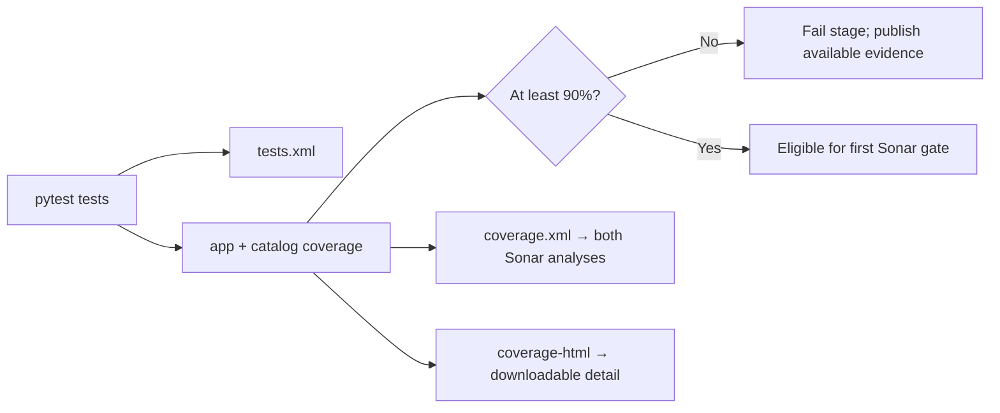

### 04 — SonarQube: first quality gate

**Stage/job:** `SonarQube`. **Dependency:** `UnitTests`. **Output:** `sonarqube-reports`.

1. Print purpose, select Python, download `unit-test-reports`.
2. Copy coverage XML into the repository's `reports/coverage.xml` path.
3. Run `scripts/sonar_scan.py --mode ephemeral` by default; compile-time alternative runs external mode with `SONAR_HOST_URL=$(sonarHostUrl)` and secret `SONAR_TOKEN=$(sonarToken)`.
4. Publish `reports/sonarqube` even when the analysis fails.

Ephemeral mode starts `sonarqube:community` on agent loopback port 9000, sets host `vm.max_map_count`, waits for readiness, rotates the default admin password in memory, generates a temporary token and executes the scanner container. Tool image digests are recorded. The scanner uses the current checkout and Python coverage, source revision and build version. It exports quality gate, issues and measures plus server logs, then removes the disposable server in cleanup. External mode requires a reachable existing server and supplied token.

`sonar-project.properties` sets `sonar.qualitygate.wait=true` and `sonar.qualitygate.timeout=600`. Project key is `volt-electronics`; sources are `app.py,catalog.py,static,templates`; tests are `tests`; image files and build metadata are excluded. The scanner's exit status enforces the gate. Actual numeric thresholds of the server's selected quality gate are not defined in this properties file and were not fetched; do not equate the pytest 90% threshold with an independently verified Sonar policy.

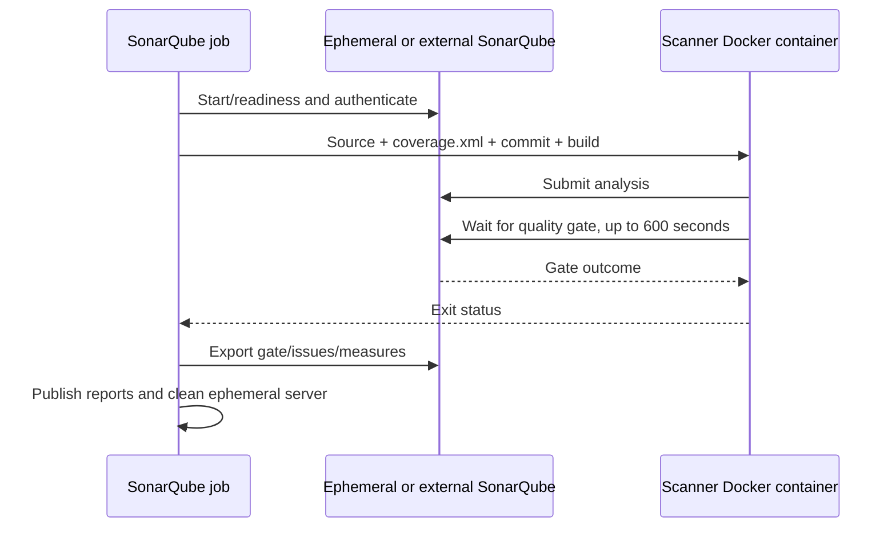

A disposable server gives each run a fresh baseline; persistent analysis history belongs to the hub or an external server.

### 05 — TrivySource: source, secrets and infrastructure scan

**Stage/job:** `TrivySource`. **Dependency:** `Validate`. **Output:** `trivy-source-reports`.

1. Print stage purpose.
2. Execute `bash scripts/trivy-scan.sh source` with Trivy version 0.75.0.
3. Pull `aquasec/trivy:0.75.0`, record tool image inspection/digests and mount repository plus cache.
4. Run filesystem scanning for `vuln,misconfig,secret`, severity HIGH and CRITICAL; skip `.git,.tools,.venv,downloads,reports,recordings`.
5. Write JSON findings with report-generation exit code zero.
6. Run SARIF scan with failure exit code one when blocking findings exist.
7. Publish reports with `succeededOrFailed()`.

A clean JSON generation command alone is not the gate: the second SARIF invocation provides the blocking exit status. BuildPackage requires both this stage and SonarQube to succeed.

### 06 — BuildPackage: versioned application ZIP

**Stage/job:** `BuildPackage`. **Dependencies:** `SonarQube`, `TrivySource`. **Output:** `application`.

1. Print purpose and select Python.
2. Run `package.py` with staging application directory, `--commit $(Build.SourceVersion)` and `--build $(Build.BuildId)`.
3. Package `app.py`, `catalog.py`, `requirements.txt`, static files and templates in sorted order with fixed archive timestamps and file permissions.
4. Embed `static/build.json` with full commit and numeric build ID.
5. Write sidecar `build.json` and `app.zip.sha256`.
6. Publish directory as `application`.

Fixed ZIP metadata improves repeatability for the same input; it does not make the Docker build fully reproducible, because package downloads and image tags can change. The build identity makes later verification traceable.

### 07 — BuildContainer: immutable release image

**Stage/job:** `BuildContainer`. **Dependency:** `BuildPackage`. **Output:** `container-image`.

1. Print stage purpose and download `application`.
2. Validate `app.zip` using `sha256sum -c app.zip.sha256`.
3. Extract into an agent temporary build context and copy the checked-out `Dockerfile` into it.
4. Run Docker build with `--pull`, OCI revision label `org.opencontainers.image.revision=COMMIT` and tag `volt:BUILD_ID`.
5. Run a one-off container test with readonly root filesystem, temporary `/tmp` and `/data` owned by UID/GID 10001. Override entrypoint with Python and assert healthy application health response and exactly 12 catalog products.
6. `docker save` the image to `image.tar`.
7. Generate `image.tar.sha256` and `image-metadata.json` using image inspection.
8. Publish all three as `container-image`.

Dockerfile uses `python:3.12.15-alpine3.24`, installs available Alpine updates, creates `volt` UID/GID 10001, installs application requirements and copies source with correct ownership. It runs as UID 10001, exposes 8000, checks `/health` every 30 seconds and starts Gunicorn with one worker, one thread and timeout 60. The single-worker choice fits the SQLite application. This pre-release test is a Flask test-client assertion inside the image; the later public smoke test verifies actual HTTP hosting.

### 08 — TrivyImage: exact container gate and SBOM

**Stage/job:** `TrivyImage`. **Dependency:** `BuildContainer`. **Output:** `trivy-image-reports`.

1. Print stage purpose and download `container-image`.
2. Pass the downloaded TAR path to `trivy-scan.sh image` as `CONTAINER_ARCHIVE` and mount artifact workspace readonly.
3. Scan the saved archive for HIGH/CRITICAL vulnerabilities into JSON.
4. Run a SARIF scan with exit-code one for blocking findings; preserve the result status.
5. Generate a CycloneDX SBOM even when the captured vulnerability gate status is failure.
6. Return the gate status and publish available scan evidence with `succeededOrFailed()`.

The archive scanned here is the archive later downloaded by Release. This stage does not contain its own SHA256 verification in the reviewed YAML; Release verifies the checksum before upload and the app VM verifies it after download. The SBOM inventories dependencies; it is not an additional deployment approval or signature.

### 09 — Infrastructure: remote state, plan and apply

**Stage/job:** `Infrastructure`. **Dependency:** `TrivyImage`. **Included only:** `deployAzure=true`. **Runtime:** eligible successful main outside PR. **Output:** `deployment-outputs`.

1. Print purpose and install verified Terraform 1.9.8.
2. Execute `AzureCLI@2` with `volt-electronics-azure-wif`, Bash inline script and federated environment enabled.
3. Source `terraform-auth.sh` to set ARM OIDC and Terraform input values.
4. Install an EXIT trap removing the agent rule from state storage, then source `agent-storage-access.sh` to add the current job's IPv4 and confirm `tfstate` data-plane access.
5. Initialize application backend using the configured RG, account, container `tfstate`, key `volt-electronics/app.tfstate` and identity authentication.
6. Create saved plan `deployment.tfplan` with noninteractive input and `-lock-timeout=5m`.
7. Apply that exact plan with `-lock-timeout=5m`.
8. Export Terraform outputs as JSON to staging `deployment/outputs.json`.
9. Publish `deployment-outputs`; exit cleanup removes temporary firewall rule best effort.

No manual plan approval task exists in this YAML, and the saved plan is not published. Infrastructure already changes Azure before the second hub quality gate. A later failure does not automatically revert those infrastructure changes.

### 10 — HubSonarQube: persistent private analysis

**Stage/job:** `HubSonarQube`. **Dependency:** `Infrastructure`. **Job timeout:** 60 minutes. **Output:** `hub-sonarqube-reports`.

1. Download `deployment-outputs`, `source-code` and `unit-test-reports`.
2. Authenticate through AzureCLI and extract resource group, generated release storage account and Sonar VM name from outputs JSON; require a Sonar VM.
3. Set immutable upload prefix `builds/BUILD_ID`; permit the current hosted agent's IPv4 on release storage and install cleanup trap.
4. Copy source ZIP and coverage XML into analysis inputs; compute `analysis-inputs.sha256` for both.
5. Upload `source.zip`, `coverage.xml`, `analysis-inputs.sha256` and `sonarqube-compose.yml` under that prefix using identity auth and `--overwrite false`.
6. Invoke `deploy-sonarqube.sh` on `volt-electronics-sonar` through `run-vm-command.sh`; require marker `VOLT_SONAR_READY`.
7. Invoke `scan-hub-sonarqube.sh`, passing build and expected commit; require marker `VOLT_HUB_ANALYSIS_SUCCESS`.
8. Capture remote scan failure status and still try to download `quality-gate.json`, `issues.json`, `measures.json` from the prefix's `hub-sonarqube` directory.
9. Fail if scanning or required report retrieval failed; publish local hub report directory with `succeededOrFailed()`.

On the Sonar VM, deployment waits for cloud-init and LUN 0, mounts `/mnt/volt-data`, logs into Azure via its system-assigned identity, downloads Compose, initializes a root-only database-password environment file if absent, starts services, waits for Sonar readiness and rotates the initial admin password into a protected local file if not already initialized.

Analysis downloads source, coverage and checksum list; verifies input hashes; extracts under `/mnt/volt-data/sonar/scans/BUILD_ID`; creates a temporary analysis token using the stored admin credential; runs the scanner with host networking, UID 10001, expected commit and build version; exports three reports to Blob with overwrite disabled; revokes its token in cleanup. Reports include the first 500 issues requested by the script, so `issues.json` is not guaranteed to enumerate a project with more than 500 issues. Gate enforcement again relies on scanner exit status and `sonar.qualitygate.wait=true`, rather than a separate JSON-status comparison.

```mermaid
sequenceDiagram
  participant Agent as Hosted HubSonarQube job
  participant Blob as releases / builds/BUILD_ID
  participant ARM as Azure Run Command
  participant VM as volt-electronics-sonar
  participant SQ as Private SonarQube
  Agent->>Blob: Upload source, coverage, hashes, Compose
  Agent->>ARM: Run deploy-sonarqube.sh
  ARM->>VM: Mount persistent disk and start services
  VM-->>Agent: VOLT_SONAR_READY
  Agent->>ARM: Run scan-hub-sonarqube.sh
  VM->>Blob: Managed-identity download and SHA256 check
  VM->>SQ: Scanner analysis, expected commit, wait for gate
  SQ-->>VM: Quality gate result
  VM->>Blob: Upload gate/issues/measures; revoke temporary token
  VM-->>Agent: Success marker only for successful script
  Agent->>Blob: Download reports for pipeline artifact
```

### 11 — Release: deploy the scanned image

**Stage/job:** `Release`. **Dependency:** `HubSonarQube`. **Job timeout:** 60 minutes.

1. Download `deployment-outputs` and `container-image`.
2. Read resource group, release storage account and application VM from outputs.
3. Add the current agent IPv4 to release storage; install removal trap.
4. Verify `image.tar.sha256` locally.
5. Upload TAR and checksum to `releases/builds/BUILD_ID` with Entra authentication and overwrite disabled.
6. Invoke `deploy-vm.sh` on `volt-electronics-app` through Azure Run Command, requiring `VOLT_DEPLOY_SUCCESS`.

The app VM performs this exact sequence:

1. Wait for cloud-init and attached LUN 0, stop Docker while initializing/mounting storage, verify block-device presence.
2. Format ext4 only when the selected disk lacks filesystem identification; mount `/mnt/volt-data` and add UUID-based `defaults,nofail` fstab entry if absent; restart Docker.
3. Authenticate `az login --identity --allow-no-subscriptions`.
4. Create `/mnt/volt-data/releases/BUILD_ID`, application and backup directories; give app UID/GID 10001 its data ownership.
5. Download TAR and checksum using Blob login auth, each with retry loop, then verify SHA256 and `docker load`.
6. If missing, create root-only application environment file with generated secret key and admin password, `DATABASE_PATH=/data/shop.db`, `PRODUCTION=0` and configured admin email. Generated secret values are not included in artifacts or this document.
7. If `volt-app` exists, take a consistent SQLite backup through Python's SQLite backup API to `/data/backups/pre-BUILD_ID.db`, then stop and remove the old container.
8. Start `volt-app` with restart policy `unless-stopped`, readonly filesystem, tmpfs `/tmp`, environment file, persistent app directory mounted as `/data`, loopback binding on host 8000 and image tag `volt:BUILD_ID`.
9. Configure Nginx on HTTP port 80 to proxy to `127.0.0.1:8000`, forward Host/X-Forwarded-For, cap client request body at 64 KiB, test configuration and enable/reload the service.
10. Check local `/health` with retries and print success marker.

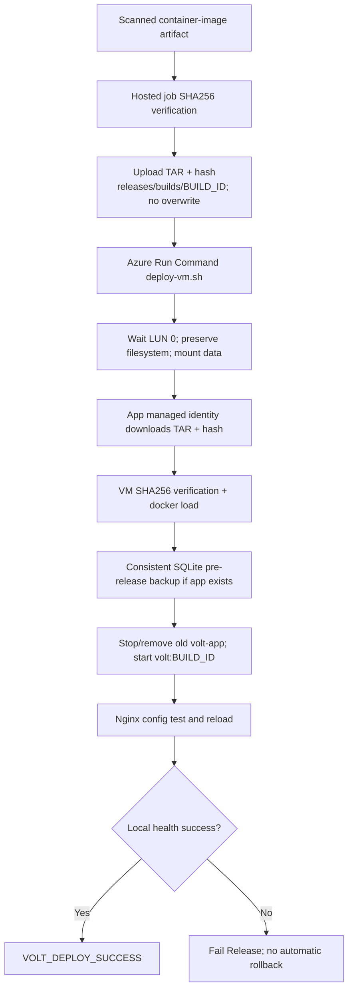

This is an in-place replacement with possible downtime, not blue/green deployment. A checksum validates bytes against their accompanying digest; it is not a cryptographic publisher signature. An immutable build prefix with overwrite disabled prevents normal script overwrite, but is not equivalent to an Azure immutable-storage retention policy.

### 12 — Verify: public endpoint and exact commit

**Stage/job:** `Verify`. **Dependency:** `Release`.

1. Print purpose, select Python and download outputs.
2. Read `url` from `outputs.json`.
3. Execute `python scripts/smoke.py URL --commit COMMIT`.
4. Retry up to 12 attempts, 10-second waits between failures, per-request timeout 20 seconds.
5. Require HTTP 200 and healthy JSON at `/health`.
6. Require `/api/products` to be a nonempty list with positive prices.
7. Require storefront `/` HTML to contain `volt` case-insensitively.
8. Require `/static/app.js` and `/static/style.css` to load.
9. Require `/static/build.json` full commit to equal this pipeline's `Build.SourceVersion`.

This stage checks public HTTP reachability and provenance after local VM health succeeded. It creates no user, order or payment. It does not repeat the full ecommerce test suite against production or assert an exact 12-product count here. Failure flags the deployment but does not restore the previous image automatically.

### 13 — Downloads: source and evidence guide

**Stage/job:** `Downloads`. **Dependencies:** all eight CI stages. **Stage condition:** `always()`. **Output:** `download-guide`.

1. Print stage purpose.
2. Create staging download-guide directory.
3. Generate its README using `scripts/download_guide.py`.
4. Attach README to run summary using `##vso[task.uploadsummary]`.
5. Publish `download-guide` with `succeededOrFailed()`.

The guide is navigation, not a replacement for actual scan/test results. Failed or skipped stages may have no corresponding artifact. Because CD is not a dependency, this guide may appear before the hub scan and deployment finish.

## 8. Artifact and release provenance

| Artifact | Producer | Principal contents | Consumer |
|---|---|---|---|
| `source-code` | Overview | `volt-electronics-source.zip` | Hub scan; human source download |
| `unit-test-reports` | UnitTests | JUnit, coverage XML, coverage HTML | Both Sonar analyses; test UI |
| `sonarqube-reports` | SonarQube | Gate, issues, measures, image evidence; ephemeral logs | CI gate evidence |
| `trivy-source-reports` | TrivySource | Source JSON/SARIF and tool evidence | Security review |
| `application` | BuildPackage | `app.zip`, `app.zip.sha256`, `build.json` | BuildContainer |
| `container-image` | BuildContainer | `image.tar`, `image.tar.sha256`, `image-metadata.json` | TrivyImage and Release |
| `trivy-image-reports` | TrivyImage | Image JSON/SARIF, CycloneDX SBOM, scanner evidence | Security / dependency review |
| `deployment-outputs` | Infrastructure | `outputs.json` | HubSonarQube, Release, Verify |
| `hub-sonarqube-reports` | HubSonarQube | `quality-gate.json`, `issues.json`, `measures.json` | Persistent gate evidence |
| `download-guide` | Downloads | README with artifact instructions | Human navigation |

Exact report filenames not enumerated above are defined in the appended scripts. This table does not imply that all ten artifacts exist in a failed or CI-only run.

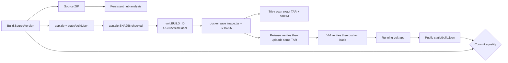

Example release directory layout, with `BUILD_ID` replaced by the actual numeric run ID:

```text
Generated release storage account
└── releases/
    └── builds/BUILD_ID/
        ├── source.zip
        ├── coverage.xml
        ├── analysis-inputs.sha256
        ├── sonarqube-compose.yml
        ├── hub-sonarqube/
        │   ├── quality-gate.json
        │   ├── issues.json
        │   └── measures.json
        ├── image.tar
        └── image.tar.sha256
```

Pipeline artifacts, Azure release blobs and Terraform state are three separate storage paths. Do not look for `app.tfstate` in the `application` artifact or generated release container.

## 9. Application request and data flows

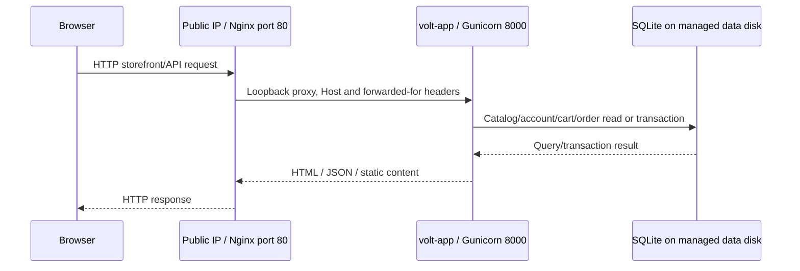

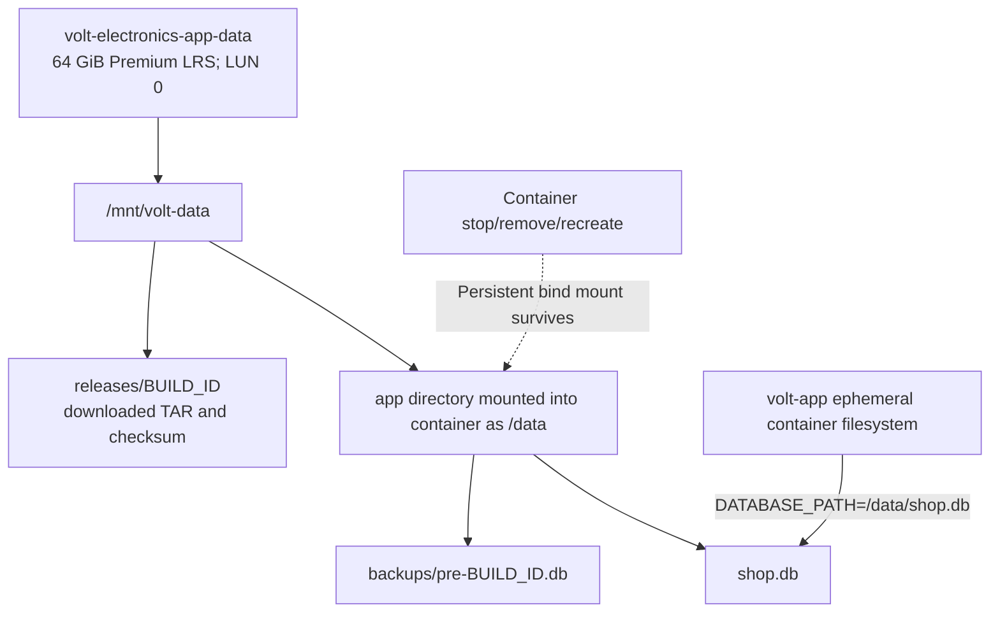

The application is Flask + SQLite, with 12 seeded electronics, filters, comparison, wishlists, accounts, persistent carts, stock-checked atomic checkout, order history and admin fulfillment. Monetary amounts are integer paise. Checkout is a demonstration rather than real payment processing. The data disk survives normal container replacement; this does not protect against accidental data edits, disk loss or site-wide disaster.

## 10. How to run and inspect the pipeline

### 10.1 CI-only validation

1. Open project → Pipelines → pipeline definition 13 (`VoltElectronics`).
2. Choose **Run pipeline** and the intended branch.
3. Leave `deployAzure=false`; choose ephemeral Sonar mode unless a reachable external server and secret token are configured.
4. Queue the run. Inspect Overview for full commit/build identity.
5. Inspect Validate, parallel UnitTests/SonarQube and TrivySource, then packaging/container/image gates.
6. Open Tests and coverage views. Open published artifacts for evidence even when a gate failed.
7. A successful CI-only run produces a scanned image artifact; it does not itself deploy Azure.

### 10.2 Full Azure deployment

1. Verify the replacement connection and matching `volt-devops` trust, required pipeline variables and identity roles.
2. Verify existing state account/container and correct backend key; preserve state during troubleshooting.
3. Confirm regional VM quota, selected SKU availability and host encryption support before deployment.
4. Queue `main`, `deployAzure=true`, with the desired first Sonar mode. Run deployment-enabled builds one at a time.
5. Wait for all CI gates. Inspect Infrastructure's init, plan/apply and exported outputs.
6. Inspect HubSonarQube readiness, analysis and report retrieval. Its failure prevents Release but leaves already-applied infrastructure.
7. Inspect Release checksum/upload and Run Command success marker.
8. Inspect Verify's public URL checks and commit equality.
9. Obtain exact public URL and generated release account from this run's outputs JSON, and retain evidence using project-approved artifact retention.

### 10.3 Read-only commands for exact deployed names

Run these from an appropriately authenticated operator environment when needed; they were not executed as part of writing this document:

```bash
az account show --query '{subscription:id,name:name,user:user.name}' -o json
az resource list --resource-group volt-electronics-rg --query '[].{name:name,type:type}' -o table
az network public-ip show --resource-group volt-electronics-rg --name volt-electronics-app-ip --query ipAddress -o tsv
az identity show --resource-group volt-electronics-tfstate-rg --name volt-electronics-pipeline --query '{clientId:clientId,principalId:principalId}' -o json
az identity federated-credential list --resource-group volt-electronics-tfstate-rg --identity-name volt-electronics-pipeline -o json
az storage blob show --account-name voltstateusc2383fdd --container-name tfstate --name volt-electronics/app.tfstate --auth-mode login --query '{name:name,lastModified:properties.lastModified}' -o json
```

Blob queries also require network access; management access alone is insufficient. Prefer outputs JSON for the exact generated release account rather than guessing a random suffix.

### 10.4 Where to find evidence

Open a run → Summary → Published artifacts. Select the relevant artifact and download. Tests shows JUnit behavior results; coverage shows measured application coverage. Sonar JSON supplies gate/issues/measures; Trivy JSON/SARIF supplies security findings; image metadata supplies the saved image identity. The `download-guide` README helps navigate these locations. The run log and condition details establish whether CD actually executed or skipped.

## 11. Failure handling, recovery and operational limits

### 11.1 Gate and failure matrix

| Failure | What stops | Evidence / next investigation |
|---|---|---|
| Syntax/format/Terraform test | Both downstream validation branches | Validate command and line diagnostics |
| Pytest or coverage <90% | First Sonar and packaging path | Tests XML, HTML coverage, missing lines |
| First Sonar quality gate | BuildPackage | Gate JSON, measures, issues, scanner log |
| Source HIGH/CRITICAL | BuildPackage | Source JSON/SARIF; intentional rule exception context |
| ZIP hash/container assertion | BuildContainer and all later work | Package digest, extracted inputs, build/test output |
| Image HIGH/CRITICAL | Infrastructure/Release path | Image JSON/SARIF and SBOM |
| OIDC trust mismatch | Azure task login/auth | Match current connection subject/issuer/audience; use identity client ID correctly |
| Storage firewall/RBAC | Init or upload/download | Authenticated data-plane probe; region and rule propagation |
| Terraform lease contention | Plan/apply after lock wait | Identify active operation before any lock remediation |
| VM quota/encryption/creation | Infrastructure | Terraform/Azure diagnostic; partial state persists |
| Hub startup or second gate | Release | Run Command logs and hub reports; infrastructure already changed |
| Remote marker missing | Corresponding remote stage | Run Command JSON output; an API invocation alone is not success |
| Existing immutable blob path | Upload fails | Same build prefix was already written; do not silently overwrite evidence |
| VM checksum/download/mount | Release | Managed identity Blob role, SHA256, exact LUN and disk status |
| Local health / public smoke | Release or Verify | Container/Nginx health, network, output IP, commit metadata |
| Download report absent | Evidence may be partial | Producer failed early or skipped; guide cannot manufacture reports |

### 11.2 Recovery flow

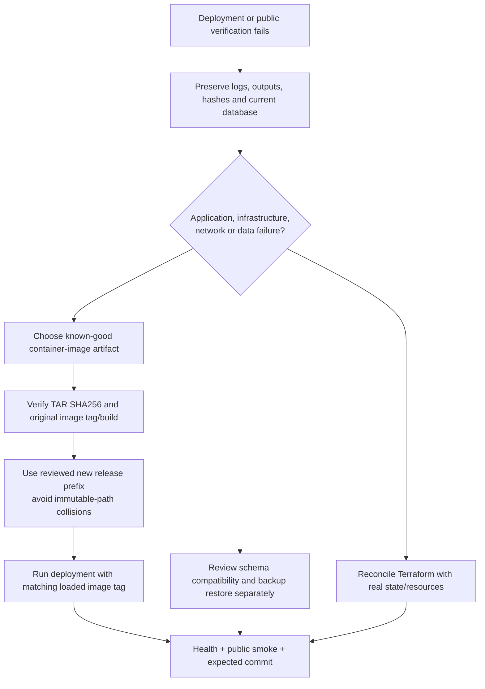

Recovery is an operator workflow, not a built-in rollback job. A recovered TAR retains its original `volt:BUILD_ID` tag; the deployment script constructs that tag from its build argument, so the supplied argument must match the selected archive. A new prefix can be supplied independently of that original build argument. Reusing a backup filename may overwrite or conflict with earlier recovery history; preserve the current database and review the exact script before recovery. Restoring database data is a separate decision from reverting application code.

### 11.3 Implemented limits

- No blue/green, canary or zero-downtime deployment; replacement stops/removes the existing container.
- No automatic application or infrastructure rollback after a failed later gate.
- No whole-release concurrency lock. CI batching and Terraform blob leases do not prevent overlapping manual deployments from replacing each other.
- No YAML `ManualValidation`, deployment-environment approval or service-connection check observed in this session.
- HTTP demo configuration; port 443 allow rule alone does not provide certificates, TLS or secure cookies.
- No real payment/shipping integration, account recovery, rate limiting or production monitoring described by the repository.
- No automated off-host backup schedule or verified disaster-recovery restore in the reviewed pipeline.
- SQLite single-host design; do not infer horizontal scaling support from the VNet layout.
- Source/report extraction is not a fresh runtime audit. Mutable Sonar/scanner tags and package downloads can change; recorded image digests help explain a particular run.
- Temporary firewall cleanup is best effort. Abrupt termination can leave a rule; normal exit traps explicitly attempt removal.
- Release storage has versioning and 30-day soft deletion in Terraform, but script `--overwrite false` is not WORM retention.
- Data disk `prevent_destroy` protects against Terraform-planned deletion while that lifecycle rule applies; it does not supply disaster recovery.

## 12. Source inventory and evidence

The executable YAML overrides simplified narrative diagrams in existing docs when they differ. In particular, the real Downloads dependency list includes all eight CI stages and excludes CD; the current service connection permits any pipeline in the project despite the older setup guide recommending definition 13 only.

Reviewed source includes `azure-pipelines.yml`, Terraform installer template, Dockerfile, Sonar properties, application/network/compute/releases Terraform, all repository deployment and setup scripts, and the project README/pipeline/architecture docs. All reviewed copies used for this file were obtained from the repository's `main` view. The UI was not pinned to one immutable commit during collection; future changes may differ. No private keys, live access tokens, generated admin passwords or Terraform state contents are included.

The appendix is an exact snapshot of the locally captured reviewed files, with SHA256 hashes and original repository-path links. The bootstrap/ci-backend Terraform root files and individual application tests were not copied into the appendix; their responsibilities are described only to the extent established by reviewed callers, docs and modules. Compose YAML and cloud-init were inspected and are included. The main YAML and every invoked script that was captured are included, so the stage task inputs and command bodies remain reviewable.

## 13. Complete source appendix

The following source listings are evidence, not instructions to execute every script. Setup and deployment scripts mutate Azure or disks when run. Use the walkthrough and intended run path rather than executing the appendix indiscriminately.

### 13.1 Step-order diagrams for every job

These diagrams follow top-level task order in the reviewed YAML. The complete code listings below preserve task conditions, compile-time alternatives and all script commands. The two mutually exclusive first-Sonar tasks are represented as a choice label.

#### Overview task order

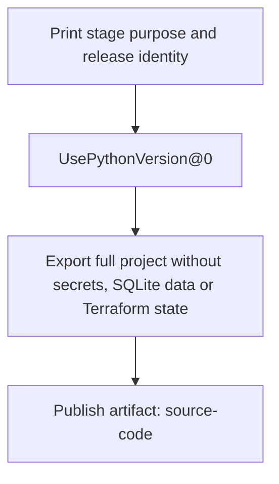

#### Validate task order

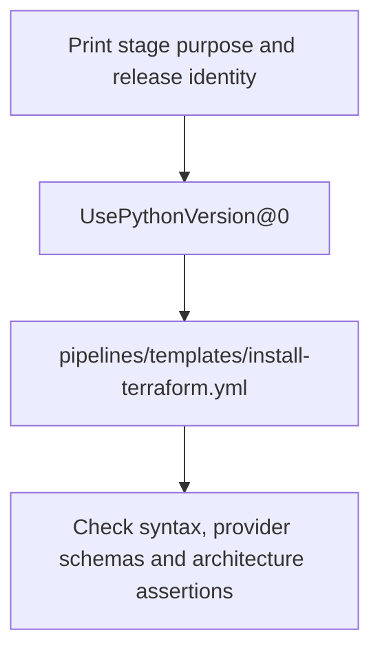

#### UnitTests task order

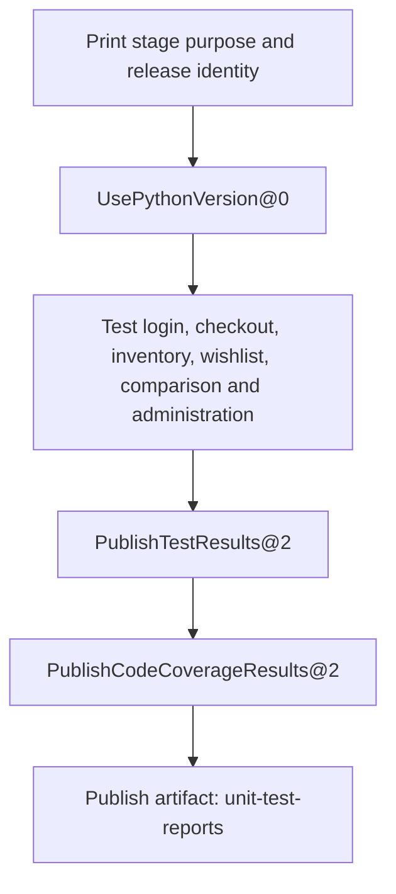

#### SonarQube task order

```mermaid
flowchart TD
  N0["Print stage purpose and release identity"]
  N1["UsePythonVersion@0"]
  N0 --> N1
  N2["Download artifact: unit-test-reports"]
  N1 --> N2
  N3["Restore measured Python coverage"]
  N2 --> N3
  Mode{"sonarMode"}
  N3 --> Mode
  N4["Run isolated SonarQube server, scan and enforce quality gate"]
  Mode -->|ephemeral| N4
  N5["Analyze against configured SonarQube server"]
  Mode -->|external| N5
  N6["Publish artifact: sonarqube-reports"]
  N4 --> N6
  N5 --> N6
```

#### TrivySource task order

```mermaid
flowchart TD
  N0["Print stage purpose and release identity"]
  N1["Fail on HIGH or CRITICAL source findings"]
  N0 --> N1
  N2["Publish artifact: trivy-source-reports"]
  N1 --> N2
```

#### BuildPackage task order

```mermaid
flowchart TD
  N0["Print stage purpose and release identity"]
  N1["UsePythonVersion@0"]
  N0 --> N1
  N2["Package exact commit, metadata and checksum"]
  N1 --> N2
  N3["Publish artifact: application"]
  N2 --> N3
```

#### BuildContainer task order

```mermaid
flowchart TD
  N0["Print stage purpose and release identity"]
  N1["Download artifact: application"]
  N0 --> N1
  N2["Build nonroot image and record SHA256"]
  N1 --> N2
  N3["Publish artifact: container-image"]
  N2 --> N3
```

#### TrivyImage task order

```mermaid
flowchart TD
  N0["Print stage purpose and release identity"]
  N1["Download artifact: container-image"]
  N0 --> N1
  N2["Scan deployable image and export CycloneDX SBOM"]
  N1 --> N2
  N3["Publish artifact: trivy-image-reports"]
  N2 --> N3
```

#### Infrastructure task order

```mermaid
flowchart TD
  N0["Print stage purpose and release identity"]
  N1["pipelines/templates/install-terraform.yml"]
  N0 --> N1
  N2["Apply saved plan with federated Azure identity"]
  N1 --> N2
  N3["Publish artifact: deployment-outputs"]
  N2 --> N3
```

#### HubSonarQube task order

```mermaid
flowchart TD
  N0["Print stage purpose and release identity"]
  N1["Download artifact: deployment-outputs"]
  N0 --> N1
  N2["Download artifact: source-code"]
  N1 --> N2
  N3["Download artifact: unit-test-reports"]
  N2 --> N3
  N4["Analyze verified release source on private hub VM"]
  N3 --> N4
  N5["Publish artifact: hub-sonarqube-reports"]
  N4 --> N5
```

#### Release task order

```mermaid
flowchart TD
  N0["Print stage purpose and release identity"]
  N1["Download artifact: deployment-outputs"]
  N0 --> N1
  N2["Download artifact: container-image"]
  N1 --> N2
  N3["Upload immutable release and deploy using managed identity"]
  N2 --> N3
```

#### Verify task order

```mermaid
flowchart TD
  N0["Print stage purpose and release identity"]
  N1["UsePythonVersion@0"]
  N0 --> N1
  N2["Download artifact: deployment-outputs"]
  N1 --> N2
  N3["Verify public health, catalog, assets and deployed commit"]
  N2 --> N3
```

#### Downloads task order

```mermaid
flowchart TD
  N0["Print stage purpose and release identity"]
  N1["Print artifact downloads and interpretation"]
  N0 --> N1
  N2["Publish artifact: download-guide"]
  N1 --> N2
```

### 13.2 Exact reviewed source listings

| Repository file | SHA256 of captured UTF-8 source |
|---|---|
| `azure-pipelines.yml` | `0ca116542e82480456d7505016941acd4a89b42136c55b59792d1e23f0ca2570` |
| `pipelines/templates/install-terraform.yml` | `df005293be5a63918b00b2c2e9a199ff8f562d2915d75ede84d3f86e6523c01b` |
| `Dockerfile` | `199e68faeda5a0af4e7d90798be988f19a1c0a7afba7c568d7f7d84c96908770` |
| `sonar-project.properties` | `8aea4ead993d50382acc6f6b1985d835534438335ba13857308f06684cfe1b17` |
| `infra/main.tf` | `79ccf81b59596c9e46c3594307731b516a0f95c6b10f9660f767d78280713093` |
| `infra/modules/network/main.tf` | `22c71998442d8edc0ebcd6eed95728e17653cfc184ceccd1764476bf3c1efeee` |
| `infra/modules/compute/main.tf` | `95a32734edca5b57aee69b0ae9b6d4a7faf1a7316f7a978c247dd2ff98c6922f` |
| `infra/modules/releases/main.tf` | `17ff30ac5fd47931dc962bb135a347c025e8b21d5dd1c88f1b795c713ccb152f` |
| `infra/cloud-init/host.yml` | `42c7a977e683eff976043aa4469189da11396b3c3bfcbbb13297349ee7fc8006` |
| `ops/sonarqube-compose.yml` | `0347d8ffb9ae8f95b097c045c667fe1c46bd709ca4d629f84e832740418c5f60` |
| `scripts/agent-storage-access.sh` | `5ad94059ad9f558e5976eafd2eb917387cfd728746c07bd686671127ce4eda98` |
| `scripts/backup.py` | `1ab10b76f7e35a83673431f2e1a73cc7060bd7fce432aa69ab107988114ab77f` |
| `scripts/bootstrap.ps1` | `e7aaf2d8a8eee73e89d97372de332522940451b1d6d7603dd48212e645a404aa` |
| `scripts/create-ci-backend.ps1` | `3e9da9fd382300621d4ce550491efcac17b1ce897b8babcad2dddaceb99b01f7` |
| `scripts/create-federation.ps1` | `79ee82b2316f933fe9706cf588dc93343f4b814471bc9a02f1b2a535987abb37` |
| `scripts/deploy-sonarqube.sh` | `978020985bd13c935287d22d67d2f334af5dd34cb7907a87e889ce78647da3a2` |
| `scripts/deploy-vm.sh` | `f074398910590e3d3bcdf5418e60b7875d0d434e31fa6f37be66f8a6d03bbd4a` |
| `scripts/download_guide.py` | `19ff18389de941f99f410853d647baeb67abdde1d11be4ef08988f94204fa30e` |
| `scripts/package.py` | `d936d815f2c8a0fa3938b8723c01f51cedd7dfd92c2990ebd8b50a58f534bbb4` |
| `scripts/pipeline_summary.py` | `bc2f9da50adebb0d7b2fe88cb5a4996de7690dd04df495fe658a338405aac0ca` |
| `scripts/prepare-host.sh` | `a838cded9922bc87b875e3b52311ca55c1270d5fcf00558ebcb995e4f0de25d8` |
| `scripts/run-vm-command.sh` | `1489b582d47e5aba715079538f0e59f5d2c3db99bf432dba1e2c646fd4df6ce5` |
| `scripts/scan-hub-sonarqube.sh` | `44ed418973983e89086dc9919e3179caf985c34e1909d4f0adc51cb2c9f263bb` |
| `scripts/setup-devops.ps1` | `3c043b678cabb554121bc7912bf327c1c3c2ad3a430f8bb511a91262fce5ec37` |
| `scripts/smoke.py` | `d15b360b699e64da42e977d6d48a016f5a4ac704094fc946a6a9334d1eeccd8f` |
| `scripts/sonar_scan.py` | `865671b5c49defcdbe844916433e3f4209b6374b3a82e4124ecc7480065371fc` |
| `scripts/source_bundle.py` | `ed76a6516041cf7b784e2dfd348d26eb5ad3f6da895e83f0cc8d3bece39a1f61` |
| `scripts/terraform-auth.sh` | `32f3fc4a1351e010086dbeebeb4301d02df94c170e8c07eb4b873ead803d8583` |
| `scripts/trivy-scan.sh` | `867b9e2d190841f0d311630cae68c1d8171eda987ac73eadeb8eea4b35502d4d` |
| `README.md` | `668fd6256541cacc64e69302802990253fb7aefdff1fee9db838748c5447246d` |
| `docs/pipeline.md` | `fc2bf1bcdfb3f6ed3d4716adff4be66158644d4650e8ab0be4964a7fb4a6b17b` |
| `docs/architecture.md` | `2fb5bea7d04890b73d67f33de77a9b34edfdf4ac8e089c1a28b3b1668a249b74` |

#### Source 1: azure-pipelines.yml

[Repository main view](https://dev.azure.com/edukrondevops/VoltElectronics/_git/VoltElectronics?path=/azure-pipelines.yml&version=GBmain)

```yaml
# Azure Repos PR validation is configured through the main branch policy.
# Deployment variables: azureServiceConnection, subscriptionId, appName, azureLocation,
# stateResourceGroup, stateStorageAccount, sshPublicKey (public key only).
name: volt-electronics-$(Date:yyyyMMdd).$(Rev:r)
parameters:
- name: deployAzure
  displayName: Apply Terraform and deploy to Azure (configured federation required)
  type: boolean
  default: false
- name: sonarMode
  displayName: SonarQube server mode
  type: string
  default: ephemeral
  values:
  - ephemeral
  - external
trigger:
  batch: true
  branches:
    include:
    - main
    - feature/*
pool:
  vmImage: ubuntu-24.04
variables:
  pythonVersion: '3.12'
  terraformVersion: 1.9.8
  trivyVersion: 0.75.0
stages:
- stage: Overview
  displayName: 01 · Release context and downloadable source
  dependsOn: []
  jobs:
  - job: Overview
    steps:
    - bash: |-
        set -euo pipefail
        python scripts/pipeline_summary.py Overview
      displayName: Print stage purpose and release identity
      env:
        DEPLOY_REQUESTED: ${{ format('{0}', parameters.deployAzure) }}
    - task: UsePythonVersion@0
      inputs:
        versionSpec: $(pythonVersion)
    - bash: |-
        set -euo pipefail
        python scripts/source_bundle.py "$(Build.ArtifactStagingDirectory)/source/volt-electronics-source.zip"
        printf "Build: %s\nCommit: %s\nSource: %s\n" "$(Build.BuildId)" "$(Build.SourceVersion)" "$(Build.Repository.Uri)"
      displayName: Export full project without secrets, SQLite data or Terraform state
    - publish: $(Build.ArtifactStagingDirectory)/source
      artifact: source-code
- stage: Validate
  displayName: 02 · Validate application and Terraform
  dependsOn:
  - Overview
  jobs:
  - job: Validate
    steps:
    - bash: |-
        set -euo pipefail
        python scripts/pipeline_summary.py Validate
      displayName: Print stage purpose and release identity
      env:
        DEPLOY_REQUESTED: ${{ format('{0}', parameters.deployAzure) }}
    - task: UsePythonVersion@0
      inputs:
        versionSpec: $(pythonVersion)
    - template: pipelines/templates/install-terraform.yml
    - bash: |-
        set -euo pipefail
        python -m compileall -q app.py catalog.py scripts tests
        node --check static/app.js
        terraform fmt -check -recursive infra
        terraform -chdir=infra init -backend=false -lockfile=readonly -input=false
        terraform -chdir=infra validate
        terraform -chdir=infra test
        terraform -chdir=infra/bootstrap init -backend=false -lockfile=readonly -input=false
        terraform -chdir=infra/bootstrap validate
        terraform -chdir=infra/ci-backend init -backend=false -lockfile=readonly -input=false
        terraform -chdir=infra/ci-backend validate
      displayName: Check syntax, provider schemas and architecture assertions
- stage: UnitTests
  displayName: 03 · Unit tests and coverage
  dependsOn:
  - Validate
  jobs:
  - job: UnitTests
    steps:
    - bash: |-
        set -euo pipefail
        python scripts/pipeline_summary.py UnitTests
      displayName: Print stage purpose and release identity
      env:
        DEPLOY_REQUESTED: ${{ format('{0}', parameters.deployAzure) }}
    - task: UsePythonVersion@0
      inputs:
        versionSpec: $(pythonVersion)
    - bash: |-
        set -euo pipefail
        python -m pip install -r requirements-dev.txt
        mkdir -p reports
        python -m pytest tests -v --junitxml=reports/tests.xml --cov=app --cov=catalog --cov-report=xml:reports/coverage.xml --cov-report=html:reports/coverage-html --cov-report=term-missing --cov-fail-under=90
      displayName: Test login, checkout, inventory, wishlist, comparison and administration
    - task: PublishTestResults@2
      condition: succeededOrFailed()
      inputs:
        testResultsFormat: JUnit
        testResultsFiles: reports/tests.xml
        failTaskOnFailedTests: true
        failTaskOnMissingResultsFile: true
        testRunTitle: VOLT ecommerce behavior
    - task: PublishCodeCoverageResults@2
      condition: succeededOrFailed()
      inputs:
        summaryFileLocation: $(System.DefaultWorkingDirectory)/reports/coverage.xml
        pathToSources: $(System.DefaultWorkingDirectory)
        failIfCoverageEmpty: true
    - publish: reports
      artifact: unit-test-reports
      condition: succeededOrFailed()
- stage: SonarQube
  displayName: 04 · SonarQube analysis and quality gate
  dependsOn:
  - UnitTests
  jobs:
  - job: SonarQube
    steps:
    - bash: |-
        set -euo pipefail
        python scripts/pipeline_summary.py SonarQube
      displayName: Print stage purpose and release identity
      env:
        DEPLOY_REQUESTED: ${{ format('{0}', parameters.deployAzure) }}
    - task: UsePythonVersion@0
      inputs:
        versionSpec: $(pythonVersion)
    - download: current
      artifact: unit-test-reports
    - bash: |-
        set -euo pipefail
        mkdir -p reports
        cp "$(Pipeline.Workspace)/unit-test-reports/coverage.xml" reports/coverage.xml
      displayName: Restore measured Python coverage
    - ${{ if eq(parameters.sonarMode, 'ephemeral') }}:
      - bash: |-
          set -euo pipefail
          python scripts/sonar_scan.py --mode ephemeral
        displayName: Run isolated SonarQube server, scan and enforce quality gate
    - ${{ if eq(parameters.sonarMode, 'external') }}:
      - bash: |-
          set -euo pipefail
          python scripts/sonar_scan.py --mode external
        displayName: Analyze against configured SonarQube server
        env:
          SONAR_HOST_URL: $(sonarHostUrl)
          SONAR_TOKEN: $(sonarToken)
    - publish: reports/sonarqube
      artifact: sonarqube-reports
      condition: succeededOrFailed()
- stage: TrivySource
  displayName: 05 · Trivy source, secrets and Terraform scan
  dependsOn:
  - Validate
  jobs:
  - job: TrivySource
    steps:
    - bash: |-
        set -euo pipefail
        python scripts/pipeline_summary.py TrivySource
      displayName: Print stage purpose and release identity
      env:
        DEPLOY_REQUESTED: ${{ format('{0}', parameters.deployAzure) }}
    - bash: |-
        set -euo pipefail
        bash scripts/trivy-scan.sh source
      displayName: Fail on HIGH or CRITICAL source findings
      env:
        TRIVY_VERSION: $(trivyVersion)
    - publish: reports/trivy
      artifact: trivy-source-reports
      condition: succeededOrFailed()
- stage: BuildPackage
  displayName: 06 · Build application ZIP
  dependsOn:
  - SonarQube
  - TrivySource
  jobs:
  - job: BuildPackage
    steps:
    - bash: |-
        set -euo pipefail
        python scripts/pipeline_summary.py BuildPackage
      displayName: Print stage purpose and release identity
      env:
        DEPLOY_REQUESTED: ${{ format('{0}', parameters.deployAzure) }}
    - task: UsePythonVersion@0
      inputs:
        versionSpec: $(pythonVersion)
    - bash: |-
        set -euo pipefail
        python scripts/package.py "$(Build.ArtifactStagingDirectory)/application" --commit "$(Build.SourceVersion)" --build "$(Build.BuildId)"
      displayName: Package exact commit, metadata and checksum
    - publish: $(Build.ArtifactStagingDirectory)/application
      artifact: application
- stage: BuildContainer
  displayName: 07 · Build immutable container
  dependsOn:
  - BuildPackage
  jobs:
  - job: BuildContainer
    steps:
    - bash: |-
        set -euo pipefail
        python scripts/pipeline_summary.py BuildContainer
      displayName: Print stage purpose and release identity
      env:
        DEPLOY_REQUESTED: ${{ format('{0}', parameters.deployAzure) }}
    - download: current
      artifact: application
    - bash: |-
        set -euo pipefail
        cd "$(Pipeline.Workspace)/application"
        sha256sum -c app.zip.sha256
        mkdir -p "$(Agent.TempDirectory)/container-context"
        unzip -q app.zip -d "$(Agent.TempDirectory)/container-context"
        cp "$(Build.SourcesDirectory)/Dockerfile" "$(Agent.TempDirectory)/container-context/Dockerfile"
        docker build --pull --label org.opencontainers.image.revision="$(Build.SourceVersion)" -t "volt:$(Build.BuildId)" "$(Agent.TempDirectory)/container-context"
        docker run --rm --read-only --tmpfs /tmp --tmpfs /data:uid=10001,gid=10001 --entrypoint python "volt:$(Build.BuildId)" -c "import app; c=app.app.test_client(); assert c.get('/health').json['status']=='healthy'; assert len(c.get('/api/products').json)==12; print('PASS: nonroot container SQLite and catalog')"
        mkdir -p "$(Build.ArtifactStagingDirectory)/container-image"
        cd "$(Build.ArtifactStagingDirectory)/container-image"
        docker save "volt:$(Build.BuildId)" -o image.tar
        sha256sum image.tar > image.tar.sha256
        docker image inspect "volt:$(Build.BuildId)" > image-metadata.json
      displayName: Build nonroot image and record SHA256
    - publish: $(Build.ArtifactStagingDirectory)/container-image
      artifact: container-image
- stage: TrivyImage
  displayName: 08 · Trivy container gate and SBOM
  dependsOn:
  - BuildContainer
  jobs:
  - job: TrivyImage
    steps:
    - bash: |-
        set -euo pipefail
        python scripts/pipeline_summary.py TrivyImage
      displayName: Print stage purpose and release identity
      env:
        DEPLOY_REQUESTED: ${{ format('{0}', parameters.deployAzure) }}
    - download: current
      artifact: container-image
    - bash: |-
        set -euo pipefail
        bash scripts/trivy-scan.sh image
      displayName: Scan deployable image and export CycloneDX SBOM
      env:
        TRIVY_VERSION: $(trivyVersion)
        PIPELINE_WORKSPACE: $(Pipeline.Workspace)
        CONTAINER_ARCHIVE: /artifacts/container-image/image.tar
    - publish: reports/trivy
      artifact: trivy-image-reports
      condition: succeededOrFailed()
- ${{ if eq(parameters.deployAzure, true) }}:
  - stage: Infrastructure
    displayName: 09 · Remote state, Terraform plan and apply
    dependsOn:
    - TrivyImage
    jobs:
    - job: Infrastructure
      steps:
      - bash: |-
          set -euo pipefail
          python scripts/pipeline_summary.py Infrastructure
        displayName: Print stage purpose and release identity
        env:
          DEPLOY_REQUESTED: ${{ format('{0}', parameters.deployAzure) }}
      - template: pipelines/templates/install-terraform.yml
      - task: AzureCLI@2
        displayName: Apply saved plan with federated Azure identity
        inputs:
          azureSubscription: $(azureServiceConnection)
          addSpnToEnvironment: true
          scriptType: bash
          scriptLocation: inlineScript
          inlineScript: |-
            set -euo pipefail
            source scripts/terraform-auth.sh
            trap 'bash scripts/agent-storage-access.sh "$STATE_STORAGE_ACCOUNT" "$STATE_RESOURCE_GROUP" remove || true' EXIT
            source scripts/agent-storage-access.sh "$STATE_STORAGE_ACCOUNT" "$STATE_RESOURCE_GROUP" add tfstate
            terraform -chdir=infra init -input=false -lockfile=readonly -backend-config="resource_group_name=$STATE_RESOURCE_GROUP" -backend-config="storage_account_name=$STATE_STORAGE_ACCOUNT" -backend-config="container_name=tfstate" -backend-config="key=volt-electronics/app.tfstate"
            terraform -chdir=infra plan -input=false -lock-timeout=5m -out=deployment.tfplan
            terraform -chdir=infra apply -input=false -lock-timeout=5m deployment.tfplan
            mkdir -p "$(Build.ArtifactStagingDirectory)/deployment"
            terraform -chdir=infra output -json > "$(Build.ArtifactStagingDirectory)/deployment/outputs.json"
        env:
          SUBSCRIPTION_ID: $(subscriptionId)
          APP_NAME: $(appName)
          AZURE_LOCATION: $(azureLocation)
          STATE_RESOURCE_GROUP: $(stateResourceGroup)
          STATE_STORAGE_ACCOUNT: $(stateStorageAccount)
          SSH_PUBLIC_KEY: $(sshPublicKey)
          TF_IN_AUTOMATION: 'true'
      - publish: $(Build.ArtifactStagingDirectory)/deployment
        artifact: deployment-outputs
    condition: and(succeeded(), eq(variables['Build.SourceBranch'], 'refs/heads/main'), ne(variables['Build.Reason'], 'PullRequest'))
  - stage: HubSonarQube
    displayName: 10 · Persistent private hub analysis and quality gate
    dependsOn:
    - Infrastructure
    jobs:
    - job: HubSonarQube
      steps:
      - bash: |-
          set -euo pipefail
          python scripts/pipeline_summary.py HubSonarQube
        displayName: Print stage purpose and release identity
        env:
          DEPLOY_REQUESTED: ${{ format('{0}', parameters.deployAzure) }}
      - download: current
        artifact: deployment-outputs
      - download: current
        artifact: source-code
      - download: current
        artifact: unit-test-reports
      - task: AzureCLI@2
        displayName: Analyze verified release source on private hub VM
        inputs:
          azureSubscription: $(azureServiceConnection)
          addSpnToEnvironment: true
          scriptType: bash
          scriptLocation: inlineScript
          inlineScript: |
            set -euo pipefail
            outputs="$PIPELINE_WORKSPACE/deployment-outputs/outputs.json"
            export RESOURCE_GROUP=$(jq -r .resource_group.value "$outputs")
            export RELEASE_ACCOUNT=$(jq -r .release_storage_account.value "$outputs")
            export RELEASE_PREFIX="builds/$BUILD_ID"
            export VM_NAME=$(jq -r .sonar_vm_name.value "$outputs")
            [[ -n "$VM_NAME" ]] || { echo 'The private SonarQube VM is required for this deployment'; exit 1; }
            mkdir -p "$BUILD_ARTIFACTSTAGINGDIRECTORY/hub-sonarqube" "$AGENT_TEMPDIRECTORY/hub-inputs"
            trap 'bash scripts/agent-storage-access.sh "$RELEASE_ACCOUNT" "$RESOURCE_GROUP" remove || true' EXIT
            source scripts/agent-storage-access.sh "$RELEASE_ACCOUNT" "$RESOURCE_GROUP" add releases
            cp "$PIPELINE_WORKSPACE/source-code/volt-electronics-source.zip" "$AGENT_TEMPDIRECTORY/hub-inputs/source.zip"
            cp "$PIPELINE_WORKSPACE/unit-test-reports/coverage.xml" "$AGENT_TEMPDIRECTORY/hub-inputs/coverage.xml"
            (cd "$AGENT_TEMPDIRECTORY/hub-inputs" && sha256sum source.zip coverage.xml > analysis-inputs.sha256)
            for file in source.zip coverage.xml analysis-inputs.sha256; do
              az storage blob upload --account-name "$RELEASE_ACCOUNT" --container-name releases --name "$RELEASE_PREFIX/$file" --file "$AGENT_TEMPDIRECTORY/hub-inputs/$file" --auth-mode login --overwrite false --output none
            done
            az storage blob upload --account-name "$RELEASE_ACCOUNT" --container-name releases --name "$RELEASE_PREFIX/sonarqube-compose.yml" --file ops/sonarqube-compose.yml --auth-mode login --overwrite false --output none
            export SCRIPT_FILE=scripts/deploy-sonarqube.sh SUCCESS_MARKER=VOLT_SONAR_READY
            bash scripts/run-vm-command.sh
            export SCRIPT_FILE=scripts/scan-hub-sonarqube.sh SUCCESS_MARKER=VOLT_HUB_ANALYSIS_SUCCESS EXPECTED_COMMIT="$BUILD_SOURCEVERSION"
            status=0
            bash scripts/run-vm-command.sh || status=$?
            for report in quality-gate issues measures; do
              az storage blob download --account-name "$RELEASE_ACCOUNT" --container-name releases --name "$RELEASE_PREFIX/hub-sonarqube/$report.json" --file "$BUILD_ARTIFACTSTAGINGDIRECTORY/hub-sonarqube/$report.json" --auth-mode login --overwrite --output none || status=1
            done
            exit "$status"
        env:
          PIPELINE_WORKSPACE: $(Pipeline.Workspace)
          BUILD_ID: $(Build.BuildId)
      - publish: $(Build.ArtifactStagingDirectory)/hub-sonarqube
        artifact: hub-sonarqube-reports
        condition: succeededOrFailed()
      timeoutInMinutes: 60
  - stage: Release
    displayName: 11 · Deploy exact scanned application image
    dependsOn:
    - HubSonarQube
    jobs:
    - job: Release
      steps:
      - bash: |-
          set -euo pipefail
          python scripts/pipeline_summary.py Release
        displayName: Print stage purpose and release identity
        env:
          DEPLOY_REQUESTED: ${{ format('{0}', parameters.deployAzure) }}
      - download: current
        artifact: deployment-outputs
      - download: current
        artifact: container-image
      - task: AzureCLI@2
        displayName: Upload immutable release and deploy using managed identity
        inputs:
          azureSubscription: $(azureServiceConnection)
          addSpnToEnvironment: true
          scriptType: bash
          scriptLocation: inlineScript
          inlineScript: |+
            set -euo pipefail
            outputs="$PIPELINE_WORKSPACE/deployment-outputs/outputs.json"

            export RESOURCE_GROUP=$(jq -r .resource_group.value "$outputs")

            export RELEASE_ACCOUNT=$(jq -r .release_storage_account.value "$outputs")

            export RELEASE_PREFIX="builds/$BUILD_ID"

            trap 'bash scripts/agent-storage-access.sh "$RELEASE_ACCOUNT" "$RESOURCE_GROUP" remove || true' EXIT

            source scripts/agent-storage-access.sh "$RELEASE_ACCOUNT" "$RESOURCE_GROUP" add releases

            cd "$PIPELINE_WORKSPACE/container-image"

            sha256sum -c image.tar.sha256

            cd "$BUILD_SOURCESDIRECTORY"

            for file in image.tar image.tar.sha256; do

              az storage blob upload --account-name "$RELEASE_ACCOUNT" --container-name releases --name "$RELEASE_PREFIX/$file" --file "$PIPELINE_WORKSPACE/container-image/$file" --auth-mode login --overwrite false --output none

            done

            export VM_NAME=$(jq -r .app_vm_name.value "$outputs") SCRIPT_FILE=scripts/deploy-vm.sh SUCCESS_MARKER=VOLT_DEPLOY_SUCCESS

            bash scripts/run-vm-command.sh

        env:
          PIPELINE_WORKSPACE: $(Pipeline.Workspace)
          BUILD_ID: $(Build.BuildId)
      timeoutInMinutes: 60
  - stage: Verify
    displayName: 12 · Public endpoint and release smoke test
    dependsOn:
    - Release
    jobs:
    - job: Verify
      steps:
      - bash: |-
          set -euo pipefail
          python scripts/pipeline_summary.py Verify
        displayName: Print stage purpose and release identity
        env:
          DEPLOY_REQUESTED: ${{ format('{0}', parameters.deployAzure) }}
      - task: UsePythonVersion@0
        inputs:
          versionSpec: $(pythonVersion)
      - download: current
        artifact: deployment-outputs
      - bash: |-
          set -euo pipefail
          url=$(python -c "import json; print(json.load(open('$(Pipeline.Workspace)/deployment-outputs/outputs.json'))['url']['value'])")
          python scripts/smoke.py "$url" --commit "$(Build.SourceVersion)"
        displayName: Verify public health, catalog, assets and deployed commit
- stage: Downloads
  displayName: 13 · Download source and quality reports
  dependsOn:
  - Overview
  - Validate
  - UnitTests
  - SonarQube
  - TrivySource
  - BuildPackage
  - BuildContainer
  - TrivyImage
  jobs:
  - job: Downloads
    steps:
    - bash: |-
        set -euo pipefail
        python scripts/pipeline_summary.py Downloads
      displayName: Print stage purpose and release identity
      env:
        DEPLOY_REQUESTED: ${{ format('{0}', parameters.deployAzure) }}
    - bash: |-
        set -euo pipefail
        mkdir -p "$(Build.ArtifactStagingDirectory)/download-guide"
        python scripts/download_guide.py "$(Build.ArtifactStagingDirectory)/download-guide/README.md"
        echo "##vso[task.uploadsummary]$(Build.ArtifactStagingDirectory)/download-guide/README.md"
      displayName: Print artifact downloads and interpretation
    - publish: $(Build.ArtifactStagingDirectory)/download-guide
      artifact: download-guide
      condition: succeededOrFailed()
  condition: always()
```

#### Source 2: pipelines/templates/install-terraform.yml

[Repository main view](https://dev.azure.com/edukrondevops/VoltElectronics/_git/VoltElectronics?path=/pipelines/templates/install-terraform.yml&version=GBmain)

```yaml
steps:
- bash: |
    set -euo pipefail
    install_directory="$AGENT_TEMPDIRECTORY/volt-electronics-terraform"
    mkdir -p "$install_directory"
    cd "$install_directory"
    archive="terraform_${TF_VERSION}_linux_amd64.zip"
    base="https://releases.hashicorp.com/terraform/${TF_VERSION}"
    curl -fsSLo "$archive" "$base/$archive"
    curl -fsSLo checksums "$base/terraform_${TF_VERSION}_SHA256SUMS"
    grep " ${archive}$" checksums | sha256sum -c -
    unzip -o "$archive" terraform
    chmod +x terraform
    echo "##vso[task.prependpath]$install_directory"
    ./terraform version
  displayName: Install checksum-verified Terraform
  env:
    TF_VERSION: $(terraformVersion)
```

#### Source 3: Dockerfile

[Repository main view](https://dev.azure.com/edukrondevops/VoltElectronics/_git/VoltElectronics?path=/Dockerfile&version=GBmain)

```dockerfile
FROM python:3.12.15-alpine3.24
ENV PYTHONDONTWRITEBYTECODE=1 PYTHONUNBUFFERED=1 DATABASE_PATH=/data/shop.db
WORKDIR /app
RUN apk upgrade --no-cache \
    && addgroup -S -g 10001 volt && adduser -S -D -H -u 10001 -G volt volt \
    && mkdir /data && chown volt:volt /data
COPY requirements.txt .
RUN pip install --no-cache-dir -r requirements.txt
COPY --chown=10001:10001 app.py catalog.py ./
COPY --chown=10001:10001 static ./static
COPY --chown=10001:10001 templates ./templates
USER 10001:10001
EXPOSE 8000
HEALTHCHECK --interval=30s --timeout=5s --start-period=30s CMD python -c "import urllib.request; urllib.request.urlopen('http://127.0.0.1:8000/health',timeout=3)"
CMD ["gunicorn", "--bind", "0.0.0.0:8000", "--workers", "1", "--threads", "1", "--timeout", "60", "app:app"]
```

#### Source 4: sonar-project.properties

[Repository main view](https://dev.azure.com/edukrondevops/VoltElectronics/_git/VoltElectronics?path=/sonar-project.properties&version=GBmain)

```properties
sonar.projectKey=volt-electronics
sonar.projectName=VOLT Electronics
sonar.sources=app.py,catalog.py,static,templates
sonar.tests=tests
sonar.python.version=3.12
sonar.python.coverage.reportPaths=reports/coverage.xml
sonar.exclusions=static/images/**,static/build.json
sonar.sourceEncoding=UTF-8
sonar.qualitygate.wait=true
sonar.qualitygate.timeout=600
```

#### Source 5: infra/main.tf

[Repository main view](https://dev.azure.com/edukrondevops/VoltElectronics/_git/VoltElectronics?path=/infra/main.tf&version=GBmain)

```hcl
terraform {
  required_version = ">= 1.9, < 2.0"
  backend "azurerm" { use_azuread_auth = true }
  required_providers {
    azurerm = { source = "hashicorp/azurerm", version = "~> 4.0" }
    random  = { source = "hashicorp/random", version = "~> 3.6" }
  }
}
provider "azurerm" {
  features {}
  resource_provider_registrations = "none"
  storage_use_azuread             = true
  subscription_id                 = var.subscription_id
}
variable "subscription_id" { type = string }
variable "trusted_public_ips" {
  type        = list(string)
  default     = []
  description = "Explicit public IPv4 addresses for deployment upload; VM access uses subnet service endpoints."
}
variable "location" {
  type    = string
  default = "eastus"
}
variable "app_name" {
  type    = string
  default = "volt-electronics"
}
variable "ssh_public_key" {
  type        = string
  description = "SSH public key only. Management uses Azure Run Command; no Internet SSH is permitted."
}
variable "app_vm_size" {
  type    = string
  default = "Standard_D2s_v4"
}
variable "sonar_vm_size" {
  type    = string
  default = "Standard_D2s_v4"
}
variable "enable_sonar_vm" {
  type    = bool
  default = true
}
resource "azurerm_resource_group" "platform" {
  name     = "${var.app_name}-rg"
  location = var.location
  tags     = { application = "volt", environment = "demo", managed_by = "terraform" }
}
module "network" {
  source              = "./modules/network"
  name                = var.app_name
  resource_group_name = azurerm_resource_group.platform.name
  location            = var.location
}
module "application" {
  source              = "./modules/compute"
  name                = "${var.app_name}-app"
  resource_group_name = azurerm_resource_group.platform.name
  location            = var.location
  subnet_id           = module.network.app_subnet_id
  public_endpoint     = true
  vm_size             = var.app_vm_size
  ssh_public_key      = var.ssh_public_key
  cloud_init          = file("${path.module}/cloud-init/host.yml")
}
module "sonarqube" {
  count               = var.enable_sonar_vm ? 1 : 0
  source              = "./modules/compute"
  name                = "${var.app_name}-sonar"
  resource_group_name = azurerm_resource_group.platform.name
  location            = var.location
  subnet_id           = module.network.hub_subnet_id
  public_endpoint     = false
  vm_size             = var.sonar_vm_size
  ssh_public_key      = var.ssh_public_key
  cloud_init          = file("${path.module}/cloud-init/host.yml")
  depends_on          = [module.network]
}
module "releases" {
  source              = "./modules/releases"
  resource_group_name = azurerm_resource_group.platform.name
  location            = var.location
  app_principal_id    = module.application.principal_id
  resource_group_id   = azurerm_resource_group.platform.id
  subnet_ids          = [module.network.app_subnet_id, module.network.hub_subnet_id]
  trusted_public_ips  = var.trusted_public_ips
  sonar_principal_id  = var.enable_sonar_vm ? module.sonarqube[0].principal_id : null
  enable_sonar        = var.enable_sonar_vm
}
output "url" { value = "http://${module.application.public_ip}" }
output "public_ip" { value = module.application.public_ip }
output "resource_group" { value = azurerm_resource_group.platform.name }
output "app_vm_name" { value = module.application.vm_name }
output "release_storage_account" { value = module.releases.storage_account_name }
output "sonar_vm_name" { value = var.enable_sonar_vm ? module.sonarqube[0].vm_name : "" }
output "sonarqube_private_url" { value = var.enable_sonar_vm ? "http://${module.sonarqube[0].private_ip}:9000" : "" }
```

#### Source 6: infra/modules/network/main.tf

[Repository main view](https://dev.azure.com/edukrondevops/VoltElectronics/_git/VoltElectronics?path=/infra/modules/network/main.tf&version=GBmain)

```hcl
variable "name" { type = string }
variable "resource_group_name" { type = string }
variable "location" { type = string }
resource "azurerm_virtual_network" "hub" {
  name                = "${var.name}-hub-vnet"
  resource_group_name = var.resource_group_name
  location            = var.location
  address_space       = ["10.10.0.0/16"]
}
resource "azurerm_subnet" "shared" {
  name                 = "shared-services"
  resource_group_name  = var.resource_group_name
  virtual_network_name = azurerm_virtual_network.hub.name
  address_prefixes     = ["10.10.1.0/24"]
  service_endpoints    = ["Microsoft.Storage"]
}
resource "azurerm_virtual_network" "spoke" {
  for_each            = { app = "10.20.0.0/16", operations = "10.30.0.0/16" }
  name                = "${var.name}-${each.key}-spoke-vnet"
  resource_group_name = var.resource_group_name
  location            = var.location
  address_space       = [each.value]
}
resource "azurerm_subnet" "spoke" {
  for_each             = { app = "10.20.1.0/24", operations = "10.30.1.0/24" }
  name                 = "${each.key}-workloads"
  resource_group_name  = var.resource_group_name
  virtual_network_name = azurerm_virtual_network.spoke[each.key].name
  address_prefixes     = [each.value]
  service_endpoints    = ["Microsoft.Storage"]
}
resource "azurerm_virtual_network_peering" "hub_to_spoke" {
  for_each                     = azurerm_virtual_network.spoke
  name                         = "hub-to-${each.key}"
  resource_group_name          = var.resource_group_name
  virtual_network_name         = azurerm_virtual_network.hub.name
  remote_virtual_network_id    = each.value.id
  allow_virtual_network_access = true
  allow_forwarded_traffic      = false
  allow_gateway_transit        = false
}
resource "azurerm_virtual_network_peering" "spoke_to_hub" {
  for_each                     = azurerm_virtual_network.spoke
  name                         = "${each.key}-to-hub"
  resource_group_name          = var.resource_group_name
  virtual_network_name         = each.value.name
  remote_virtual_network_id    = azurerm_virtual_network.hub.id
  allow_virtual_network_access = true
  allow_forwarded_traffic      = false
  use_remote_gateways          = false
}
resource "azurerm_network_security_group" "application" {
  name                = "${var.name}-app-nsg"
  resource_group_name = var.resource_group_name
  location            = var.location
}
# trivy:ignore:AVD-AZU-0047 Public HTTP/HTTPS is the requested demonstration endpoint; Internet SSH is not allowed.
resource "azurerm_network_security_rule" "public_web" {
  name                        = "PublicWeb"
  resource_group_name         = var.resource_group_name
  network_security_group_name = azurerm_network_security_group.application.name
  priority                    = 100
  direction                   = "Inbound"
  access                      = "Allow"
  protocol                    = "Tcp"
  source_port_range           = "*"
  destination_port_ranges     = ["80", "443"]
  source_address_prefix       = "Internet"
  destination_address_prefix  = "*"
}
resource "azurerm_network_security_rule" "deny_other_inbound" {
  name                        = "DenyOtherInbound"
  resource_group_name         = var.resource_group_name
  network_security_group_name = azurerm_network_security_group.application.name
  priority                    = 4000
  direction                   = "Inbound"
  access                      = "Deny"
  protocol                    = "*"
  source_port_range           = "*"
  destination_port_range      = "*"
  source_address_prefix       = "*"
  destination_address_prefix  = "*"
}
resource "azurerm_subnet_network_security_group_association" "application" {
  subnet_id                 = azurerm_subnet.spoke["app"].id
  network_security_group_id = azurerm_network_security_group.application.id
}
resource "azurerm_network_security_group" "shared" {
  name                = "${var.name}-shared-nsg"
  resource_group_name = var.resource_group_name
  location            = var.location
}
resource "azurerm_network_security_rule" "private_sonar" {
  name                        = "PrivateSonar"
  resource_group_name         = var.resource_group_name
  network_security_group_name = azurerm_network_security_group.shared.name
  priority                    = 100
  direction                   = "Inbound"
  access                      = "Allow"
  protocol                    = "Tcp"
  source_port_range           = "*"
  destination_port_range      = "9000"
  source_address_prefixes     = ["10.10.0.0/16", "10.20.0.0/16", "10.30.0.0/16"]
  destination_address_prefix  = "*"
}
resource "azurerm_network_security_rule" "shared_deny" {
  name                        = "DenyOtherInbound"
  resource_group_name         = var.resource_group_name
  network_security_group_name = azurerm_network_security_group.shared.name
  priority                    = 4000
  direction                   = "Inbound"
  access                      = "Deny"
  protocol                    = "*"
  source_port_range           = "*"
  destination_port_range      = "*"
  source_address_prefix       = "*"
  destination_address_prefix  = "*"
}
resource "azurerm_subnet_network_security_group_association" "shared" {
  subnet_id                 = azurerm_subnet.shared.id
  network_security_group_id = azurerm_network_security_group.shared.id
}
resource "azurerm_public_ip" "nat" {
  name                = "${var.name}-hub-egress-ip"
  resource_group_name = var.resource_group_name
  location            = var.location
  allocation_method   = "Static"
  sku                 = "Standard"
}
resource "azurerm_nat_gateway" "hub" {
  name                = "${var.name}-hub-egress"
  resource_group_name = var.resource_group_name
  location            = var.location
  sku_name            = "Standard"
}
resource "azurerm_nat_gateway_public_ip_association" "hub" {
  nat_gateway_id       = azurerm_nat_gateway.hub.id
  public_ip_address_id = azurerm_public_ip.nat.id
}
resource "azurerm_subnet_nat_gateway_association" "shared" {
  subnet_id      = azurerm_subnet.shared.id
  nat_gateway_id = azurerm_nat_gateway.hub.id
}
output "app_subnet_id" { value = azurerm_subnet.spoke["app"].id }
output "hub_subnet_id" { value = azurerm_subnet.shared.id }
```

#### Source 7: infra/modules/compute/main.tf

[Repository main view](https://dev.azure.com/edukrondevops/VoltElectronics/_git/VoltElectronics?path=/infra/modules/compute/main.tf&version=GBmain)

```hcl
variable "name" { type = string }
variable "resource_group_name" { type = string }
variable "location" { type = string }
variable "subnet_id" { type = string }
variable "vm_size" { type = string }
variable "ssh_public_key" { type = string }
variable "cloud_init" { type = string }
variable "public_endpoint" { type = bool }
resource "azurerm_public_ip" "web" {
  count               = var.public_endpoint ? 1 : 0
  name                = "${var.name}-ip"
  resource_group_name = var.resource_group_name
  location            = var.location
  allocation_method   = "Static"
  sku                 = "Standard"
}
resource "azurerm_network_interface" "vm" {
  name                = "${var.name}-nic"
  resource_group_name = var.resource_group_name
  location            = var.location
  ip_configuration {
    name                          = "private"
    subnet_id                     = var.subnet_id
    private_ip_address_allocation = "Dynamic"
    public_ip_address_id          = var.public_endpoint ? azurerm_public_ip.web[0].id : null
  }
}
resource "azurerm_linux_virtual_machine" "vm" {
  name                                                   = var.name
  resource_group_name                                    = var.resource_group_name
  location                                               = var.location
  size                                                   = var.vm_size
  admin_username                                         = "voltadmin"
  network_interface_ids                                  = [azurerm_network_interface.vm.id]
  disable_password_authentication                        = true
  disk_controller_type                                   = "SCSI"
  encryption_at_host_enabled                             = true
  patch_mode                                             = "AutomaticByPlatform"
  bypass_platform_safety_checks_on_user_schedule_enabled = true
  custom_data                                            = base64encode(var.cloud_init)
  # Cloud-init runs only at first boot. Software releases are managed by Run Command.
  # Ignore template text differences to preserve VM identity and attached data disks.
  lifecycle { ignore_changes = [custom_data] }
  identity { type = "SystemAssigned" }
  admin_ssh_key {
    username   = "voltadmin"
    public_key = var.ssh_public_key
  }
  os_disk {
    caching              = "ReadWrite"
    storage_account_type = "Premium_LRS"
    disk_size_gb         = 32
  }
  source_image_reference {
    publisher = "Canonical"
    offer     = "ubuntu-24_04-lts"
    sku       = "server"
    version   = "latest"
  }
  boot_diagnostics {}
}
resource "azurerm_managed_disk" "data" {
  name                 = "${var.name}-data"
  resource_group_name  = var.resource_group_name
  location             = var.location
  storage_account_type = "Premium_LRS"
  create_option        = "Empty"
  disk_size_gb         = 64
  lifecycle { prevent_destroy = true }
}
resource "azurerm_virtual_machine_data_disk_attachment" "data" {
  managed_disk_id    = azurerm_managed_disk.data.id
  virtual_machine_id = azurerm_linux_virtual_machine.vm.id
  lun                = 0
  caching            = "None"
}
output "vm_name" { value = azurerm_linux_virtual_machine.vm.name }
output "principal_id" { value = azurerm_linux_virtual_machine.vm.identity[0].principal_id }
output "private_ip" { value = azurerm_network_interface.vm.private_ip_address }
output "public_ip" { value = var.public_endpoint ? azurerm_public_ip.web[0].ip_address : "" }
```

#### Source 8: infra/modules/releases/main.tf

[Repository main view](https://dev.azure.com/edukrondevops/VoltElectronics/_git/VoltElectronics?path=/infra/modules/releases/main.tf&version=GBmain)

```hcl
variable "resource_group_name" { type = string }
variable "resource_group_id" { type = string }
data "azurerm_client_config" "current" {}
variable "location" { type = string }
variable "subnet_ids" { type = list(string) }
variable "trusted_public_ips" { type = list(string) }
variable "app_principal_id" { type = string }
variable "sonar_principal_id" {
  type    = string
  default = null
}
variable "enable_sonar" {
  type    = bool
  default = false
}
resource "random_string" "suffix" {
  length  = 10
  upper   = false
  special = false
}
resource "azurerm_storage_account" "release" {
  depends_on                      = [azurerm_role_assignment.uploader]
  name                            = "volt${random_string.suffix.result}"
  resource_group_name             = var.resource_group_name
  location                        = var.location
  account_tier                    = "Standard"
  account_replication_type        = "LRS"
  min_tls_version                 = "TLS1_2"
  shared_access_key_enabled       = false
  allow_nested_items_to_be_public = false
  network_rules {
    default_action             = "Deny"
    bypass                     = ["AzureServices"]
    ip_rules                   = var.trusted_public_ips
    virtual_network_subnet_ids = var.subnet_ids
  }
  blob_properties {
    versioning_enabled = true
    delete_retention_policy { days = 30 }
  }
}
resource "azurerm_storage_container" "release" {
  name                  = "releases"
  storage_account_id    = azurerm_storage_account.release.id
  container_access_type = "private"
}
resource "azurerm_role_assignment" "app" {
  scope                = azurerm_storage_account.release.id
  role_definition_name = "Storage Blob Data Reader"
  principal_id         = var.app_principal_id
}
resource "azurerm_role_assignment" "uploader" {
  scope                = var.resource_group_id
  role_definition_name = "Storage Blob Data Contributor"
  principal_id         = data.azurerm_client_config.current.object_id
}
resource "azurerm_role_assignment" "sonar" {
  count                = var.enable_sonar ? 1 : 0
  scope                = azurerm_storage_account.release.id
  role_definition_name = "Storage Blob Data Contributor"
  principal_id         = var.sonar_principal_id
}
output "storage_account_name" { value = azurerm_storage_account.release.name }
```

#### Source 9: infra/cloud-init/host.yml

[Repository main view](https://dev.azure.com/edukrondevops/VoltElectronics/_git/VoltElectronics?path=/infra/cloud-init/host.yml&version=GBmain)

```yaml
#cloud-config
package_update: true
packages:
  - docker.io
  - docker-compose-v2
  - nginx
  - unzip
  - python3
  - curl
  - jq
write_files:
  - path: /etc/sysctl.d/99-sonarqube.conf
    content: |
      vm.max_map_count=524288
  - path: /etc/docker/daemon.json
    content: |
      {"data-root":"/mnt/volt-data/docker","log-driver":"json-file","log-opts":{"max-size":"10m","max-file":"3"}}
runcmd:
  - systemctl stop docker
  - sysctl --system
  - curl -sL https://aka.ms/InstallAzureCLIDeb | bash
  - systemctl enable docker
  - systemctl disable --now nginx
final_message: "VOLT host packages installed; deployment mounts the managed data disk before starting containers."
```

#### Source 10: ops/sonarqube-compose.yml

[Repository main view](https://dev.azure.com/edukrondevops/VoltElectronics/_git/VoltElectronics?path=/ops/sonarqube-compose.yml&version=GBmain)

```yaml
services:
  db:
    image: postgres:17-alpine
    restart: unless-stopped
    environment:
      POSTGRES_USER: sonar
      POSTGRES_PASSWORD: ${SONAR_DB_PASSWORD:?Set SONAR_DB_PASSWORD}
      POSTGRES_DB: sonar
    volumes:
      - sonar_postgres:/var/lib/postgresql/data
    healthcheck:
      test: [CMD-SHELL, 'pg_isready -U sonar']
      interval: 10s
      retries: 10
  sonarqube:
    image: sonarqube:community
    restart: unless-stopped
    depends_on:
      db:
        condition: service_healthy
    environment:
      SONAR_JDBC_URL: jdbc:postgresql://db:5432/sonar
      SONAR_JDBC_USERNAME: sonar
      SONAR_JDBC_PASSWORD: ${SONAR_DB_PASSWORD:?Set SONAR_DB_PASSWORD}
    ports:
      - '${SONAR_BIND_IP:-127.0.0.1}:9000:9000'
    volumes:
      - sonar_data:/opt/sonarqube/data
      - sonar_extensions:/opt/sonarqube/extensions
      - sonar_logs:/opt/sonarqube/logs
volumes:
  sonar_postgres:
  sonar_data:
  sonar_extensions:
  sonar_logs:
```

#### Source 11: scripts/agent-storage-access.sh

[Repository main view](https://dev.azure.com/edukrondevops/VoltElectronics/_git/VoltElectronics?path=/scripts/agent-storage-access.sh&version=GBmain)

```bash
#!/usr/bin/env bash
# Temporarily permit this job's IPv4; verify data-plane reachability before deployment.
set -euo pipefail
account=${1:?Storage account required}
group=${2:?Resource group required}
action=${3:-add}
container=${4:-releases}
ip=${VOLT_AGENT_IP:-$(curl -4 --fail --silent --show-error https://api.ipify.org)}
[[ "$ip" =~ ^[0-9]{1,3}(\.[0-9]{1,3}){3}$ ]] || { echo 'Cannot determine agent IPv4'; exit 1; }
export VOLT_AGENT_IP="$ip"
az storage account network-rule "$action" --account-name "$account" --resource-group "$group" --ip-address "$ip" --output none
if [[ "$action" == add ]]; then
  region=$(az storage account show --name "$account" --resource-group "$group" --query location -o tsv)
  echo "Storage account region: $region; waiting for authenticated data-plane access."
  for attempt in $(seq 1 24); do
    if az storage blob list --account-name "$account" --container-name "$container" --auth-mode login --num-results 1 --output none --only-show-errors; then
      echo 'Storage firewall and Blob RBAC access verified.'
      exit_status=0
      break
    fi
    exit_status=1
    sleep 10
  done
  [[ "${exit_status:-1}" == 0 ]] || { echo 'Storage access is blocked. Check same-region restrictions, firewall propagation and Blob RBAC.'; return 1 2>/dev/null || exit 1; }
fi
```

#### Source 12: scripts/backup.py

[Repository main view](https://dev.azure.com/edukrondevops/VoltElectronics/_git/VoltElectronics?path=/scripts/backup.py&version=GBmain)

```python
"""Create a consistent SQLite snapshot, including a database currently in use."""
import argparse
import sqlite3
from pathlib import Path

parser=argparse.ArgumentParser()
parser.add_argument('source')
parser.add_argument('destination')
args=parser.parse_args()
if not Path(args.source).is_file():
    parser.error('Source database does not exist')
if Path(args.destination).exists():
    parser.error('Destination exists; use a new backup filename')
Path(args.destination).parent.mkdir(parents=True,exist_ok=True)
with sqlite3.connect(f'{Path(args.source).resolve().as_uri()}?mode=ro',uri=True) as source:
    with sqlite3.connect(args.destination) as destination:
        source.backup(destination)
print(f'Backup created: {args.destination}')
```

#### Source 13: scripts/bootstrap.ps1

[Repository main view](https://dev.azure.com/edukrondevops/VoltElectronics/_git/VoltElectronics?path=/scripts/bootstrap.ps1&version=GBmain)

```powershell
param([Parameter(Mandatory)][string]$SubscriptionId,[Parameter(Mandatory)][string]$StorageName,[string]$Location='centralindia')
$ErrorActionPreference='Stop'
function Assert-Success { if ($LASTEXITCODE -ne 0) { throw 'Command failed; stopping bootstrap.' } }
$bootstrapIdentity = az account show --query user.name -o tsv
Assert-Success
if ($bootstrapIdentity.Trim().ToLowerInvariant() -ne 'giftzee.online@gmail.com') { throw 'Sign in as giftzee.online@gmail.com before provisioning.' }
$bootstrapPublicIp = (Invoke-RestMethod https://api.ipify.org).Trim()
if ($bootstrapPublicIp -notmatch '^\d{1,3}(\.\d{1,3}){3}$') { throw 'A public IPv4 address is required for the backend firewall.' }
$env:TF_VAR_trusted_public_ips = ConvertTo-Json -Compress -InputObject @($bootstrapPublicIp)
az account set --subscription $SubscriptionId
Assert-Success
foreach ($bootstrapProvider in @('Microsoft.Resources','Microsoft.Storage','Microsoft.Authorization','Microsoft.Network','Microsoft.Compute','Microsoft.ManagedIdentity')) {
  az provider register --namespace $bootstrapProvider
  Assert-Success
}
terraform -chdir=infra/bootstrap init
Assert-Success
terraform -chdir=infra/bootstrap apply "-var=subscription_id=$SubscriptionId" "-var=storage_name=$StorageName" "-var=location=$Location" -auto-approve
Assert-Success
# Data-plane RBAC propagation can take several minutes. Re-run the next command if needed.
az storage container create --account-name $StorageName --name tfstate --auth-mode login
Assert-Success
@"
resource_group_name = "volt-electronics-tfstate-rg"
storage_account_name = "$StorageName"
container_name = "tfstate"
key = "volt-electronics/app.tfstate"
use_azuread_auth = true
"@ | Set-Content infra/backend.hcl
terraform -chdir=infra init '-backend-config=backend.hcl'
Assert-Success
# Preserve the bootstrap state in its own remote key after the backend exists.
@'
terraform {
  backend "azurerm" {}
}
'@ | Set-Content infra/bootstrap/backend.tf
terraform -chdir=infra/bootstrap init -migrate-state -force-copy -backend-config="resource_group_name=volt-electronics-tfstate-rg" -backend-config="storage_account_name=$StorageName" -backend-config="container_name=tfstate" -backend-config="key=volt-electronics/bootstrap.tfstate" -backend-config="use_azuread_auth=true"
Assert-Success
```

#### Source 14: scripts/create-ci-backend.ps1

[Repository main view](https://dev.azure.com/edukrondevops/VoltElectronics/_git/VoltElectronics?path=/scripts/create-ci-backend.ps1&version=GBmain)

```powershell
param(
  [string]$SubscriptionId='c2383fdd-26a3-44a8-9d61-2c7f2e1e08bf',
  [string]$BootstrapStorage='voltstatec2383fdd',
  [string]$StorageName='voltstateusc2383fdd',
  [string]$Location='eastus',
  [string]$PipelinePrincipalId=''
)
$ErrorActionPreference='Stop'
function Check-Command { if ($LASTEXITCODE -ne 0) { throw 'Backend command failed; migration stopped.' } }
$account=az account show -o json | ConvertFrom-Json
Check-Command
if ($account.user.name -ne 'giftzee.online@gmail.com' -or $account.id -ne $SubscriptionId) { throw 'Select the Giftzee account and subscription first.' }
if (-not $PipelinePrincipalId) {
  $PipelinePrincipalId=az identity show --name volt-electronics-pipeline --resource-group volt-electronics-tfstate-rg --query principalId -o tsv
  Check-Command
}
$operatorIp=(Invoke-RestMethod https://api.ipify.org).Trim()
$env:TF_VAR_subscription_id=$SubscriptionId
$env:TF_VAR_storage_name=$StorageName
$env:TF_VAR_location=$Location
$env:TF_VAR_pipeline_principal_id=$PipelinePrincipalId
$env:TF_VAR_trusted_public_ips=ConvertTo-Json -Compress -InputObject @($operatorIp)
az storage account network-rule add --account-name $BootstrapStorage --resource-group volt-electronics-tfstate-rg --ip-address $operatorIp -o none
Check-Command
@"
resource_group_name = "volt-electronics-tfstate-rg"
storage_account_name = "$BootstrapStorage"
container_name = "tfstate"
key = "volt-electronics/ci-backend.tfstate"
use_azuread_auth = true
"@ | Set-Content infra/ci-backend/backend.hcl
terraform -chdir=infra/ci-backend init '-backend-config=backend.hcl' -input=false
Check-Command
terraform -chdir=infra/ci-backend plan '-out=backend.tfplan' -input=false
Check-Command
terraform -chdir=infra/ci-backend apply -input=false backend.tfplan
Check-Command
@"
resource_group_name = "volt-electronics-tfstate-rg"
storage_account_name = "$StorageName"
container_name = "tfstate"
key = "volt-electronics/app.tfstate"
use_azuread_auth = true
"@ | Set-Content infra/backend.hcl
# Copy state through Terraform's migration flow; the original account is retained.
terraform -chdir=infra init -migrate-state -force-copy '-backend-config=backend.hcl' -input=false
Check-Command
Write-Host 'Protected CI backend created and application state migrated. Update pipeline stateStorageAccount to the new account.'
```

#### Source 15: scripts/create-federation.ps1

[Repository main view](https://dev.azure.com/edukrondevops/VoltElectronics/_git/VoltElectronics?path=/scripts/create-federation.ps1&version=GBmain)

```powershell
param(
  [string]$Organization='https://dev.azure.com/edukrondevops',
  [string]$Project='VoltElectronics',
  [int]$PipelineId=13,
  [string]$SubscriptionId='c2383fdd-26a3-44a8-9d61-2c7f2e1e08bf',
  [string]$Location='centralindia',
  [string]$AppResourceGroup='volt-electronics-rg',
  [string]$StateResourceGroup='volt-electronics-tfstate-rg',
  [string]$StateStorageAccount='voltstatec2383fdd'
)
$ErrorActionPreference='Stop'
function Check-Azure { if ($LASTEXITCODE -ne 0) { throw 'Azure/DevOps command failed; stopping federation setup.' } }
$account = az account show -o json | ConvertFrom-Json
Check-Azure
if ($account.user.name -ne 'giftzee.online@gmail.com' -or $account.id -ne $SubscriptionId) { throw 'Select the intended Giftzee account and subscription first.' }
$identityName='volt-electronics-pipeline'
$connectionName='volt-electronics-azure-wif'
$identity=az identity create --name $identityName --resource-group $StateResourceGroup --location $Location -o json | ConvertFrom-Json
Check-Azure
$projectId=az devops project show --organization $Organization --project $Project --query id -o tsv
Check-Azure
$connections=az devops service-endpoint list --organization $Organization --project $Project -o json | ConvertFrom-Json
Check-Azure
$connection=$connections | Where-Object name -eq $connectionName | Select-Object -First 1
if (-not $connection) {
  $configuration=@{
    name=$connectionName; type='AzureRM'; url='https://management.azure.com/'; isShared=$false; isReady=$true
    data=@{subscriptionId=$SubscriptionId;subscriptionName=$account.name;environment='AzureCloud';scopeLevel='Subscription';creationMode='Manual'}
    authorization=@{scheme='WorkloadIdentityFederation';parameters=@{tenantid=$account.tenantId;serviceprincipalid=$identity.clientId}}
    serviceEndpointProjectReferences=@(@{projectReference=@{id=$projectId;name=$Project};name=$connectionName})
  }
  $temporaryConfig=Join-Path $env:TEMP ('volt-service-connection-'+[guid]::NewGuid()+'.json')
  $configuration | ConvertTo-Json -Depth 12 | Set-Content $temporaryConfig
  try {
    $connection=az devops service-endpoint create --organization $Organization --project $Project --service-endpoint-configuration $temporaryConfig -o json | ConvertFrom-Json
    Check-Azure
  } finally { Remove-Item -LiteralPath $temporaryConfig -ErrorAction SilentlyContinue }
}
$parameters=$connection.authorization.parameters
if (-not $parameters.workloadIdentityFederationIssuer -or -not $parameters.workloadIdentityFederationSubject) { throw 'Azure DevOps did not return federation claims.' }
az identity federated-credential create --name volt-devops --identity-name $identityName --resource-group $StateResourceGroup --issuer $parameters.workloadIdentityFederationIssuer --subject $parameters.workloadIdentityFederationSubject --audiences api://AzureADTokenExchange -o none
Check-Azure
# Resource management is limited to the two project resource groups.
$stateScope="/subscriptions/$SubscriptionId/resourceGroups/$StateResourceGroup"
$appScope="/subscriptions/$SubscriptionId/resourceGroups/$AppResourceGroup"
foreach ($assignment in @(@{role='Contributor';scope=$stateScope},@{role='Storage Blob Data Contributor';scope="$stateScope/providers/Microsoft.Storage/storageAccounts/$StateStorageAccount"},@{role='Contributor';scope=$appScope},@{role='Storage Blob Data Reader';scope=$appScope},@{role='Role Based Access Control Administrator';scope=$appScope})) {
  az role assignment create --assignee-object-id $identity.principalId --assignee-principal-type ServicePrincipal --role $assignment.role --scope $assignment.scope -o none
  Check-Azure
}
$permissionFile=Join-Path $env:TEMP ('volt-pipeline-permission-'+[guid]::NewGuid()+'.json')
@{pipelines=@(@{id=$PipelineId;authorized=$true})} | ConvertTo-Json -Depth 6 | Set-Content $permissionFile
try {
  az devops invoke --organization $Organization --area pipelinePermissions --resource pipelinePermissions --route-parameters project=$Project resourceType=endpoint "resourceId=$($connection.id)" --http-method PATCH --in-file $permissionFile --api-version 7.1-preview -o none
  Check-Azure
} finally { Remove-Item -LiteralPath $permissionFile -ErrorAction SilentlyContinue }
Write-Host "Federated connection configured: $connectionName; only pipeline $PipelineId is authorized."
```

#### Source 16: scripts/deploy-sonarqube.sh

[Repository main view](https://dev.azure.com/edukrondevops/VoltElectronics/_git/VoltElectronics?path=/scripts/deploy-sonarqube.sh&version=GBmain)

```bash
#!/usr/bin/env bash
set -euo pipefail
account=$1
release=$2
build=$3
cloud-init status --wait
for attempt in $(seq 1 120); do [[ -b /dev/disk/azure/scsi1/lun0 ]] && break; sleep 5; done
systemctl stop docker
disk=$(readlink -f /dev/disk/azure/scsi1/lun0)
[[ -b "$disk" ]] || exit 1
mkdir -p /mnt/volt-data
if ! mountpoint -q /mnt/volt-data; then
  if ! blkid "$disk" >/dev/null; then mkfs.ext4 -F "$disk"; fi
  uuid=$(blkid -s UUID -o value "$disk")
  grep -q "UUID=$uuid " /etc/fstab || echo "UUID=$uuid /mnt/volt-data ext4 defaults,nofail 0 2" >> /etc/fstab
  mount /mnt/volt-data
fi
systemctl start docker
az login --identity --allow-no-subscriptions --output none
mkdir -p /mnt/volt-data/sonar
cd /mnt/volt-data/sonar
az storage blob download --account-name "$account" --container-name releases --name "$release/sonarqube-compose.yml" --file compose.yml --auth-mode login --overwrite --output none
if [[ ! -f .env ]]; then
  umask 077
  printf 'SONAR_DB_PASSWORD=%s\nSONAR_BIND_IP=0.0.0.0\n' "$(openssl rand -hex 32)" > .env
fi
# Named Docker volumes live beneath the Docker data-root on the managed data disk.
docker compose -f compose.yml up -d
for attempt in $(seq 1 180); do
  status=$(curl -fsS http://127.0.0.1:9000/api/system/status | jq -r .status || true)
  [[ "$status" == UP ]] && break
  [[ "$attempt" == 180 ]] && exit 1
  sleep 3
done
if [[ ! -f admin.password ]]; then
  umask 077
  printf 'V0lt!%s\n' "$(openssl rand -hex 32)" > admin.password.pending
  password=$(cat admin.password.pending)
  curl --fail -sS -u admin:admin -X POST http://127.0.0.1:9000/api/users/change_password --data-urlencode login=admin --data-urlencode previousPassword=admin --data-urlencode "password=$password"
  mv admin.password.pending admin.password
fi
printf '\nVOLT_SONAR_READY\n'
```

#### Source 17: scripts/deploy-vm.sh

[Repository main view](https://dev.azure.com/edukrondevops/VoltElectronics/_git/VoltElectronics?path=/scripts/deploy-vm.sh&version=GBmain)

```bash
#!/usr/bin/env bash
# Parameters: storage account, release prefix, build ID. Fetch immutable scanned image using managed identity.
set -euo pipefail
account=$1
release=$2
build=$3
cloud-init status --wait
for attempt in $(seq 1 120); do [[ -b /dev/disk/azure/scsi1/lun0 ]] && break; sleep 5; done
systemctl stop docker
disk=$(readlink -f /dev/disk/azure/scsi1/lun0)
[[ -b "$disk" ]] || { echo 'LUN 0 is not attached'; exit 1; }
mkdir -p /mnt/volt-data
if ! mountpoint -q /mnt/volt-data; then
  if ! blkid "$disk" >/dev/null; then mkfs.ext4 -F "$disk"; fi
  uuid=$(blkid -s UUID -o value "$disk")
  grep -q "UUID=$uuid " /etc/fstab || echo "UUID=$uuid /mnt/volt-data ext4 defaults,nofail 0 2" >> /etc/fstab
  mount /mnt/volt-data
fi
systemctl start docker
az login --identity --allow-no-subscriptions --output none
work="/mnt/volt-data/releases/$build"
mkdir -p "$work" /mnt/volt-data/app/backups
chown -R 10001:10001 /mnt/volt-data/app
cd "$work"
for file in image.tar image.tar.sha256; do
  for attempt in $(seq 1 30); do
    az storage blob download --account-name "$account" --container-name releases --name "$release/$file" --file "$file" --auth-mode login --overwrite --output none --only-show-errors && break
    [[ "$attempt" == 30 ]] && exit 1
    sleep 10
  done
done
sha256sum -c image.tar.sha256
docker load -i image.tar
if [[ ! -f /mnt/volt-data/app.env ]]; then
  umask 077
  printf 'SECRET_KEY=%s\nDATABASE_PATH=/data/shop.db\nPRODUCTION=0\nADMIN_EMAIL=giftzee.online@gmail.com\nADMIN_PASSWORD=%s\n' "$(openssl rand -hex 32)" "$(openssl rand -hex 32)" > /mnt/volt-data/app.env
fi
# HTTP is a demonstration endpoint. Set PRODUCTION=1 after configuring HTTPS.
if docker inspect volt-app >/dev/null 2>&1; then
  docker exec volt-app python -c "import sqlite3; a=sqlite3.connect('/data/shop.db'); b=sqlite3.connect('/data/backups/pre-$build.db'); a.backup(b); b.close(); a.close()"
  docker stop volt-app
  docker rm volt-app
fi
docker run -d --name volt-app --restart unless-stopped --read-only --tmpfs /tmp --env-file /mnt/volt-data/app.env -v /mnt/volt-data/app:/data -p 127.0.0.1:8000:8000 "volt:$build"
cat > /etc/nginx/sites-available/volt <<'NGINX'
server {
  listen 80 default_server;
  server_name _;
  client_max_body_size 64k;
  location / {
    proxy_pass http://127.0.0.1:8000;
    proxy_set_header Host $host;
    proxy_set_header X-Forwarded-For $proxy_add_x_forwarded_for;
  }
}
NGINX
rm -f /etc/nginx/sites-enabled/default
ln -sfn /etc/nginx/sites-available/volt /etc/nginx/sites-enabled/volt
nginx -t
systemctl enable --now nginx
systemctl reload nginx
curl --fail --retry 12 --retry-delay 5 --retry-all-errors http://127.0.0.1/health
printf '\nVOLT_DEPLOY_SUCCESS\n'
```

#### Source 18: scripts/download_guide.py

[Repository main view](https://dev.azure.com/edukrondevops/VoltElectronics/_git/VoltElectronics?path=/scripts/download_guide.py&version=GBmain)

```python
"""Publish navigable Azure DevOps artifact instructions without secrets."""
import os
import sys
from pathlib import Path
base=os.environ.get('SYSTEM_COLLECTIONURI','https://dev.azure.com/edukrondevops/')
project=os.environ.get('SYSTEM_TEAMPROJECT','VoltElectronics')
build=os.environ.get('BUILD_BUILDID','')
url=f'{base}{project}/_build/results?buildId={build}&view=artifacts&type=publishedArtifacts'
text=f'''# VOLT release downloads

[Open published artifacts and choose Download]({url})

| Artifact | Contents |
| --- | --- |
| source-code | Full authored project ZIP including Terraform modules and pipeline |
| unit-test-reports | JUnit results, coverage XML and browsable HTML |
| sonarqube-reports | Quality gate, issues, measures and scanner/server diagnostics |
| trivy-source-reports | Terraform, dependency and secret findings as JSON and SARIF |
| application | Application ZIP, build identity and SHA256 |
| container-image | Exact deployable image TAR, SHA256 and metadata |
| trivy-image-reports | Container findings, SARIF and CycloneDX SBOM |
| hub-sonarqube-reports | Persistent private hub quality gate, issues and measures (deployment runs) |
| deployment-outputs | Public endpoint and resource names when Azure deployment runs |

Only artifacts from stages that ran are present. A failed security gate blocks release.
Terraform plans/state, account tokens, private SSH keys and live SQLite data are excluded.
For SonarQube, ephemeral mode performs real analysis on a fresh isolated server; use
deployment also scans the private hub server through Azure Run Command for durable history.
External CI mode can use a reachable server and a secret sonarToken.
'''
Path(sys.argv[1]).write_text(text,encoding='utf-8')
print(text)
```

#### Source 19: scripts/package.py

[Repository main view](https://dev.azure.com/edukrondevops/VoltElectronics/_git/VoltElectronics?path=/scripts/package.py&version=GBmain)

```python
"""Package only deployable source, with a checksum and release identity."""
import argparse
import hashlib
import json
from pathlib import Path
from zipfile import ZipFile, ZIP_DEFLATED, ZipInfo

def build(destination, commit, build_id):
    root=Path(__file__).resolve().parents[1]
    destination=Path(destination)
    destination.mkdir(parents=True,exist_ok=True)
    files=[root/'app.py',root/'catalog.py',root/'requirements.txt']
    for folder in ('static','templates'):
        files.extend(p for p in (root/folder).rglob('*') if p.is_file())
    metadata=json.dumps({'commit':commit,'build_id':build_id},sort_keys=True).encode()
    archive=destination/'app.zip'
    with ZipFile(archive,'w',compression=ZIP_DEFLATED) as bundle:
        for path in sorted(files):
            info=ZipInfo(path.relative_to(root).as_posix(),date_time=(2020,1,1,0,0,0))
            info.compress_type=ZIP_DEFLATED
            info.external_attr=0o100644 << 16
            bundle.writestr(info,path.read_bytes())
        info=ZipInfo('static/build.json',date_time=(2020,1,1,0,0,0))
        info.compress_type=ZIP_DEFLATED
        info.external_attr=0o100644 << 16
        bundle.writestr(info,metadata)
    (destination/'build.json').write_bytes(metadata)
    (destination/'app.zip.sha256').write_text(f'{hashlib.sha256(archive.read_bytes()).hexdigest()}  app.zip\n',encoding='utf-8')
    print(f'Built {archive} for commit {commit}')

if __name__=='__main__':
    parser=argparse.ArgumentParser()
    parser.add_argument('destination')
    parser.add_argument('--commit',required=True)
    parser.add_argument('--build',required=True)
    args=parser.parse_args()
    build(args.destination,args.commit,args.build)
```

#### Source 20: scripts/pipeline_summary.py

[Repository main view](https://dev.azure.com/edukrondevops/VoltElectronics/_git/VoltElectronics?path=/scripts/pipeline_summary.py&version=GBmain)

```python
import argparse
import json
import os
from pathlib import Path

parser=argparse.ArgumentParser()
parser.add_argument('stage')
parser.add_argument('--output')
args=parser.parse_args()
data={'stage':args.stage,'build':os.getenv('BUILD_BUILDID','local'),'commit':os.getenv('BUILD_SOURCEVERSION','local'),'branch':os.getenv('BUILD_SOURCEBRANCH','local'),'deployment_requested':os.getenv('DEPLOY_REQUESTED','false')}
print('##[section]VOLT pipeline: '+args.stage)
for key,value in data.items():
    print(f'{key}: {value}')
print('No credentials, environment secrets, Terraform state or plan contents are printed by this summary.')
if args.output:
    path=Path(args.output);path.parent.mkdir(parents=True,exist_ok=True)
    path.write_text(json.dumps(data,indent=2),encoding='utf-8')
```

#### Source 21: scripts/prepare-host.sh

[Repository main view](https://dev.azure.com/edukrondevops/VoltElectronics/_git/VoltElectronics?path=/scripts/prepare-host.sh&version=GBmain)

```bash
#!/usr/bin/env bash
# Run as root using Azure Run Command. Only the explicitly attached LUN 0 is initialized.
set -euo pipefail
cloud-init status --wait
systemctl stop docker
for attempt in $(seq 1 120); do
  [[ -b /dev/disk/azure/scsi1/lun0 ]] && break
  sleep 5
done
disk=$(readlink -f /dev/disk/azure/scsi1/lun0)
[[ -b "$disk" ]] || { echo 'Attached data disk LUN 0 not found'; exit 1; }
mkdir -p /mnt/volt-data
if ! mountpoint -q /mnt/volt-data; then
  if ! blkid "$disk" >/dev/null; then mkfs.ext4 -F "$disk"; fi
  uuid=$(blkid -s UUID -o value "$disk")
  grep -q "UUID=$uuid " /etc/fstab || echo "UUID=$uuid /mnt/volt-data ext4 defaults,nofail 0 2" >> /etc/fstab
  mount /mnt/volt-data
fi
systemctl start docker
az login --identity --allow-no-subscriptions --output none
```

#### Source 22: scripts/run-vm-command.sh

[Repository main view](https://dev.azure.com/edukrondevops/VoltElectronics/_git/VoltElectronics?path=/scripts/run-vm-command.sh&version=GBmain)

```bash
#!/usr/bin/env bash
set -euo pipefail
: "${RESOURCE_GROUP:?}" "${VM_NAME:?}" "${SCRIPT_FILE:?}" "${RELEASE_ACCOUNT:?}" "${RELEASE_PREFIX:?}" "${BUILD_ID:?}" "${SUCCESS_MARKER:?}"
parameters=("$RELEASE_ACCOUNT" "$RELEASE_PREFIX" "$BUILD_ID")
if [[ -n "${EXPECTED_COMMIT:-}" ]]; then parameters+=("$EXPECTED_COMMIT"); fi
az vm run-command invoke --resource-group "$RESOURCE_GROUP" --name "$VM_NAME" --command-id RunShellScript --scripts "@$SCRIPT_FILE" --parameters "${parameters[@]}" -o json > command-result.json
jq -r '.value[]?.message' command-result.json
jq -r '.value[]?.message' command-result.json | grep -q "$SUCCESS_MARKER" || { echo 'Remote deployment did not confirm success'; exit 1; }
```

#### Source 23: scripts/scan-hub-sonarqube.sh

[Repository main view](https://dev.azure.com/edukrondevops/VoltElectronics/_git/VoltElectronics?path=/scripts/scan-hub-sonarqube.sh&version=GBmain)

```bash
#!/usr/bin/env bash
# Analyze the exact release source on the private hub server and export durable evidence.
set -euo pipefail
account=$1
release=$2
build=$3
commit=$4
umask 077
work="/mnt/volt-data/sonar/scans/$build"
mkdir -p "$work/reports/sonarqube"
cd "$work"
az login --identity --allow-no-subscriptions --output none
for file in source.zip coverage.xml analysis-inputs.sha256; do
  az storage blob download --account-name "$account" --container-name releases --name "$release/$file" --file "$file" --auth-mode login --overwrite --output none
done
sha256sum -c analysis-inputs.sha256
unzip -q -o source.zip
mv coverage.xml reports/coverage.xml
chown -R 10001:10001 "$work"
chmod 750 "$work"
export SONAR_HOST_URL=http://127.0.0.1:9000 SONAR_USER_HOME=/tmp/sonar-cache
password=$(cat /mnt/volt-data/sonar/admin.password)
SONAR_TOKEN=$(curl --fail -sS -u "admin:$password" -X POST "$SONAR_HOST_URL/api/user_tokens/generate" --data-urlencode "name=volt-release-$build" | jq -er .token)
export SONAR_TOKEN
trap 'curl --fail -sS -u "admin:$password" -X POST "$SONAR_HOST_URL/api/user_tokens/revoke" --data-urlencode "name=volt-release-$build" >/dev/null || true' EXIT
status=0
docker run --rm --network host --user 10001:10001 -e SONAR_TOKEN -e SONAR_HOST_URL -e SONAR_USER_HOME -v "$work:/usr/src" sonarsource/sonar-scanner-cli:latest -Dsonar.working.directory=/usr/src/.scannerwork -Dsonar.scm.disabled=true "-Dsonar.scm.revision=$commit" "-Dsonar.projectVersion=$build" || status=$?
for report in quality-gate issues measures; do
  case "$report" in
    quality-gate) endpoint='/api/qualitygates/project_status?projectKey=volt-electronics';;
    issues) endpoint='/api/issues/search?componentKeys=volt-electronics&ps=500';;
    measures) endpoint='/api/measures/component?component=volt-electronics&metricKeys=coverage,ncloc,duplicated_lines_density';;
  esac
  curl --fail -sS -H "Authorization: Bearer $SONAR_TOKEN" "$SONAR_HOST_URL$endpoint" > "reports/sonarqube/$report.json"
  az storage blob upload --account-name "$account" --container-name releases --name "$release/hub-sonarqube/$report.json" --file "reports/sonarqube/$report.json" --auth-mode login --overwrite false --output none
done
# Remove the analysis token after exporting reports; credentials never enter logs.
curl --fail -sS -u "admin:$password" -X POST "$SONAR_HOST_URL/api/user_tokens/revoke" --data-urlencode "name=volt-release-$build"
jq -r '"Private hub SonarQube quality gate: " + .projectStatus.status' reports/sonarqube/quality-gate.json
[[ "$status" == 0 ]] || exit "$status"
printf '\nVOLT_HUB_ANALYSIS_SUCCESS\n'
```

#### Source 24: scripts/setup-devops.ps1

[Repository main view](https://dev.azure.com/edukrondevops/VoltElectronics/_git/VoltElectronics?path=/scripts/setup-devops.ps1&version=GBmain)

```powershell
param(
  [Parameter(Mandatory)][string]$Organization,
  [string]$Project='VoltElectronics',
  [Parameter(Mandatory)][string]$ServiceConnection,
  [Parameter(Mandatory)][string]$SubscriptionId,
  [Parameter(Mandatory)][string]$AppName,
  [Parameter(Mandatory)][string]$StateStorageAccount,
  [Parameter(Mandatory)][string]$SshPublicKey,
  [string]$Location='centralindia'
)
$ErrorActionPreference='Stop'
function Check-Exit { if ($LASTEXITCODE -ne 0) { throw 'Azure DevOps command failed. Authenticate and verify access before retrying.' } }
if ($Organization -notmatch '^https://dev\.azure\.com/[^/]+/?$') { throw 'Use the exact https://dev.azure.com/ORGANIZATION URL.' }
$identity = az account show --query user.name -o tsv
Check-Exit
if ($identity.Trim().ToLowerInvariant() -ne 'giftzee.online@gmail.com') { throw "CLI identity is $identity. Sign in to giftzee.online@gmail.com before continuing." }
az devops project show --organization $Organization --project $Project --query id -o tsv 2>$null | Out-Null
if ($LASTEXITCODE -ne 0) {
  az devops project create --organization $Organization --name $Project --visibility private -o none
  Check-Exit
}
$repoId = az repos list --organization $Organization --project $Project --query "[?name=='VoltElectronics'].id | [0]" -o tsv
Check-Exit
if (-not $repoId) {
  $repoId = az repos create --organization $Organization --project $Project --name VoltElectronics --query id -o tsv
  Check-Exit
}
$remote = az repos show --organization $Organization --project $Project --repository $repoId --query remoteUrl -o tsv
Check-Exit
Write-Host "Repository: $remote"
Write-Host 'Commit and push this project to the main branch before continuing. This script does not change your local Git history.'
az repos ref list --organization $Organization --project $Project --repository $repoId --filter heads/main --query '[0].name' -o tsv | Tee-Object -Variable mainBranch
Check-Exit
if (-not $mainBranch) { throw "Push main to $remote, then run this script again." }
$endpoints = az devops service-endpoint list --organization $Organization --project $Project -o json | ConvertFrom-Json
Check-Exit
$connection = $endpoints | Where-Object name -eq $ServiceConnection | Select-Object -First 1
if (-not $connection -or $connection.authorization.scheme -ne 'WorkloadIdentityFederation') { throw 'Create the named Azure Resource Manager workload-identity service connection first.' }
$definitions = az pipelines list --organization $Organization --project $Project --name VoltElectronics -o json | ConvertFrom-Json
Check-Exit
$pipeline = $definitions | Select-Object -First 1
if (-not $pipeline) {
  $pipeline = az pipelines create --organization $Organization --project $Project --name VoltElectronics --repository $repoId --repository-type tfsgit --branch main --yml-path azure-pipelines.yml --skip-first-run -o json | ConvertFrom-Json
  Check-Exit
}
$values = @{
  azureServiceConnection=$ServiceConnection
  subscriptionId=$SubscriptionId
  appName=$AppName
  azureLocation=$Location
  stateResourceGroup='volt-electronics-tfstate-rg'
  stateStorageAccount=$StateStorageAccount
  sshPublicKey=$SshPublicKey
}
$existing = az pipelines variable list --organization $Organization --project $Project --pipeline-id $pipeline.id -o json | ConvertFrom-Json
Check-Exit
foreach ($entry in $values.GetEnumerator()) {
  if ($existing.PSObject.Properties.Name -contains $entry.Key) {
    az pipelines variable update --organization $Organization --project $Project --pipeline-id $pipeline.id --name $entry.Key --value $entry.Value -o none
  } else {
    az pipelines variable create --organization $Organization --project $Project --pipeline-id $pipeline.id --name $entry.Key --value $entry.Value -o none
  }
  Check-Exit
}
$policies = az repos policy list --organization $Organization --project $Project --repository-id $repoId --branch main -o json | ConvertFrom-Json
Check-Exit
$policy = $policies | Where-Object { $_.settings.buildDefinitionId -eq $pipeline.id } | Select-Object -First 1
if (-not $policy) {
  az repos policy build create --organization $Organization --project $Project --repository-id $repoId --branch main --build-definition-id $pipeline.id --display-name 'VoltElectronics PR validation' --enabled true --blocking true --manual-queue-only false --queue-on-source-update-only true --valid-duration 0 -o none
  Check-Exit
}
Write-Host "Pipeline ID: $($pipeline.id)"
Write-Host "Pipeline: $Organization/$Project/_build?definitionId=$($pipeline.id)"
Write-Host 'Authorize the federated connection for this pipeline. Queue only one deployment-enabled build at a time.'
Write-Host "Run: az pipelines run --organization $Organization --project $Project --id $($pipeline.id) --branch main"
```

#### Source 25: scripts/smoke.py

[Repository main view](https://dev.azure.com/edukrondevops/VoltElectronics/_git/VoltElectronics?path=/scripts/smoke.py&version=GBmain)

```python
"""Read-only release checks. Creates no accounts, orders or payments."""
import argparse
import json
import time
from urllib.request import urlopen
from urllib.error import URLError

def verify(base,commit=None):
    def read(path):
        with urlopen(base.rstrip('/')+path,timeout=20) as response:
            if response.status!=200:
                raise RuntimeError(f'{path}: HTTP {response.status}')
            return response.read()
    if json.loads(read('/health')).get('status')!='healthy':
        raise RuntimeError('Database health check failed')
    products=json.loads(read('/api/products'))
    if not isinstance(products,list) or not products or any(p.get('price',0)<=0 for p in products):
        raise RuntimeError('Catalog is empty or invalid')
    if b'volt' not in read('/').lower():
        raise RuntimeError('Storefront did not render')
    read('/static/app.js')
    read('/static/style.css')
    if commit and json.loads(read('/static/build.json')).get('commit')!=commit:
        raise RuntimeError('Deployed commit does not match this build')
    print('PASS: health, catalog, storefront, assets'+(' and deployed commit' if commit else ''))

if __name__=='__main__':
    parser=argparse.ArgumentParser()
    parser.add_argument('url')
    parser.add_argument('--commit')
    parser.add_argument('--attempts',type=int,default=12)
    args=parser.parse_args()
    for attempt in range(args.attempts):
        try:
            verify(args.url,args.commit)
            break
        except (URLError,RuntimeError,ValueError,TimeoutError) as error:
            if attempt+1==args.attempts:
                raise SystemExit(f'Release verification failed: {error}')
            print(f'Waiting for deployment ({attempt+1}/{args.attempts}): {error}')
            time.sleep(10)
```

#### Source 26: scripts/sonar_scan.py

[Repository main view](https://dev.azure.com/edukrondevops/VoltElectronics/_git/VoltElectronics?path=/scripts/sonar_scan.py&version=GBmain)

```python
"""Run an actual SonarQube scan, either against a disposable CI server or a supplied server."""
import argparse
import base64
import json
import os
from pathlib import Path
import secrets
import subprocess
import time
from urllib.request import Request,urlopen
from urllib.parse import urlencode
from urllib.error import URLError

def run(mode):
    reports=Path('reports/sonarqube'); reports.mkdir(parents=True,exist_ok=True)
    server=os.environ.get('SONAR_HOST_URL','') if mode=='external' else 'http://127.0.0.1:9000'
    token=os.environ.get('SONAR_TOKEN','')
    name='volt-sonarqube-ci'
    def api(path,data=None,basic=None):
        headers={}
        if basic:
            headers['Authorization']='Basic '+base64.b64encode(basic.encode()).decode()
        elif token:
            headers['Authorization']='Bearer '+token
        request=Request(server+path,data=urlencode(data).encode() if data is not None else None,headers=headers)
        with urlopen(request,timeout=30) as response:
            content=response.read()
            return json.loads(content) if content else {}
    try:
        if mode=='ephemeral':
            subprocess.run(['sudo','sysctl','-w','vm.max_map_count=524288'],check=True)
            image=os.environ.get('SONAR_SERVER_IMAGE','sonarqube:community')
            subprocess.run(['docker','run','-d','--name',name,'-p','127.0.0.1:9000:9000',image],check=True)
            for _ in range(180):
                try:
                    if api('/api/system/status').get('status')=='UP':
                        break
                except (URLError,TimeoutError,ValueError,OSError):
                    pass
                time.sleep(3)
            else:
                raise RuntimeError('SonarQube server did not become ready in nine minutes')
            password='V0lt!'+secrets.token_urlsafe(32)
            api('/api/users/change_password',{'login':'admin','previousPassword':'admin','password':password},basic='admin:admin')
            token=api('/api/user_tokens/generate',{'name':'volt-ci-analysis'},basic='admin:'+password)['token']
            print('Disposable CI SonarQube is ready; credentials stay in process memory.')
        elif not server or not token:
            raise RuntimeError('External SonarQube requires SONAR_HOST_URL and secret SONAR_TOKEN')
        environment=os.environ.copy(); environment['SONAR_TOKEN']=token
        environment['SONAR_HOST_URL']=server
        environment['SONAR_USER_HOME']='/tmp/sonar-cache'
        scanner=os.environ.get('SONAR_SCANNER_IMAGE','sonarsource/sonar-scanner-cli:latest')
        for image in ([os.environ.get('SONAR_SERVER_IMAGE','sonarqube:community')] if mode=='ephemeral' else [])+[scanner]:
            subprocess.run(['docker','pull',image],check=True)
            digest=subprocess.check_output(['docker','image','inspect',image,'--format','{{json .RepoDigests}}'],text=True)
            with (reports/'tool-images.txt').open('a') as output:
                output.write(image+' '+digest)
        command=['docker','run','--rm','--network','host','--user',f'{os.getuid()}:{os.getgid()}','-e','SONAR_TOKEN','-e','SONAR_HOST_URL','-e','SONAR_USER_HOME','-v',f'{Path.cwd()}:/usr/src',scanner,'-Dsonar.working.directory=/usr/src/.scannerwork']
        result=subprocess.run(command,env=environment)
        try:
            quality=api('/api/qualitygates/project_status?projectKey=volt-electronics')
            (reports/'quality-gate.json').write_text(json.dumps(quality,indent=2))
            issues=api('/api/issues/search?componentKeys=volt-electronics&ps=500')
            (reports/'issues.json').write_text(json.dumps(issues,indent=2))
            measures=api('/api/measures/component?component=volt-electronics&metricKeys=coverage,ncloc,duplicated_lines_density')
            (reports/'measures.json').write_text(json.dumps(measures,indent=2))
            print('SonarQube quality gate:',quality.get('projectStatus',{}).get('status','unknown'))
        except URLError as error:
            print('Analysis export unavailable:',error.code if hasattr(error,'code') else 'connection error')
        if result.returncode:
            raise RuntimeError('SonarQube scan or quality gate failed; inspect the published reports')
    finally:
        if mode=='ephemeral':
            with (reports/'server.log').open('w') as output:
                subprocess.run(['docker','logs',name],stdout=output,stderr=subprocess.STDOUT)
            subprocess.run(['docker','rm','-f',name],stdout=subprocess.DEVNULL)

if __name__=='__main__':
    parser=argparse.ArgumentParser();parser.add_argument('--mode',choices=['ephemeral','external'],default='ephemeral')
    run(parser.parse_args().mode)
```

#### Source 27: scripts/source_bundle.py

[Repository main view](https://dev.azure.com/edukrondevops/VoltElectronics/_git/VoltElectronics?path=/scripts/source_bundle.py&version=GBmain)

```python
"""Export authored project files; never include databases, credentials or state."""
import argparse
from pathlib import Path
from zipfile import ZipFile, ZIP_DEFLATED

def bundle(destination):
    root=Path(__file__).resolve().parents[1]
    allowed_root={'.gitignore','.dockerignore','.coveragerc','Dockerfile','README.md','app.py','catalog.py','requirements.txt','requirements-dev.txt','azure-pipelines.yml','sonar-project.properties'}
    folders={'docs','infra','pipelines','scripts','static','templates','tests','ops'}
    suffixes={'.py','.md','.tf','.yml','.yaml','.txt','.sh','.ps1','.svg','.js','.css','.html','.example','.properties','.hcl'}
    paths=[]
    for path in root.rglob('*'):
        if not path.is_file():
            continue
        relative=path.relative_to(root)
        if relative.parts[0] not in folders and str(relative) not in allowed_root:
            continue
        if any(part in {'.terraform','__pycache__','.git','downloads','.pytest_cache'} for part in relative.parts):
            continue
        if path.name in {'backend.tf','backend.hcl'} or 'tfstate' in path.name or path.suffix=='.tfplan':
            continue
        if path.suffix in suffixes or path.name in allowed_root or path.name=='.terraform.lock.hcl':
            paths.append(path)
    destination=Path(destination)
    destination.parent.mkdir(parents=True,exist_ok=True)
    with ZipFile(destination,'w',ZIP_DEFLATED) as archive:
        for path in sorted(paths):
            archive.write(path,path.relative_to(root).as_posix())
    print(f'Exported {len(paths)} authored files to {destination}')

if __name__=='__main__':
    parser=argparse.ArgumentParser()
    parser.add_argument('destination')
    bundle(parser.parse_args().destination)
```

#### Source 28: scripts/terraform-auth.sh

[Repository main view](https://dev.azure.com/edukrondevops/VoltElectronics/_git/VoltElectronics?path=/scripts/terraform-auth.sh&version=GBmain)

```bash
# Source inside AzureCLI@2 with addSpnToEnvironment: true. Do not enable tracing.
: "${servicePrincipalId:?A federated Azure service connection is required}"
: "${tenantId:?Missing Azure tenant}"
: "${idToken:?Service connection must use workload identity federation}"
: "${SUBSCRIPTION_ID:?Missing subscriptionId}"
: "${APP_NAME:?Missing appName}"
: "${AZURE_LOCATION:?Missing azureLocation}"
: "${STATE_RESOURCE_GROUP:?Missing stateResourceGroup}"
: "${STATE_STORAGE_ACCOUNT:?Missing stateStorageAccount}"
export ARM_CLIENT_ID="$servicePrincipalId"
export ARM_TENANT_ID="$tenantId"
export ARM_SUBSCRIPTION_ID="$SUBSCRIPTION_ID"
export ARM_USE_OIDC=true
export ARM_OIDC_TOKEN="$idToken"
export TF_VAR_subscription_id="$SUBSCRIPTION_ID"
export TF_VAR_app_name="$APP_NAME"
export TF_VAR_location="$AZURE_LOCATION"
export TF_VAR_ssh_public_key="${SSH_PUBLIC_KEY:?Set sshPublicKey to an SSH public key}"
```

#### Source 29: scripts/trivy-scan.sh

[Repository main view](https://dev.azure.com/edukrondevops/VoltElectronics/_git/VoltElectronics?path=/scripts/trivy-scan.sh&version=GBmain)

```bash
#!/usr/bin/env bash
set -euo pipefail
mode=${1:-source}
mkdir -p reports/trivy
image="aquasec/trivy:${TRIVY_VERSION:-0.75.0}"
docker pull "$image"
docker image inspect "$image" --format '{{json .RepoDigests}}' > reports/trivy/tool-image.json
extra_mount=()
if [[ "$mode" == image ]]; then extra_mount=(-v "${PIPELINE_WORKSPACE:?}:/artifacts:ro"); fi
trivy() { docker run --rm -v "$PWD:/work" -w /work "${extra_mount[@]}" -v "$HOME/.cache/trivy:/root/.cache/trivy" "$image" "$@"; }
if [[ "$mode" == source ]]; then
  echo 'Scanning pinned dependencies, Terraform, Dockerfile and repository secrets.'
  trivy fs --scanners vuln,misconfig,secret --skip-dirs .git,.tools,.venv,downloads,reports,recordings --severity HIGH,CRITICAL --format json --output reports/trivy/source.json --exit-code 0 .
  trivy fs --scanners vuln,misconfig,secret --skip-dirs .git,.tools,.venv,downloads,reports,recordings --severity HIGH,CRITICAL --format sarif --output reports/trivy/source.sarif --exit-code 1 .
else
  : "${CONTAINER_ARCHIVE:?Set CONTAINER_ARCHIVE}"
  echo 'Scanning the exact application container that will be deployed.'
  trivy image --input "$CONTAINER_ARCHIVE" --severity HIGH,CRITICAL --format json --output reports/trivy/image.json --exit-code 0
  status=0
  trivy image --input "$CONTAINER_ARCHIVE" --severity HIGH,CRITICAL --format sarif --output reports/trivy/image.sarif --exit-code 1 || status=$?
  trivy image --input "$CONTAINER_ARCHIVE" --format cyclonedx --output reports/trivy/sbom.cdx.json
  exit "$status"
fi
```

#### Source 30: README.md

[Repository main view](https://dev.azure.com/edukrondevops/VoltElectronics/_git/VoltElectronics?path=/README.md&version=GBmain)

````markdown
# VOLT electronics ecommerce

A complete Flask + SQLite demonstration store with 12 sample electronics, responsive product pages, search/category/brand/price/stock filters, sorting, comparison, account wishlists, registration/login, persistent carts, atomic stock-checked checkout, order history, and admin inventory/fulfillment. Prices are integer paise. Checkout is a demo without real payments. Existing gift catalog data is archived while accounts and historical order snapshots are preserved.

Project: https://dev.azure.com/edukrondevops/VoltElectronics
Pipeline: https://dev.azure.com/edukrondevops/VoltElectronics/_build?definitionId=13

## Local startup

```powershell
python -m venv .venv
.\.venv\Scripts\python -m pip install -r requirements-dev.txt
# Set SECRET_KEY to a stable random value in your environment.
.\.venv\Scripts\python app.py
```

Open http://127.0.0.1:8000. SQLite is created at data/shop.db. Set ADMIN_EMAIL and ADMIN_PASSWORD before startup to seed an administrator; existing users are not silently promoted. Keep credentials out of source and recordings.

```powershell
.\.venv\Scripts\python -m pytest tests -v --cov=app --cov=catalog --cov-fail-under=90
node --check static/app.js
terraform -chdir=infra init -backend=false
terraform -chdir=infra validate
terraform -chdir=infra test
.\.venv\Scripts\python scripts/backup.py data/shop.db backups/snapshot.db
.\.venv\Scripts\python scripts/source_bundle.py downloads/volt-electronics-source.zip
```

Nine application tests cover accounts, CSRF, checkout totals, stock, cart changes, order isolation, wishlist/comparison, authorization and admin fulfillment. Three mocked Terraform tests check hub/spoke networks, public app hosting and private SonarQube. Mock tests validate plans without creating Azure resources.

## CI/CD and architecture

See [pipeline walkthrough](docs/pipeline.md) for all 13 stages, report downloads, SonarQube modes, Trivy gates and deployment variables. See [hub-and-spoke architecture](docs/architecture.md) for modules, network ranges, disk persistence and operational limits.

The pipeline builds a versioned ZIP, constructs a nonroot Docker image, scans the exact saved image, and deploys that image to an Ubuntu VM on a public IP. SQLite uses a separate protected managed disk. A private SonarQube VM in the hub uses PostgreSQL and persistent Docker volumes. A second operations spoke reserves network space for future private agents.

## Azure identity and remote state

The requested Azure identity is giftzee.online@gmail.com. Authenticate it before Terraform execution; another cached CLI identity must not be used. Initialize the Entra-authenticated Blob backend:

```powershell
az login --use-device-code
# Verify the returned account and subscription before continuing.
.\scripts\bootstrap.ps1 -SubscriptionId YOUR_GIFTZEE_SUBSCRIPTION_ID -StorageName UNIQUE_LOWERCASE_NAME -Location centralindia
```

After the federated pipeline identity exists, run scripts/create-ci-backend.ps1 to create the East US backend and migrate application state. Set pipeline stateStorageAccount to voltstateusc2383fdd. The Central India account remains for bootstrap and recovery. Backend keys include volt-electronics/app.tfstate, volt-electronics/bootstrap.tfstate and volt-electronics/ci-backend.tfstate. Storage disables public blobs and shared keys, enables versioning/soft deletion, and uses identity permissions and blob leases. Preserve bootstrap state until migration succeeds. Do not publish Terraform state or saved plans.

Create a federated Azure service connection, configure the variables documented in docs/pipeline.md, then queue main with deployAzure=true. Infrastructure can incur charges for two VMs, managed disks, NAT gateway, public IPs and storage. Regional quota and host-encryption availability must be checked on the intended subscription.

## Scope and operation

The public IP initially provides HTTP demo access. HTTPS, real payment/shipping services, account recovery, throttling, automated off-host backups and production monitoring are not configured. Use one VM/worker with SQLite; do not scale horizontally against this database. Deployment takes a consistent SQLite backup before replacing the container. Validate restores and retain encrypted backups outside the VM for disaster recovery.

Full source downloads exclude live databases, credentials, private SSH keys and Terraform state. Screen recordings live under recordings/ and are excluded from Git. Background terminal execution is not itself visible in a desktop recording; the recording captures the desktop/browser/chat activity from the time it starts.
````

#### Source 31: docs/pipeline.md

[Repository main view](https://dev.azure.com/edukrondevops/VoltElectronics/_git/VoltElectronics?path=/docs/pipeline.md&version=GBmain)

````markdown
# VOLT Azure DevOps pipeline

Project: https://dev.azure.com/edukrondevops/VoltElectronics
Pipeline: https://dev.azure.com/edukrondevops/VoltElectronics/_build?definitionId=13
Executable definition: `azure-pipelines.yml`.

```mermaid
flowchart LR
  O[Overview / source ZIP] --> V[Validate / Terraform tests]
  V --> U[UnitTests / coverage]
  U --> S[SonarQube quality gate]
  V --> T[Trivy source and IaC]
  S --> P[Build application ZIP]
  T --> P
  P --> C[Build container TAR]
  C --> I[Trivy image / SBOM]
  I --> F[Terraform plan / apply]
  F --> H[Private hub SonarQube gate]
  H --> R[Deploy exact scanned image]
  R --> E[Public endpoint smoke test]
  I --> D[Download guide]
```

| Stage | Details and evidence |
| --- | --- |
| Overview | Prints commit, build and branch; exports complete source ZIP before security gates |
| Validate | Python/JS syntax, Terraform format/init/schema, three mocked architecture tests |
| UnitTests | Nine ecommerce tests, minimum 90% coverage, JUnit and coverage HTML/XML |
| SonarQube | Real scanner, measured Python coverage, enforced quality gate; exports issues/measures/server logs |
| TrivySource | Vulnerability, secret and Terraform/Docker misconfiguration checks; HIGH/CRITICAL block the pipeline |
| BuildPackage | Application ZIP with deterministic timestamps, build metadata and SHA256 |
| BuildContainer | Nonroot Python Alpine image from the verified ZIP; SQLite/catalog container checks, OCI commit label and TAR checksum |
| TrivyImage | Scans that exact container TAR; JSON/SARIF findings and CycloneDX SBOM |
| Infrastructure | Federated Azure authentication, Blob backend locking, saved plan and exact apply |
| HubSonarQube | Verified source and coverage scanned on the private hub through Run Command; persistent history and a second enforced gate |
| Release | Private blob upload; managed-identity download; persistent disk setup; exact scanned application deployment |
| Verify | Public health/catalog/assets checks and exact deployed commit verification |
| Downloads | Always publishes a navigable artifact download guide; missing/failed stages are not represented as successful |

`deployAzure=false` runs complete CI without Azure credentials. Select true on main for CD after setup. Azure Repos PR validation uses the existing blocking main-branch build policy. HIGH/CRITICAL Trivy findings or a failed SonarQube quality gate prevent container release. Reports from failed scan stages are still published. Trivy uses version 0.75.0; scanner/server Docker image digests are recorded in reports.

SonarQube ephemeral mode starts a disposable server on the hosted Ubuntu 24.04 agent, rotates default credentials in memory, scans source and exports results before cleanup. External mode needs `sonarHostUrl` and secret `sonarToken`, plus network reachability. Deployment uses Azure Run Command to execute the scanner beside the private hub server and publishes its reports; hosted agents need no direct private network access. A fresh ephemeral server is a fresh quality baseline each run.

## Azure setup

1. Authenticate Azure CLI as giftzee.online@gmail.com and select its subscription.
2. Run `scripts/bootstrap.ps1` with that subscription, a globally unique lowercase storage name and supported bootstrap region. Then run scripts/create-ci-backend.ps1 to provision the East US CI backend and migrate application state. It creates the state container and migrates bootstrap state to its separate remote key.
3. Create an Azure Resource Manager workload-identity federated service connection. It requires resource management permissions, role-assignment permissions for the managed identities, management access to update the state account firewall, and Blob Data Contributor on the state account. Authorize pipeline 13 specifically.
4. Configure `azureServiceConnection`, `subscriptionId`, `appName` (resource prefix, e.g. volt-electronics), `azureLocation`, `stateResourceGroup`, `stateStorageAccount`, and `sshPublicKey` (public RSA key only).
5. The selected deployment region is eastus with Standard_D2s_v4 for both VMs. The live CI backend is in eastus; the original centralindia account retains bootstrap and recovery state. Confirm regional quota/SKU availability and host-encryption support. Queue main with deployAzure=true. The release uploads artifacts under an immutable build-ID prefix.

Do not run concurrent deployment-enabled builds. Blob leasing serializes Terraform state operations, but does not serialize the entire application release. CI is batched; manual deployments should be queued one at a time. Plans and state are never published. Only public resource names/endpoints are exported as deployment outputs.

## Downloads and recovery

Open a run, choose Published artifacts, and choose Download beside source-code, application, container-image, unit-test-reports, sonarqube-reports or the Trivy reports. `source-code/volt-electronics-source.zip` includes the website, tests, Terraform modules, bootstrap, deployment scripts and YAML. It excludes account tokens, private SSH keys, Terraform state/plans and live SQLite databases.

For recovery use a known-good container-image artifact, verify its SHA256, upload it beneath a new release prefix, and call the deployment script using the matching build-ID image tag. A pre-release SQLite backup is created before replacement. Restore data separately only after reviewing schema compatibility. No automatic rollback or off-host backup schedule is configured.

The public IP initially serves an HTTP demonstration store and demo checkout. Configure HTTPS and secure cookies before accepting real customer accounts or payments. See architecture.md for network and persistence boundaries.

Federation can be created reproducibly with scripts/create-federation.ps1 after both resource groups exist. It uses a user-assigned identity without a password, accepts the issuer/subject returned by Azure DevOps, restricts management roles to the two project resource groups, and authorizes only pipeline 13. No account token or private key is stored in the repository.

The application uses the official Python 3.12.15 Alpine 3.24 base with available package updates. Trivy blocked the earlier Debian image because installed operating-system packages had HIGH findings, including several without available Debian fixes. The gate remains enforced; findings are not ignored.

The organization is in Central India. Hosted Linux agents run in its India geography; same-region Azure requests cannot be permitted through Storage public-IP rules. The application backend therefore uses voltstateusc2383fdd in East US. The original voltstatec2383fdd account and state are retained. CI verifies data-plane access after adding its temporary IPv4 and removes it on exit, including failed initialization.
````

#### Source 32: docs/architecture.md

[Repository main view](https://dev.azure.com/edukrondevops/VoltElectronics/_git/VoltElectronics?path=/docs/architecture.md&version=GBmain)

````markdown
# VOLT hub-and-spoke architecture

```mermaid
flowchart TB
  User[Browser] --> Public[Static public IPv4 / Nginx HTTP 80]
  subgraph App[Application spoke 10.20.0.0/16]
    Public --> VM[Ubuntu app VM / managed identity]
    VM --> Docker[Nonroot Gunicorn container / one worker]
    Docker --> DB[SQLite on protected managed disk /data/shop.db]
  end
  subgraph Hub[Hub 10.10.0.0/16]
    Sonar[Private SonarQube VM / PostgreSQL Docker volumes]
    NAT[NAT Gateway / explicit outbound Internet]
    Sonar --> NAT
  end
  subgraph Ops[Operations spoke 10.30.0.0/16]
    Reserved[Reserved subnet for future private build agents]
  end
  VM <-->|VNet peering| Sonar
  Reserved <-->|VNet peering| Sonar
  Pipeline[Azure DevOps / federated identity] --> Blob[Private release blobs / Entra RBAC]
  Pipeline --> State[Separate state account / blob lease locking]
  Pipeline --> Command[Azure VM Run Command]
  Command --> VM
  Command --> Sonar
  VM -->|Managed identity / read only| Blob
  Sonar -->|Managed identity / read inputs and write reports| Blob
```

| Module | Resources and purpose |
| --- | --- |
| network | Hub, two spokes, four peerings, subnets, NSGs, hub NAT gateway |
| compute | Ubuntu 24.04 VM, managed identity, NIC, optional static public IP, separate 64 GB disk |
| releases | Private release container, versioned storage and scoped identity permissions |
| bootstrap / ci-backend | Protected versioned state accounts, scoped Blob roles, migrated CI backend outside the hosted-agent geography |

The application NSG permits public TCP 80 and 443, then denies other inbound traffic. Only HTTP is configured initially; HTTPS needs a domain and certificate. Internet SSH is closed. SonarQube has no public IP and port 9000 only accepts private hub/spoke sources. Azure Run Command manages the VMs without exposing SSH. The operations spoke is provisioned as network capacity; no build agent is installed there yet.

Peerings are bidirectional but not transitive. This design does not add a central Azure Firewall, VPN gateway, or cross-spoke routing appliance. The hub NAT gateway provides outbound access only to its associated shared-services subnet. The application VM uses its own public IP for outbound traffic. Release/state containers require Entra authentication and default-deny storage firewalls. VM subnets use Microsoft.Storage service endpoints; each deployment job temporarily allows its own public IPv4 and removes that rule on exit. Bootstrap retains the explicit workstation IPv4 for state access. Private endpoints are not configured.

Docker data and SQLite use a separate managed disk. Terraform prevents disk deletion. Deployment verifies the TAR checksum, loads the exact scanned image, backs up existing SQLite through its backup API, and replaces only the container. One worker and one VM preserve SQLite's single-writer assumptions. Backups on the same disk are recovery snapshots, not an off-host disaster-recovery solution.

SonarQube PostgreSQL and server volumes also live on a separate managed disk. Initial server credentials are generated on the host and kept in root-only files. CI defaults to a real disposable SonarQube server on its hosted agent; deployment additionally executes a scanner on the private hub VM through Azure Run Command, exports reports through private Blob storage, and enforces its persistent quality gate before application release.

Deployment provisions two VMs, managed disks, NAT gateway, public IPs and storage; these incur Azure charges while present. No resources should be applied under an identity other than the user-requested giftzee.online@gmail.com.

Deployment selection: app and SonarQube use Standard_D2s_v4 (2 vCPU / 8 GB) in East US after checking Giftzee subscription capacity. The live application backend is in East US; the original Central India account preserves bootstrap and recovery state. The originally considered B-series and Dsv3 machines were restricted in the checked regions; Dsv5 quota was zero in Central India.

The first application deployment seeds giftzee.online@gmail.com as administrator with a generated password held only in /mnt/volt-data/app.env (root-only). It is never logged or included in artifacts. Use a secure administrative channel to manage that credential.

Cloud-init is applied at first boot. Its text is ignored during later VM updates, preventing cross-platform line endings or template edits from replacing an existing host. Deployment scripts manage subsequent application and SonarQube releases. Deliberate host replacement requires a separate reviewed operation.
````


## 14. CI/CD theory explained through VoltElectronics

This chapter explains why the pipeline is structured this way, what each control proves, and where its guarantees stop. **Implemented** means established by the reviewed source/session. **Illustrative** examples teach a concept and are not measurements from your run. **Proposed** designs are possible extensions, not features already deployed. Official references support product semantics; local source remains the evidence for your actual implementation.

### 14.1 CI, continuous delivery and continuous deployment

Continuous integration is the practice of frequently integrating changes and evaluating them with automated feedback. In this project, a matching push starts syntax checks, application tests, source analysis, security scanning and image production. CI answers whether a particular source revision meets the configured checks and can be packaged.

Continuous delivery means a validated release can be deployed through a repeatable process when deployment is selected. Continuous deployment means qualifying changes proceed automatically into the target environment without a separate release selection. VoltElectronics has a delivery-style switch: `deployAzure` defaults false. A successful ordinary CI run creates release material, while a selected eligible main run also applies infrastructure and deploys. The existence of an automated deployment script does not mean every push automatically deploys.

The deployment and release concepts also differ. Deployment installs an artifact into an environment. Release exposes a capability to users. Here, replacing `volt-app` and routing public traffic through Nginx effectively exposes the new app immediately; no feature-flag rollout layer separates those two actions.

```mermaid
flowchart LR
  Change["Source change"] --> Integrate["Integrate and validate"]
  Integrate --> Candidate["Scanned release candidate"]
  Candidate --> Select{"Deployment selected and eligible?"}
  Select -->|Yes| Deploy["Install into Azure VM"]
  Select -->|No| Retain["Retain candidate artifacts"]
  Deploy --> Expose["Public Nginx serves new container"]
  Expose --> Observe["Public verification and operational feedback"]
```

### 14.2 The pipeline as a directed acyclic graph

A pipeline is a dependency graph. An edge means one stage must reach a suitable result before another can run. Display numbering helps humans, but dependencies and conditions determine execution. This explains why stage 05 can run beside stages 03–04 and why stage 13 can complete before stage 12.

The **critical path** is the longest dependency chain that determines the earliest possible completion. After Validate, this project has two branches: UnitTests → SonarQube and TrivySource. BuildPackage waits for the slower branch. Parallel execution reduces wall-clock time only when independent jobs can obtain agents; queue time and pool capacity may erase part of that benefit.

Illustrative timing: if UnitTests takes 40 seconds, SonarQube 180 seconds and TrivySource 120 seconds, the parallel section takes roughly `max(40+180,120)=220` seconds, excluding agent provisioning and downloads. Sequential execution would take 340 seconds. These numbers are teaching examples, not historical VoltElectronics timings.

Pipeline duration should therefore be measured as queue time + job preparation + critical-path execution + artifact transfer + cleanup. Making a noncritical scan faster may not shorten total completion; making the slowest prerequisite faster may.

### 14.3 Stage, job, task and script boundaries

| Layer | Meaning | VoltElectronics example | Failure boundary |
|---|---|---|---|
| Stage | Logical lifecycle phase and dependencies | `TrivyImage` | Controls later stages |
| Job | Scheduled execution unit on an agent | `BuildContainer` job | Own workspace/environment |
| Task | Pipeline integration or command runner | `AzureCLI@2`, `PublishTestResults@2` | Returns task status |
| Script | Detailed application/deployment logic | `deploy-vm.sh` | Command status and markers |
| Artifact | Explicit durable handoff | `container-image` | Download/upload may fail independently |

A successful Azure task invocation does not automatically establish successful application deployment. This project adds remote success markers because a Run Command API response and useful script execution are different pieces of evidence. Similarly, publishing a report does not mean its gate passed: reporting tasks intentionally run after failures.

`set -euo pipefail` makes Bash fail for many command errors, unset variable expansions and pipeline failures. It is not a replacement for deliberate checks. Retry loops, conditionals and explicitly captured statuses change how errors propagate; the Trivy image script captures scan failure to produce an SBOM before returning failure.

### 14.4 Compile time, runtime and variable expansion

Azure Pipelines processes different expressions at different times. `${{ ... }}` expressions expand the compiled pipeline using parameters and static context. Runtime expressions and conditions evaluate execution context. `$(name)` macro variables are substituted in task inputs. These distinctions explain why `deployAzure` changes which stages exist, while branch/build-reason checks decide whether an included stage executes. [Microsoft expression documentation](https://learn.microsoft.com/en-us/azure/devops/pipelines/process/expressions?view=azure-devops).

Illustrative fragments corresponding to the design:

```yaml
# Compile-time selection: include a block in the execution plan.
- ${{ if eq(parameters.deployAzure, true) }}:
  - stage: Infrastructure
    condition: and(succeeded(), eq(variables['Build.SourceBranch'], 'refs/heads/main'), ne(variables['Build.Reason'], 'PullRequest'))
```

```yaml
# Macro variable substituted for a task's service connection setting.
azureSubscription: $(azureServiceConnection)
```

Parameters are user-selected run inputs, not a secure place for secrets. Variables are named configuration, with secret handling where appropriate. Environment mappings expose selected values to a process. A Bash child process cannot permanently change the parent agent's environment for every subsequent task just by exporting a variable; task logging commands or explicit mappings/artifacts are needed for cross-task communication. Terraform outputs JSON is this project's explicit cross-job resource handoff.

### 14.5 Why conditions and evidence need separate reasoning

The normal path uses success dependencies: failed gates stop production of the next release candidate. The evidence path uses `succeededOrFailed()` and `always()` to preserve diagnostics where possible. These answer different questions:

- **Gate:** may the release advance?
- **Evidence:** can the operator inspect why it stopped?
- **Cleanup:** can temporary resources/access be removed?

Treating all three as ordinary success-only tasks loses diagnostics and cleanup after errors. Treating deployment as always-running would bypass the safety of the graph. The reviewed YAML intentionally keeps these roles different.

An artifact can exist for a failed stage. A stage can be skipped even though its YAML is present. A failed run can contain several successful early stages. A download guide can succeed while the release failed. Always read stage results together with dependencies, conditions and gate reports.

### 14.6 Build once, promote the same bytes

A common delivery error is testing one image and rebuilding another during deployment. Rebuilds can resolve newer base images or packages, changing the executable release. VoltElectronics saves the built image to TAR, scans that archive and deploys that archive. This is the project's strongest artifact-consistency property.

The ZIP digest confirms input bytes for BuildContainer. The TAR digest is checked at the Release agent and again on the app VM. The commit in `static/build.json` ties public application content back to source. These controls reinforce one another but do not substitute for complete supply-chain authentication.

```mermaid
flowchart TD
  Commit["Source revision"] --> Build["Build once"]
  Build --> Candidate["One saved image TAR"]
  Candidate --> Test["Test and scan candidate"]
  Candidate --> Transfer["Transfer unchanged candidate"]
  Transfer --> Check["Verify SHA256"]
  Check --> Run["Load and run candidate"]
  Test --> Gate{"Checks passed?"}
  Gate -->|Yes| Transfer
```

**Proposed extension:** sign the artifact or a provenance statement, then verify the signer/policy during deployment. Hashes show consistency with a digest; signatures add a statement about an authenticated producer. If an attacker can replace both TAR and hash in the trusted storage path, an unsigned hash comparison alone cannot detect that producer substitution.

### 14.7 Determinism, reproducibility and traceability

These terms are related but distinct:

| Property | Question | Current project |
|---|---|---|
| Deterministic packaging | Same selected inputs produce stable archive metadata? | Sorted files and fixed ZIP timestamps |
| Reproducible build | Can an independent rebuild produce identical output? | Not established; image/package downloads can vary |
| Traceable release | Can running output be connected to build/source? | Build ID, commit, metadata, labels and hashes |
| Immutable promotion | Are the scanned bytes the deployed bytes? | TAR handoff and checksums |
| Authenticated provenance | Can build origin be verified against a producer policy? | No signing/attestation verification implemented |

Docker tags are convenient selectors but can move; digest pinning identifies a particular image content version. The current base names a Python/Alpine tag and uses `--pull`; Sonar/scanner tags are also mutable. Pinning verified digests and managing update changes explicitly is a possible extension. [Docker build guidance](https://docs.docker.com/build/building/best-practices/).

Recording the scanner/server image digest explains which tool image a run used. It does not automatically pin future runs or record every external input, such as the vulnerability database used at scan time.

### 14.8 Testing layers and what each proves

| Check | Detects well | Does not establish by itself |
|---|---|---|
| Python/JavaScript syntax | Invalid parsing/compilation | Correct business behavior |
| Terraform format | Formatting drift | Safe architecture or valid credentials |
| Terraform validate | Schema/configuration errors | Regional quota or live Azure success |
| Mocked Terraform tests | Expected resource-plan shape | Real network reachability or provider-side availability |
| Application tests | Asserted business rules | Every possible user path |
| Coverage threshold | Execution of measured code | Strong assertions or absence of defects |
| Static analysis | Recognizable code-quality patterns | Runtime correctness under all inputs |
| Image test-client check | Packaged imports/basic app behavior | Nginx/public connectivity |
| Local `/health` | App reachable on host after replacement | Correct public firewall/routing |
| Public smoke | Deployed endpoint/assets/commit | Full customer journey or long-term reliability |

The pipeline layers inexpensive checks before expensive cloud actions. This reduces the cost of discovering a basic failure. Some real deployment issues can only be discovered after provisioning and execution, which explains the later public smoke stage.

### 14.9 Coverage theory and practical interpretation

Line coverage measures how much instrumented executable code was exercised. A 90% threshold means this run must meet the configured coverage tool's calculation for `app` and `catalog`; it does not mean 90% of requirements were proven correct. A test that calls a function without meaningful assertions can raise coverage while detecting little.

Useful interpretation combines uncovered lines with business risk. An uncovered checkout stock check is more consequential than an uncovered display-format branch. Boundary cases should include empty carts, insufficient stock, repeated requests, unauthorized operations, malformed input and transaction failures where those behaviors matter. These are testing ideas, not claims that every such case is already present.

Coverage can change because code changes, tests change, exclusions change or instrumentation changes. Compare both the percentage and the absolute covered/missed lines. A small codebase can shift several percentage points from a few lines. Never remove important code from instrumentation solely to satisfy the threshold.

### 14.10 Quality profiles, quality gates and new-code baselines

A quality profile selects analysis rules for a language. A quality gate combines measured outcomes into a pass/fail decision. A new-code baseline defines the change set evaluated for incremental quality. The concepts serve different functions, so changing a rule profile is not the same operation as changing a gate threshold. [Sonar's explanation](https://www.sonarsource.com/blog/clean_coding-quality_profile_quality_gate_guidance/).

VoltElectronics has a pytest 90% gate and Sonar server-side gates. The properties file enables waiting for the server gate; it does not specify the gate's numerical policy. The disposable server cannot provide long-lived project history across runs. The persistent hub supplies continuity, but the exact configured new-code definition must be inspected on that server to interpret a particular result correctly.

Two analyses of the same commit may produce different outcomes if server versions, profiles, baselines, exclusions or gate policies differ. When troubleshooting, compare analysis identity and coverage ingestion before assuming one gate is erroneous. The hub reports request a limited issue page; a downloadable page of findings may not be the entire project issue inventory.

### 14.11 Security scan categories

**Source analysis** examines authored code patterns. **Software composition analysis** examines dependencies for known vulnerabilities. **IaC scanning** examines infrastructure configuration. **Secret scanning** examines patterns that resemble credentials. **Container scanning** examines the assembled runtime image, including operating-system packages absent from Python requirements.

VoltElectronics combines Sonar analysis with Trivy filesystem `vuln,misconfig,secret` scanning and later TAR scanning. The categories overlap in purpose but have different inputs. An application dependency change might be visible in source scanning; an Alpine package vulnerability may only be represented in the image. A public NSG rule belongs to configuration analysis rather than application test coverage.

Trivy secret scanning uses detection rules, which can be customized; a clean scan is not proof that every possible credential representation was detected. [Trivy secret-scanning documentation](https://www.trivy.dev/docs/latest/guide/scanner/secret/).

```mermaid
flowchart TB
  Repo["Repository inputs"] --> SAST["Sonar: code patterns and maintainability"]
  Repo --> FS["Trivy filesystem: dependencies, IaC, secrets"]
  Repo --> Build["Docker build adds base OS and installed packages"]
  Build --> Image["Trivy image TAR scan"]
  Image --> SBOM["CycloneDX dependency inventory"]
  SAST --> Decision["Combined release eligibility"]
  FS --> Decision
  Image --> Decision
```

### 14.12 Severity, vulnerability age and exception management

The current HIGH/CRITICAL rule is an explicit threshold policy. Severity summarizes potential impact; it does not alone describe exploitability in this deployment, exposure, fix availability or business priority. A scan result is also time-dependent: the same saved image can acquire newly reported findings when the vulnerability database updates.

For a finding, investigate the affected package/version, advisory, available fix, installed context and runtime exposure. Rebuilding with an updated package can resolve a finding; merely rescanning without changing affected bytes usually does not remediate it. A dependency that is not directly imported can still be present in the image and require review.

The reviewed network Terraform contains one intentional public-web-rule exception. A disciplined exception record would document rule ID, reason, scope, reviewer, expiration and compensating controls. That fuller governance record is **proposed**, not verified in the source. Avoid treating a deliberate HTTP demo rule suppression as a general permission to ignore image vulnerabilities.

### 14.13 SBOM, provenance and attestation

An SBOM is a structured component inventory. It helps answer which release includes a dependency and where a newly disclosed advisory may matter. A scan report answers which findings a particular scanner recognized at scan time. Provenance answers how an artifact was produced and from which inputs. An attestation packages a claim so it can be verified under an identity/policy model.

SLSA describes provenance as information connecting an artifact to its build origin. VoltElectronics has useful traceability metadata but this document does not certify a SLSA level. [SLSA provenance definition](https://slsa.dev/spec/v1.2/provenance).

**Proposed release evidence bundle:** source commit, pipeline definition revision, numeric build ID, TAR digest, base-image digest, dependency resolution data, tool digests, scan timestamp/database identity, SBOM, quality results, target environment and verification result. Retain this bundle under controlled access and a retention policy suitable for investigation. Do not include tokens or generated application passwords.

### 14.14 Authentication, authorization and network admission

Authentication identifies the caller. Authorization decides what that caller may do. Network admission decides whether its request can reach the service. These are independent checks.

In VoltElectronics, successful OIDC exchange authenticates the pipeline identity. Contributor authorizes management operations at its scope. Blob Data Contributor authorizes blob data operations. A temporary IPv4 rule admits a hosted agent to the storage endpoint. Failure of any layer can block state or artifact access even when another layer works.

```mermaid
flowchart LR
  Request["Pipeline Blob request"] --> Network{"Firewall admits origin?"}
  Network -->|No| Blocked["Access blocked"]
  Network -->|Yes| AuthN{"Valid identity token?"}
  AuthN -->|No| Denied["Authentication failure"]
  AuthN -->|Yes| AuthZ{"Blob data action allowed at scope?"}
  AuthZ -->|No| Forbidden["Authorization failure"]
  AuthZ -->|Yes| Data["Read/write allowed operation"]
```

The diagram is a conceptual checklist, not a claim about the service's exact internal order of evaluation or the error code returned for every failure.

### 14.15 Federation and managed identities

Workload federation exchanges an externally issued assertion for Azure access under a configured trust. The issuer describes who produced it, subject identifies the trusted workload context, and audience constrains its intended token exchange. A service connection stores configuration and authorization for pipeline use; it is not itself the Azure identity.

Microsoft documents workload identity federation for AzureRM service connections and managed-identity role assignment. The existing `volt-devops` trust must match the replacement endpoint's actual values. [Microsoft setup guidance](https://learn.microsoft.com/en-us/azure/devops/pipelines/release/configure-workload-identity?view=azure-devops).

The pipeline uses a user-assigned identity whose lifecycle can outlive a single VM. The app and Sonar VMs use their own system-assigned identities for local Blob access. Their client/principal identifiers should not be interchanged with the pipeline identity or the service connection ID. An identity client ID identifies the application-like identity for authentication; its principal/object ID identifies the directory object to which Azure roles are assigned.

**Proposed access improvement:** narrow endpoint authorization to the intended pipeline and periodically review Azure role scopes. This is a proposed change only; the observed current endpoint permission remains any pipeline in the project.

### 14.16 Terraform's desired state, recorded state and real infrastructure

Terraform reconciles three views: configuration says what should exist, state records managed object bindings, and provider reads describe what exists. State is not the infrastructure itself and is not a source-code substitute. Losing state does not erase Azure resources; it can remove the associations Terraform needs to manage them safely.

```mermaid
flowchart TD
  Config["Desired configuration: .tf files"] --> Plan["Terraform plan"]
  State["Recorded object bindings: app.tfstate"] --> Plan
  Real["Current Azure provider observations"] --> Plan
  Plan --> Saved["deployment.tfplan"]
  Saved --> Apply["Terraform apply exact saved plan"]
  Apply --> Azure["Updated Azure resources"]
  Apply --> NewState["Updated remote state"]
```

A saved plan provides consistency between the reviewed calculation and apply input in this job. It does not freeze every external service or guarantee that apply cannot fail. Drift, quota, permissions and concurrent modifications can still affect execution. Infrastructure failure can leave partially completed changes recorded in state; investigation should reconcile those observations rather than deleting state to make an error disappear.

### 14.17 Remote state, locking and bootstrap theory

Remote state centralizes the file so operators and pipeline runs use a common record. The AzureRM backend requires data-plane authentication and supports state locking through Azure Blob capabilities. [HashiCorp AzureRM backend](https://developer.hashicorp.com/terraform/language/backend/azurerm).

Locking protects a state-changing operation against another writer using that lock. It does not lock Nginx, a running container or the whole application release. Force-unlock is a recovery mechanism for an abandoned lock and must not be treated as a normal response to a legitimate active run. [HashiCorp state-locking explanation](https://developer.hashicorp.com/terraform/language/state/locking).

Bootstrap solves a circular dependency: the backend must exist before a Terraform root can use it. This repository separates initial state storage, CI backend provisioning and application infrastructure into roots with separate keys. State migration moves the existing application record to the intended backend; pointing init at an empty unrelated key is not equivalent to migration.

The dependency lock file pins provider selections/checksums for reproducible initialization. It is different from the state lease: one governs dependency installation, the other coordinates state operations. Application container hashes form a third unrelated digest mechanism.

### 14.18 Idempotency, retries and side effects

An idempotent operation can be repeated with the same intent without accumulating unwanted effects. A retry repeats after a failure; it is safe only when partial progress is understood. Terraform convergence, conditional filesystem formatting, creating env files only when absent and using a named container are examples of attempts to make operations repeatable.

The whole release is not perfectly idempotent. Uploading to an existing prefix with overwrite disabled fails. A deployment can load the image, back up the database and stop the old container before a later step fails. Retrying can take another backup or encounter previously completed work. The script's behavior must be read as a sequence of side effects rather than a single atomic transaction.

Use retries for plausible transient failures such as role/firewall propagation or service startup. Retrying a permanent syntax error, wrong account name, unsupported SKU or mismatched federation subject wastes time. Capture the final diagnostic; an exhausted retry should fail visibly instead of reporting success.

### 14.19 Control plane, data plane and Run Command

The Azure control plane manages resources: create a VM, add a firewall rule, assign a role or invoke Run Command. The Blob data plane reads/writes state and release files. The application data plane serves users through Nginx and Gunicorn. A healthy control plane does not guarantee either data plane is healthy.

Run Command lets the pipeline request guest execution through Azure VM management without opening Internet SSH. The pipeline must still have management permission, the VM guest execution mechanism must function, the script must succeed, and the success marker must appear. It is powerful administrative access, not a substitute for restricting identity scope.

Run Command bridges orchestration to the private hub, while Blob storage bridges file transfer. These two channels solve different problems: management execution and input/output transport. Hosted agents therefore need not mount the VM disk or connect directly to private port 9000.

### 14.20 Network theory: CIDR, NSGs, routing and NAT

A CIDR range defines an address space. A VNet groups address spaces and connectivity; a subnet segments allocation and applies subnet-level services/policies. NSGs allow or deny traffic by rules. Routes decide next-hop paths. NAT provides translated outbound connectivity; it does not publish the private Sonar service inbound.

For this architecture, hub 10.10/16, app 10.20/16 and operations 10.30/16 do not overlap. Each uses a /24 workload subnet. Choosing nonoverlapping ranges preserves room for growth and peering. The actual layout includes no central firewall or transit gateway design.

Azure VNet peering is not transitive. App-to-hub plus operations-to-hub does not, by itself, create app-to-operations connectivity through the hub. The hub NAT applies only to its associated subnet. [Azure networking FAQ](https://learn.microsoft.com/en-us/azure/virtual-network/virtual-networks-faq).

A public IP resource, NSG allow rule, guest listener and correct routing must all align for public HTTP. Conversely, private SonarQube has no VM public IP, restricts port 9000 to configured private ranges and is operated from the guest through Run Command. These controls reduce exposure but do not eliminate the need to patch and protect the server.

### 14.21 Service endpoints versus private endpoints

The reviewed implementation uses Microsoft.Storage service endpoints and allowed subnet rules. The release account's service hostname remains a storage service endpoint; subnet identity is used in network policy. A private endpoint would instead place a private network interface for a service in a VNet and require corresponding private DNS/connectivity design.

Do not describe the current Blob design as having a private endpoint merely because its container is private and the firewall defaults to deny. Container access level, identity authorization, public-network policy and endpoint addressing are separate settings. See [Microsoft's network planning documentation](https://learn.microsoft.com/en-us/azure/virtual-network/virtual-networks-nsg).

**Proposed future private-agent design:** install a managed build agent in the operations spoke, provide explicit connectivity/DNS to required services, permit only the intended subnet, and remove hosted-agent public-IP exceptions when the design is ready. The existing operations network alone is not an installed or functioning agent pool.

### 14.22 Containers, filesystems and privilege boundaries

A container image is the packaged filesystem/configuration; a running container adds a writable runtime layer and process isolation. Deleting a container removes its ordinary runtime state, so important data must live outside that layer. VoltElectronics binds `/mnt/volt-data/app` to `/data`, keeping SQLite on the managed disk.

Running UID/GID 10001 reduces application-process privileges. A readonly root filesystem limits writes to explicitly writable mounts/tmpfs. Neither setting makes application data immutable: the app can still write the bound database directory. A compromised app may modify data it is authorized to write even if it cannot alter the image filesystem.

The host deployment script runs administrative operations, owns root-only env files and starts Docker. Container-user restrictions and host-administrator privileges are different boundaries. Docker access on a host is highly consequential; do not equate nonroot application execution with unprivileged deployment administration.

`--restart unless-stopped` attempts container restart after exits/reboots under Docker behavior; it is not a multi-VM failover mechanism. A Docker health check signals health status, but the reviewed pipeline does not implement an orchestrator that replaces an unhealthy VM automatically.

### 14.23 Reverse proxy and layered health checks

Gunicorn serves the Flask app on host loopback through Docker's port binding. Nginx accepts public HTTP and forwards to that local endpoint. This separates the public-facing listener from the application worker process and provides a place to configure TLS, request size, timeouts and access logging when expanded.

There are three relevant checks: image test-client assertions before deployment; local host HTTP after container replacement; and public smoke from a later hosted job. They isolate different failure classes. If local health passes but public smoke fails, investigate Nginx listener/configuration, public IP, NSG and routing before treating it as a packaging failure.

**Proposed health refinement:** distinguish process liveness from request readiness, track response time, and add externally scheduled checks. The current `/health` implementation and one-time smoke checks are not a full availability monitoring service. A health response should remain useful without exposing secrets or unnecessary internal details.

### 14.24 SQLite transactions, concurrency and migrations

SQLite supports transactions and isolation, but serializes writers; more application workers do not automatically create unlimited safe write throughput. The current single VM/Gunicorn-worker design deliberately avoids introducing multi-host database coordination. [SQLite isolation documentation](https://sqlite.org/isolation.html).

An atomic stock-checked checkout should either commit the intended order/stock changes together or leave them uncommitted on failure. The repository describes that behavior and tests it; the pipeline's smoke check does not perform a real checkout transaction. That distinction keeps public verification read-only.

Schema changes complicate rollback. Reverting an image may not revert a modified database schema or newly written records. A safer future migration design would separate compatible schema expansion, code transition and later cleanup, with tested restore procedures. This is a design proposal; no independent migration pipeline was identified.

The deployment uses SQLite's backup mechanism before replacement rather than simply treating a live database file as an ordinary static artifact. Backup location and retention still matter: same-disk backups can assist application recovery, but disk loss can destroy both the database and those backups.

### 14.25 Deployment strategy comparison

| Strategy | How it works | Useful property | Cost / complication | Current status |
|---|---|---|---|---|
| In-place replacement | Stop old process/container, start new one | Simple host/data model | Downtime and limited automatic recovery | Implemented |
| Rolling | Replace replicas gradually | Capacity can remain available | Needs replicas and compatible shared data | Not implemented |
| Blue/green | Keep two environments and switch traffic | Fast traffic reversal | Duplicate capacity and database compatibility | Not implemented |
| Canary | Send a fraction of traffic to new release | Limits initial exposure | Requires traffic control and meaningful metrics | Not implemented |
| Feature flags | Deploy code but selectively expose behavior | Separate code installation from feature release | Flag governance and removal | Not implemented |

```mermaid
flowchart LR
  subgraph Current["Current in-place deployment"]
    Old["Old volt-app"] --> Stop["Backup and stop/remove"] --> New["New volt-app"]
  end
  subgraph Proposed["Illustrative blue/green extension"]
    Traffic["Traffic router"] --> Blue["Blue current environment"]
    Green["Green candidate environment"] --> Check["Verify before switch"]
    Check --> Switch["Switch router to green"]
    Switch --> Traffic
  end
```

For this SQLite application, choosing a new deployment strategy must include database ownership and schema compatibility. Adding a second container alone is not a complete blue/green architecture if both versions contend for one incompatible data model. A public commit check can detect an unexpected release but cannot undo incompatible database writes.

### 14.26 Release concurrency and race conditions

Imagine illustrative builds A and B both running with deployment enabled. Terraform operations may serialize using the state lease, yet B can finish a hub scan while A begins application replacement. Their later Run Command operations can race or encounter guest-execution constraints. Public Verify for A may observe B's commit and fail even though both images were valid.

```mermaid
sequenceDiagram
  participant A as Build A
  participant State as Terraform state lease
  participant B as Build B
  participant VM as Shared application VM
  A->>State: Apply A under lock
  A-->>State: Release operation lock
  B->>State: Apply B under lock
  A->>VM: Begin application release A
  B-->>State: Release operation lock
  B->>VM: Attempt application release B
  A->>VM: Verify expected commit A
  Note over A,VM: Observation can be disturbed by a competing release
```

**Proposed control:** serialize deployment-enabled runs for the target environment across the complete Infrastructure → HubSonarQube → Release → Verify interval. Canceling an older run is not automatically safe after it has started changing infrastructure or data. Queue policy must account for partial execution and preserve evidence.

### 14.27 Backups, RPO, RTO and disaster recovery

**Recovery point objective (RPO)** describes how much recent data loss is acceptable. **Recovery time objective (RTO)** describes how long restoration may take. A backup schedule, retention, storage separation and restore procedure must collectively support those objectives. Neither objective has an established value in the current reviewed project.

A pre-deployment snapshot protects a particular transition. If the app processes orders for days afterward, that old snapshot does not meet a small RPO. Off-host copies protect a different failure domain than snapshots on the same managed disk. A successful backup command is also different from a successfully tested restore.

Blob soft deletion retains recoverable deleted objects for a configured period; versioning retains versions. Immutable storage imposes WORM-style protection under its configured policies. These are separate capabilities, and `--overwrite false` is a script option rather than an immutable retention policy. [Soft deletion](https://learn.microsoft.com/en-us/azure/storage/blobs/soft-delete-blob-overview), [immutable storage](https://learn.microsoft.com/en-us/azure/storage/blobs/immutable-storage-overview).

**Proposed restore drill:** copy a selected backup into an isolated test location; validate database integrity and expected records; start the compatible application image against that isolated database; run functional checks; measure restoration duration; record which data interval was lost. Do not conduct the drill by overwriting the live database.

### 14.28 Observability: logs, metrics, traces and release evidence

Logs describe discrete events. Metrics summarize numeric behavior over time. Traces connect work across request/service boundaries. Release evidence describes what was built, tested and installed. The current pipeline has rich release evidence, Docker log rotation and script output, but no reviewed end-to-end operational monitoring platform.

Useful future metrics include public success rate, latency percentiles, checkout failures, application restarts, disk usage, CPU/memory and backup freshness. Alert thresholds should reflect meaningful impact rather than every transient message. A report that a deployment succeeded yesterday does not establish that the service is healthy now.

A service-level indicator measures behavior, a service-level objective specifies a target, and an error budget describes tolerated unreliability relative to that target. These could inform release decisions once measurement exists; no SLO gate is implemented here. [Google SRE's SLO guidance](https://sre.google/workbook/implementing-slos/?hl=ca).

Illustrative availability arithmetic: a 99.9% time-based target over a 30-day period permits 43.2 minutes outside the target (`30 × 24 × 60 × 0.001`). This is a mathematical example, not a promised VoltElectronics SLA, and request-based measurements would use a different denominator.

### 14.29 Performance, caching and cost reasoning

Pipeline speed should improve without bypassing gates. Candidate optimizations include dependency caching with correct keys, reducing unnecessary artifact transfer, reusing authenticated download inputs appropriately and keeping parallel jobs independent. Caches accelerate work; they are not release evidence or trusted replacements for checksums and vulnerability evaluation.

Docker's build context determines what files are available to the build. This pipeline deliberately extracts the deployable ZIP into a temporary context and adds the Dockerfile, limiting unrelated input files. Dependency installation order influences layer reuse; a requirements change invalidates the dependency layer. The current build uses fresh hosted execution and `--pull`, so cache gains must be measured rather than assumed.

Infrastructure costs continue outside pipeline execution: app/Sonar VMs, disks, public IPs, NAT and storage remain provisioned. Persistent analysis history has an operational/cost tradeoff compared with disposable agent analysis. Artifact retention and blob versions also consume storage. No prices are quoted because actual charges depend on region, usage, reservation and account terms.

### 14.30 Change governance and environment separation

A branch policy can require CI before integration. A deployment authorization can control who or which pipeline may mutate an environment. Azure RBAC limits cloud actions. An environment approval can provide a separate review boundary. These controls are complementary; a green branch-policy build does not prove all deployment access is appropriately scoped.

The reviewed project describes one deployment target resource group, not separate development/staging/production environments. **Proposed separation:** distinct state keys/accounts where appropriate, service connections, identity scopes, resource prefixes and environment-specific configurations; promote the same candidate bytes while supplying environment-specific runtime settings.

Do not reuse a single application state key for unrelated environments. Do not rebuild each environment's image merely to inject configuration if that can instead be safely provided at runtime. Keep runtime secrets outside source/ZIP/image layers and apply target-specific access.

### 14.31 Failure investigation as hypothesis testing

Start with the first causative failure, not the last downstream skipped stage. Record the build ID, commit, stage, first error and relevant resource names. Form a hypothesis that distinguishes layers, then choose the smallest observation that can confirm or reject it.

| Symptom | First hypothesis | Useful evidence | Incorrect shortcut |
|---|---|---|---|
| AzureCLI login fails | Trust/token configuration mismatch | Issuer/subject/audience, identity client ID | Adding broad resource roles |
| Storage management works; Blob fails | Data role or firewall issue | Authenticated Blob probe and rule scope | Assuming Contributor grants Blob read |
| Terraform init works; VM creation fails | Resource/provider/quota issue | Terraform Azure error and plan inputs | Moving state to a new empty key |
| Sonar has zero coverage | Coverage path/input issue | XML presence, scanner ingestion log | Lowering gate without investigation |
| Public smoke commit mismatch | Wrong/concurrent release or stale endpoint | Outputs URL, build metadata, running tag | Rebuilding unreviewed image on VM |
| Local health works; public endpoint fails | Proxy/network exposure issue | Nginx, IP, NSG and request path | Disabling all network restrictions |
| Remote command response exists; marker missing | Script failed or output incomplete | Run Command messages and guest logs | Treating API acceptance as deployment success |

Logs should be sufficient to identify the failure without printing bearer tokens, root-only environment content or generated passwords. Keep the fact that an identity was selected visible while keeping the credential itself private.

### 14.32 Worked change scenarios

**Scenario A — catalog text change:** a feature push triggers CI. Tests and scans validate the changed source; packaging embeds the new commit; the image is saved/scanned. Default deployment remains false. After integration, an eligible selected main deployment applies infrastructure, performs hub analysis, replaces the app and verifies the new commit publicly.

**Scenario B — dependency update:** source scanning may identify Python dependency advisories; image scanning additionally sees the resolved runtime and OS packages. If image scanning fails, no Infrastructure stage starts. Fix the dependency/base package selection, create a new candidate, and retain the failed evidence for comparison.

**Scenario C — network Terraform change:** formatting, validation and mocked tests can succeed even if the new rule causes real reachability trouble. Plan/apply changes Azure; public smoke may then fail. Recovery investigates the actual network/configuration/state relationship. Automatic application rollback would not necessarily undo a network change.

**Scenario D — service connection replaced:** keeping the friendly name does not preserve endpoint identity. Trust must follow the new endpoint's returned subject. This happened during the session: connection ID changed and `volt-devops` was recreated. Future operators should use current verified trust rather than hardcoding old values from a historical run.

**Scenario E — public check fails after replacement:** Release may already have installed the new container. A failed Verify stage records that fact; it does not imply the old image is still running. Determine current image/commit, preserve current data, and select an explicit recovery path.

### 14.33 Stage-by-stage learning map

| Stage | Theory to understand | Practical operator question |
|---|---|---|
| Overview | Source snapshots and identity | Which exact commit/build is this? |
| Validate | Static validation versus real execution | Is the authored configuration coherent? |
| UnitTests | Assertions, isolation and coverage | Which business rules are proven? |
| SonarQube | Rules, baselines and gate policies | Did the selected code-quality policy pass? |
| TrivySource | Dependency/IaC/secret discovery | Which source-related risks were found? |
| BuildPackage | Deterministic packaging and metadata | What source became deployable input? |
| BuildContainer | Runtime composition and isolation | What exact executable environment was assembled? |
| TrivyImage | Runtime vulnerability inventory | Is that assembled image eligible under severity policy? |
| Infrastructure | Desired state, locking and convergence | What Azure changes were planned/applied? |
| HubSonarQube | Persistent history and private execution | Did persistent project policy also pass? |
| Release | Promotion, checksums and side effects | Were the scanned bytes installed on the right host? |
| Verify | Readiness and end-to-end provenance | Can users reach the intended commit? |
| Downloads | Evidence retention | Can another person inspect the release decision? |

### 14.34 Glossary

| Term | Meaning in this guide |
|---|---|
| Artifact | Persisted output exchanged between jobs or retained for review |
| Attestation | Verifiable statement about an artifact or process |
| Backend | Terraform mechanism storing state, here Azure Blob |
| Batch trigger | Coalescing matching CI changes while a run is in progress |
| Build ID | Numeric Azure Pipelines run identifier used in image/blob paths |
| Commit | Git revision identifying source content/history |
| Control plane | Azure management operations |
| Coverage | Instrumented code executed during tests |
| DAG | Dependency graph with no cycles |
| Data plane | Service data operations, such as Blob reads/writes |
| Digest | Cryptographic hash identifying bytes |
| Drift | Difference between expected/recorded and actual infrastructure |
| Gate | Explicit pass/fail criterion that controls advancement |
| Hosted agent | Ephemeral execution environment provided by Azure Pipelines |
| Idempotency | Repeat execution without unintended cumulative effects |
| Image | Packaged container filesystem/configuration |
| Lease | Coordination mechanism used for backend state locking |
| Managed identity | Azure-managed identity used for token-based access |
| NAT | Address translation for associated outbound connectivity |
| NSG | Network Security Group with allow/deny rules |
| OIDC | Identity protocol underlying federated assertion exchange |
| Peering | VNet-to-VNet connectivity relationship |
| Principal ID | Directory object identifier used in role assignments |
| Provenance | Information linking an artifact to origin/build process |
| RBAC | Role-based authorization at defined scopes |
| Readiness | Ability to serve intended traffic correctly |
| RPO / RTO | Target tolerable data loss / restoration duration |
| SBOM | Structured software component inventory |
| Service connection | Azure DevOps configuration/authorization for external access |
| SLI / SLO | Measured service indicator / target for it |
| Smoke test | Small check of key deployed functions |
| State | Terraform's recorded managed-object associations and values |
| Subject | Federated assertion identifier matched by trust |
| TAR | Archive used here to transport a saved Docker image |
| WIF | Workload identity federation |

### 14.35 Self-check questions and answers

1. **Why can stage 05 overlap stage 03?** Both depend on Validate and do not depend on each other.
2. **Why does a successful feature build not deploy by default?** Deployment defaults false and eligible CD additionally requires main outside PR validation.
3. **Why keep both ZIP and TAR hashes?** They validate different handoffs: packaging input and assembled runtime image.
4. **Why is Contributor alone insufficient for Blob data?** Management operations and Blob data permissions are distinct authorization scopes/actions.
5. **Why does the recreated endpoint need updated trust?** The endpoint ID changed, and the federated subject binds the replacement workload context.
6. **Does 90% coverage prove correctness?** No; it measures execution of instrumented code, while assertions determine what behavior was tested.
7. **Does passing the image scan mean the image remains vulnerability-free forever?** No; advisory knowledge changes after build time.
8. **Does Terraform locking prevent overlapping app releases?** No; it protects state operations rather than the full deployment workflow.
9. **Does a private container imply a private endpoint?** No; access policy and network endpoint addressing are different concepts.
10. **Why is there a second Sonar gate?** It checks persistent private project history/policy before app release, after infrastructure exists.
11. **Can Infrastructure change Azure before that second gate fails?** Yes; this is the implemented ordering.
12. **Does Verify failure roll the app back?** No; the installed release must be investigated and recovered explicitly.
13. **Why do backups on the same disk not provide full disaster recovery?** A disk failure can remove live data and local backups together.
14. **Why can Downloads finish before Verify?** It depends only on CI stages and has no CD dependency.
15. **Does opening this guide apply its proposed improvements?** No; the changes in this turn are documentation only.

