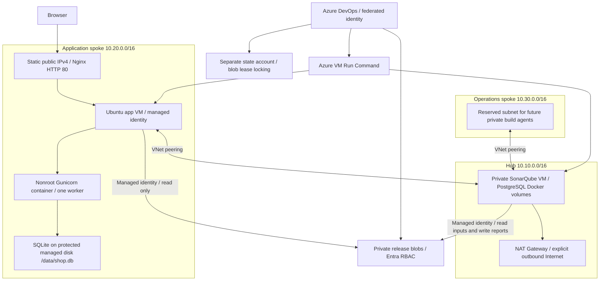

# VOLT hub-and-spoke architecture

| Module | Resources and purpose |
| --- | --- |
| network | Hub, two spokes, four peerings, subnets, NSGs, hub NAT gateway |
| compute | Ubuntu 24.04 VM, managed identity, NIC, optional static public IP, separate 64 GB disk |
| releases | Private release container, versioned storage and scoped identity permissions |
| bootstrap / ci-backend | Protected versioned state accounts, scoped Blob roles, migrated CI backend outside the hosted-agent geography |

The application NSG permits public TCP 80 and 443, then denies other inbound traffic. Only HTTP is configured initially; HTTPS needs a domain and certificate. Internet SSH is closed. SonarQube has no public IP and port 9000 only accepts private hub/spoke sources. Azure Run Command manages the VMs without exposing SSH. The operations spoke is provisioned as network capacity; no build agent is installed there yet.

Peerings are bidirectional but not transitive. This design does not add a central Azure Firewall, VPN gateway, or cross-spoke routing appliance. The hub NAT gateway provides outbound access only to its associated shared-services subnet. The application VM uses its own public IP for outbound traffic. Release/state containers require Entra authentication and default-deny storage firewalls. VM subnets use Microsoft.Storage service endpoints; each deployment job temporarily allows its own public IPv4 and removes that rule on exit. Bootstrap retains the explicit workstation IPv4 for state access. Private endpoints are not configured.

Docker data and SQLite use a separate managed disk. Terraform prevents disk deletion. Deployment verifies the TAR checksum, loads the exact scanned image, backs up existing SQLite through its backup API, and replaces only the container. One worker and one VM preserve SQLite's single-writer assumptions. Backups on the same disk are recovery snapshots, not an off-host disaster-recovery solution.

SonarQube PostgreSQL and server volumes also live on a separate managed disk. Initial server credentials are generated on the host and kept in root-only files. CI defaults to a real disposable SonarQube server on its hosted agent; deployment additionally executes a scanner on the private hub VM through Azure Run Command, exports reports through private Blob storage, and enforces its persistent quality gate before application release.

Deployment provisions two VMs, managed disks, NAT gateway, public IPs and storage; these incur Azure charges while present. No resources should be applied under an identity other than the user-requested giftzee.online@gmail.com.

Deployment selection: app and SonarQube use Standard_D2s_v4 (2 vCPU / 8 GB) in East US after checking Giftzee subscription capacity. The live application backend is in East US; the original Central India account preserves bootstrap and recovery state. The originally considered B-series and Dsv3 machines were restricted in the checked regions; Dsv5 quota was zero in Central India.

The first application deployment seeds giftzee.online@gmail.com as administrator with a generated password held only in /mnt/volt-data/app.env (root-only). It is never logged or included in artifacts. Use a secure administrative channel to manage that credential.

Cloud-init is applied at first boot. Its text is ignored during later VM updates, preventing cross-platform line endings or template edits from replacing an existing host. Deployment scripts manage subsequent application and SonarQube releases. Deliberate host replacement requires a separate reviewed operation.
