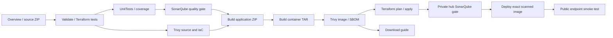

# VOLT Azure DevOps pipeline

Project: https://dev.azure.com/edukrondevops/VoltElectronics
Pipeline: https://dev.azure.com/edukrondevops/VoltElectronics/_build?definitionId=13
Executable definition: `azure-pipelines.yml`.

| Stage | Details and evidence |
| --- | --- |
| Overview | Prints commit, build and branch; exports complete source ZIP before security gates |
| Validate | Python/JS syntax, Terraform format/init/schema, three mocked architecture tests |
| UnitTests | Nine ecommerce tests, minimum 90% coverage, JUnit and coverage HTML/XML |
| SonarQube | Real scanner, measured Python coverage, enforced quality gate; exports issues/measures/server logs |
| TrivySource | Vulnerability, secret and Terraform/Docker misconfiguration checks; HIGH/CRITICAL block the pipeline |
| BuildPackage | Application ZIP with deterministic timestamps, build metadata and SHA256 |
| BuildContainer | Nonroot Python Alpine image from the verified ZIP; SQLite/catalog container checks, OCI commit label and TAR checksum |
| TrivyImage | Scans that exact container TAR; JSON/SARIF findings and CycloneDX SBOM |
| Infrastructure | Federated Azure authentication, Blob backend locking, saved plan and exact apply |
| HubSonarQube | Verified source and coverage scanned on the private hub through Run Command; persistent history and a second enforced gate |
| Release | Private blob upload; managed-identity download; persistent disk setup; exact scanned application deployment |
| Verify | Public health/catalog/assets checks and exact deployed commit verification |
| Downloads | Always publishes a navigable artifact download guide; missing/failed stages are not represented as successful |

`deployAzure=false` runs complete CI without Azure credentials. Select true on main for CD after setup. Azure Repos PR validation uses the existing blocking main-branch build policy. HIGH/CRITICAL Trivy findings or a failed SonarQube quality gate prevent container release. Reports from failed scan stages are still published. Trivy uses version 0.75.0; scanner/server Docker image digests are recorded in reports.

SonarQube ephemeral mode starts a disposable server on the hosted Ubuntu 24.04 agent, rotates default credentials in memory, scans source and exports results before cleanup. External mode needs `sonarHostUrl` and secret `sonarToken`, plus network reachability. Deployment uses Azure Run Command to execute the scanner beside the private hub server and publishes its reports; hosted agents need no direct private network access. A fresh ephemeral server is a fresh quality baseline each run.

## Azure setup

1. Authenticate Azure CLI as giftzee.online@gmail.com and select its subscription.
2. Run `scripts/bootstrap.ps1` with that subscription, a globally unique lowercase storage name and supported bootstrap region. Then run scripts/create-ci-backend.ps1 to provision the East US CI backend and migrate application state. It creates the state container and migrates bootstrap state to its separate remote key.
3. Create an Azure Resource Manager workload-identity federated service connection. It requires resource management permissions, role-assignment permissions for the managed identities, management access to update the state account firewall, and Blob Data Contributor on the state account. Authorize pipeline 13 specifically.
4. Configure `azureServiceConnection`, `subscriptionId`, `appName` (resource prefix, e.g. volt-electronics), `azureLocation`, `stateResourceGroup`, `stateStorageAccount`, and `sshPublicKey` (public RSA key only).
5. The selected deployment region is eastus with Standard_D2s_v4 for both VMs. The live CI backend is in eastus; the original centralindia account retains bootstrap and recovery state. Confirm regional quota/SKU availability and host-encryption support. Queue main with deployAzure=true. The release uploads artifacts under an immutable build-ID prefix.

Do not run concurrent deployment-enabled builds. Blob leasing serializes Terraform state operations, but does not serialize the entire application release. CI is batched; manual deployments should be queued one at a time. Plans and state are never published. Only public resource names/endpoints are exported as deployment outputs.

## Downloads and recovery

Open a run, choose Published artifacts, and choose Download beside source-code, application, container-image, unit-test-reports, sonarqube-reports or the Trivy reports. `source-code/volt-electronics-source.zip` includes the website, tests, Terraform modules, bootstrap, deployment scripts and YAML. It excludes account tokens, private SSH keys, Terraform state/plans and live SQLite databases.

For recovery use a known-good container-image artifact, verify its SHA256, upload it beneath a new release prefix, and call the deployment script using the matching build-ID image tag. A pre-release SQLite backup is created before replacement. Restore data separately only after reviewing schema compatibility. No automatic rollback or off-host backup schedule is configured.

The public IP initially serves an HTTP demonstration store and demo checkout. Configure HTTPS and secure cookies before accepting real customer accounts or payments. See architecture.md for network and persistence boundaries.

Federation can be created reproducibly with scripts/create-federation.ps1 after both resource groups exist. It uses a user-assigned identity without a password, accepts the issuer/subject returned by Azure DevOps, restricts management roles to the two project resource groups, and authorizes only pipeline 13. No account token or private key is stored in the repository.

The application uses the official Python 3.12.15 Alpine 3.24 base with available package updates. Trivy blocked the earlier Debian image because installed operating-system packages had HIGH findings, including several without available Debian fixes. The gate remains enforced; findings are not ignored.

The organization is in Central India. Hosted Linux agents run in its India geography; same-region Azure requests cannot be permitted through Storage public-IP rules. The application backend therefore uses voltstateusc2383fdd in East US. The original voltstatec2383fdd account and state are retained. CI verifies data-plane access after adding its temporary IPv4 and removes it on exit, including failed initialization.
